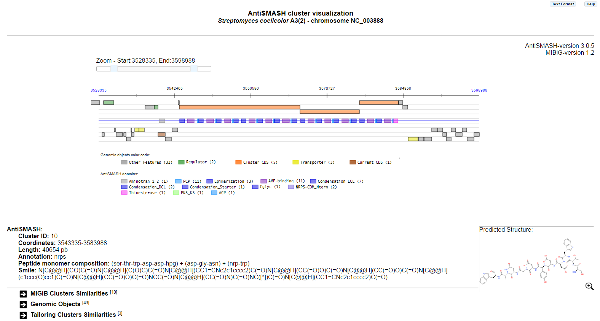
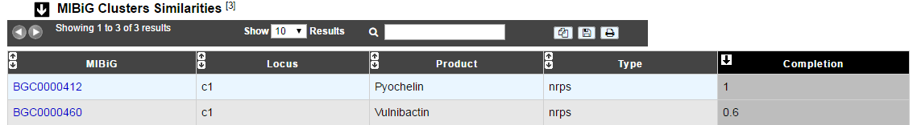
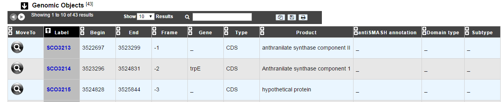
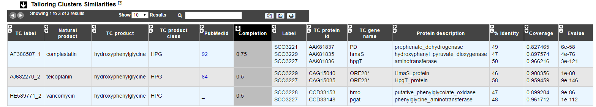
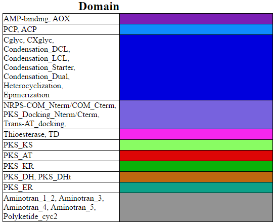
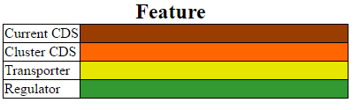

######################
AntiSMASH cluster visualization
######################

What is antiSMASH?
------------------

Know  `more <https://microscope.readthedocs.io/en/latest/content/mage/info.html#antismash>`_ about `antiSMASH <http://antismash.secondarymetabolites.org/about.html>`_

How can I visualize the clusters predicted by antiSMASH?
--------------------------------------------------------

You can access to the **AntiSMASH cluster visualization** window by clicking on the number indicated in the Cluster field of the antiSMASH result table.

You can also use the main navigation menu in the **Metabolism** section to obtain the **AntiSMASH predictions** page.
This page enumerates all secondary metabolite cluster detected for the selected organism and its replicons.

What informations are in this window?
--------------------------------------------------------
This window allows you to visualize the full antiSMASH cluster prediction and its genomic context.

In case of NRPS/PKS cluster type, the predicted peptide monomer composition may be indicated as well, if this composition is specific enough, the smile prediction and its visualization are displayed.

|
|

Thanks to `https://cdkdepict-openchem.rhcloud.com/depict.html <https://cdkdepict-openchem.rhcloud.com/depict.html>`_ for Picture's displays 

|
|

The **MIGiB Clusters Similarities** table provides information about similar known clusters described in MIBiG database. The Minimum Information about a Biosynthetic Gene cluster (MIBiG) can help to know more on biosynthetic gene clusters, their molecular products and their related publications.

`Medema M.H., et al. (2015) Minimum Information about a Biosynthetic Gene cluster. Nat Chem Biol. Sep;11(9):625-31. <http://www.ncbi.nlm.nih.gov/pubmed/26284661>`_

|
|

The **Genomic Objects** table provides informations regarding the genomic objects depicted in the graphical representation.

|
|

The **Tailoring Clusters Similarities** table provides informations about genes which may be involved in tailoring reactions. By clicking on the number, you can access to the Pubmed related article.

* The 6 first columns help to know more about the predict tailoring clusters. 
* *Label* column give the MicroScope gene label.
* *TC protein id* , *TC gene name* and *Protein description* give informations about genes which compose the tailoring cluster.
* *% identity*, *Coverage* and *e-values* give some mathematical informations about the match between tailoring gene and MicroScope one.

|
|

What is the meaning of the color code in the AntiSMASH cluster visualisation window?
-------------------------------------------------------------------------------------------

