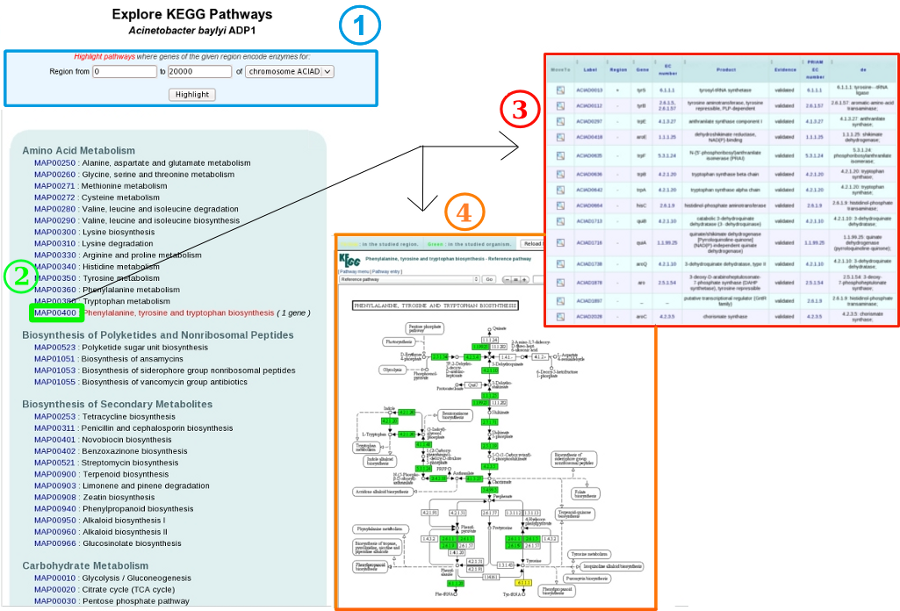

####
Kegg
####

How to access to the KEGG pathways predictions?
-----------------------------------------------

KEGG pathways are accessible through the **Metabolism** section, in the main navigation menu.

What is this list?
------------------

This list enumerates all pathways having at least one reaction linked to a gene of the current reference genome, by the EC number (enzymatic function) and the KO identifier (Kegg Orthology).

Red highlighted pathways matching the region in the Genome Browser and bounds of this region can be modified through the menu at the top of the page (1).

How to explore this metabolic pathways?
---------------------------------------

KEGG maps (4) and genes involved in each metabolic pathway (3) are also displayed, and can be accessed by clicking on a given MAP number (2).

In the table (3), each line describes a gene related to an enzymatic reaction or a KO of this pathway. EC numbers (enzymatic functions) and the predictions of KofamScan are useful to construct these links. The « region » column indicates the genes presence/absence in the region of interest.

On the KEGG maps (4), reactions matching genome annotations are highlighted in green and reaction matching region annotations are highlighted in yellow. More details are available by clicking on items of the map and. The Reload button allows the user to come back in this his exploration work.
