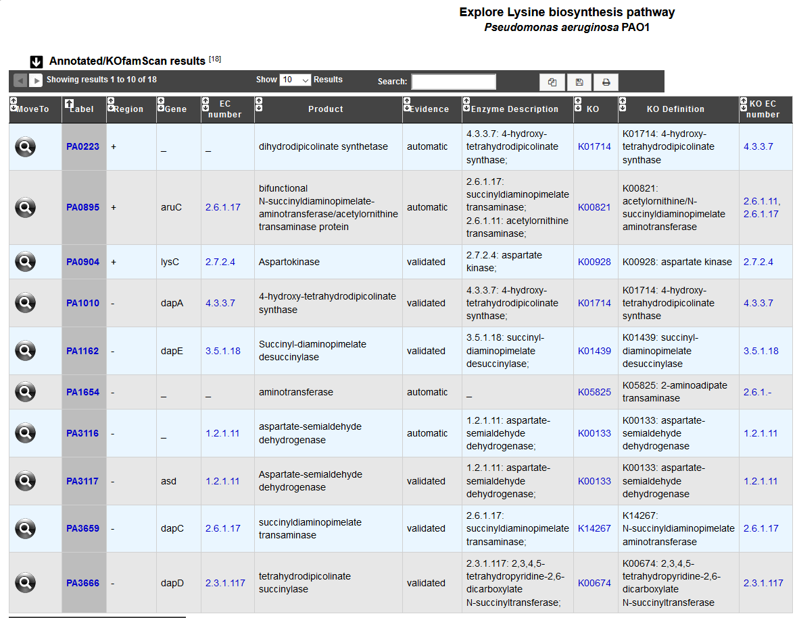
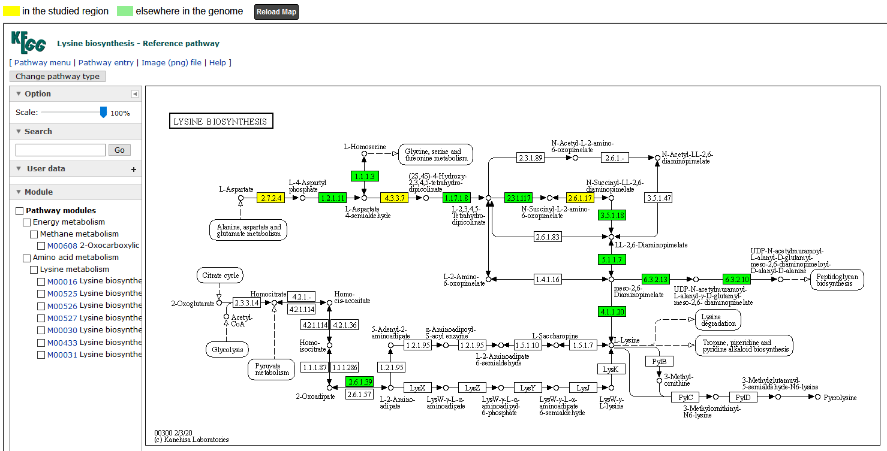

########
KEGG MAP
########

How to read the table ?
-----------------------

In the table, each line describes a gene related to an enzymatic reaction and a KO number (KEGG Orthology) in this pathway. 

* **Label**: Label of the protein. If you click on the label, you access to the Gene annotation window
* **Region**: '+' indicate the genes presence in the region selected and '-' indicate abscence
* **Gene**: Gene name of the protein
* **EC number**: EC number associated with the protein
* **Product**: Product description of the protein
* **Evidence**: Status of the annotation: "validated" means the gene is manual annotated and "automatic" means the gene annotation come from automatic annotation system
* **KEGG map EC**: Description of enzymatic functions involved in the pathway
* **KO**: ID number of KEGG Ortholog entry
* **KO Definition**: Functional description of KO
* **KO EC number**: EC number associated with the KO

How to explore the KEGG map ?
-----------------------------

On the KEGG map, reactions matching genome annotations are highlighted in green and reaction matching region annotations are highlighted in yellow.
More details are available by clicking on items of the map and the Reload button allows the user to come back in this his exploration work.

