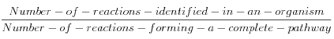
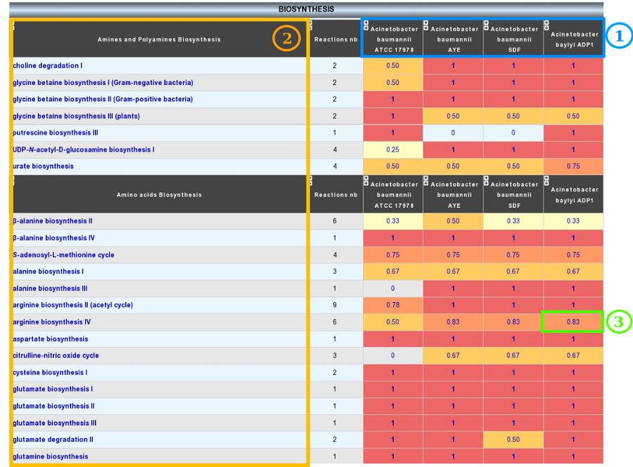
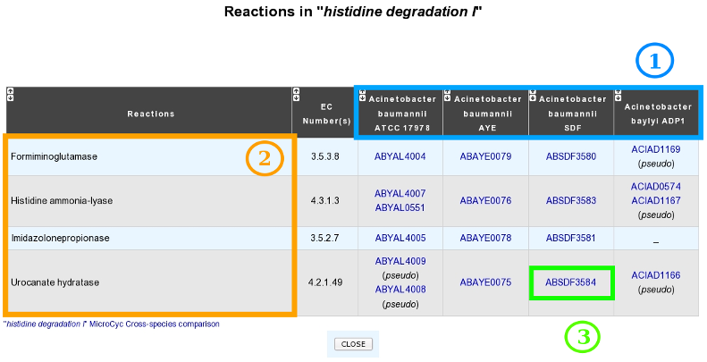

#################
Metabolic Profile
#################

How to access to the Metabolic Profile Tool?
--------------------------------------------

Metabolic Profile tool is accessible in the **Metabolism** section of the main navigation menu.

What is the usefulness of this tool?
------------------------------------

This method allows to:

* compare the metabolic content of the selected bacterial genomes,
* highlight common or specific metabolic pathways,
* detect uncompleted network to fill with expert annotations.

This comparison is based on the computation of a ’pathway completion’ value, i.e the ratio between the number of reactions for pathway X in a given organism and the total number of reactions of pathway X defined in the MetaCyc or KEGG databases.

How to use this tool?
---------------------

* 1) Choose a metabolic database of reference (BioCyc/MicroCyc or Kegg).
* 2) Select the organisms to compare (up to 15).
* 3) Select the metabolic pathways of interest (some or all).
* 4) Validation

The **With pseudogenes** option allows to include pseudogenes in the analysis

Use the **Pathway Completion** box to restrict the analysis to pathways with a completion higher than a threshold

How to read the result table?
-----------------------------

* 1) Different Organisms chosen.
* 2) Metabolic Pathways of interest.
* 3) Completion of the pathway in this organism.
	* the « reaction number » column show the number of reactions forming the complete metabolic pathway.
	* cliking on the completion number open the BioCyc or KEGG metabolic map for this organism.
	
	
Reactions table
---------------

Clicking on a metabolic pathway in the result table allows to access to the detailled reaction table of this pathway. This table summarizes for each selected organism the presence/absence of genes coding for enzymes necessary for each reaction of the pathway.

* 1) Selected organisms.
* 2) Reactions required to perform this metabolic pathway.
* 3) Gene(s) coding for enzyme(s) implicated in this reaction for this organism. Pseudogenes are flagged with **(pseudo)** in this table.

The link below the table allows access to the BioCyc or KEGG comparison metabolic maps.