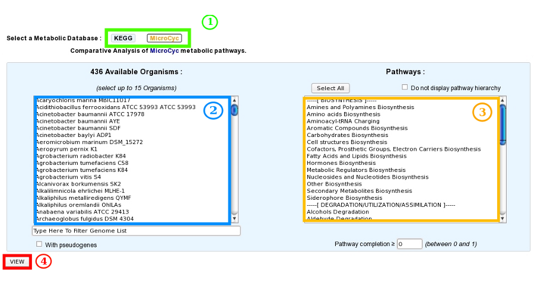

#################
Metabolic Profile
#################

How to access the Metabolic Profile Tool?
-----------------------------------------
	
The Metabolic Profile tool is accessible in the **Metabolism** section of the main navigation menu.

It allows users to compare the metabolic pathway predictions for a selection of genomes.

Two sources of pathways are used: those of `MetaCyc <https://metacyc.org/>`_ predicted by the MicroCyc workflow and the `KEGG modules <https://www.kegg.jp/kegg/module.html>`_.

For KEGG modules, annotated EC numbers and KO assignations (made with :ref:`mage_kofamscan`) are used to predict reactions.

What is the purpose of this tool?
---------------------------------

This tool allows to:

* compare the metabolic content of the selected microbial genomes,
* highlight common or specific metabolic pathways,
* detect missing reactions to find candidate genes.

This comparison is based on the computation of a pathway completion value, i.e for a given pathway :math:`P` and a given genome :math:`G`, the ratio between the number of reactions of :math:`P` predicted in :math:`G`, :math:`N(P, G)`, and the total number of reactions of :math:`P` defined in the KEGG or MetaCyc databases, :math:`N_{tot}(P)`:

.. math::

   completion(P, G)=\frac{N(P, G)}{N_{tot}(P)}

How to use this tool?
---------------------

The interface of the tool is organized as follows:

* **Item #1**: Selection of the metabolic database of reference between KEGG and :ref:`microcyc`.

* **Item #2**: Selection of genomes to compare (up to 30).

* **Item #3**: Inclusion of pseudogenes in the analysis.
  If not checked, reactions associated only to pseudogenes are considered as absent.

* **Item #4**: Selection of metabolic pathways of interest according to their hierarchical classification (some or all).
  You can choose whether or not to display the pathway hierarchy here.

* **Item #5**: Setting of the completion threshold.
  If the completion value of a pathway is below this threshold in all selected genomes, the pathway is considered as not predicted and will not be displayed.

Once the database, the genomes and the pathways have been selected, click on the View button (**Item #6**) to launch the analysis.

How to read the result table?
------------------------------

The results of the analysis will be displayed in one or several tables: if you choose to display the pathway hierarchy, there will be one table for each pathway category; otherwise, there will be only one table for all the pathways.
For each pathway, the total number of reactions and the completion values for each selected genome are displayed.
By clicking on pathway name, a reaction table is displayed (see below).

.. image:: img/meta2.png

* **Item #1**: Name of the metabolic pathways with their total number of reactions.
  Click on the pathway name to open the detailed reactions table of the pathway (see next section).

* **Item #2**: :math:`completion(P, G)` values for each genome.
  Click on the completion number to open the KEGG or the MicroCyc metabolic map for this genome.
	
How to read the reaction table?
--------------------------------

The reaction table is a detailed table of all the reactions of a pathway.
It summarizes for each selected genome the presence/absence of genes coding for enzymes that catalyze the corresponding reaction.

.. image:: img/meta3.png

* **Item #1**: Name of all reactions required to perform the metabolic pathway.
* **Item #2**: EC number(s) of each enzyme involved in a reaction.
* **Item #3**: KO number(s) of each enzyme involved in a reaction (present only in the case of an analysis with the KEGG database).
* **Item #4**: Selected genome(s).
* **Item #5**: List of gene(s) in the genome coding for enzyme(s) involved in the corresponding reaction.
  Pseudogenes are flagged with the keyword "(*pseudo*)".
  Click on a gene name to open the genomic object information page.

The links below the table allow access to a graphical representation of the corresponding MicroCyc/MetaCyc pathways or KEGG maps.

In the co-evolved genes section, users can search for genes with a similar phylogenetic profile to those associated with the corresponding pathway.
This list of genes can be useful to find candidates for missing reactions.

