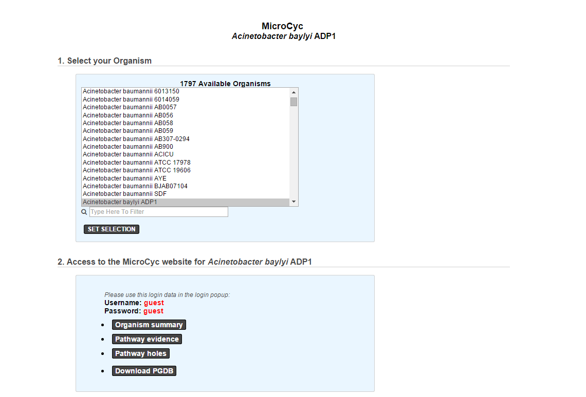

.. _microcyc:

########
MicroCyc
########

MicroCyc is a collection of microbial Pathway/Genome Databases (PGDBs) which are created in the context of the MicroScope projects.
They are supported by the Pathway tools software developed by Peter Karp and his team at SRI international.
These PGDBs were generated using the PathoLogic module which computes an initial set of pathways by comparing a genome annotations to the metabolic reference database MetaCyc.

For each studied genome, the annotation data is extracted from our Prokaryotic Genome DataBase (PkGDB) which benefit both the (re)annotation process performed in our group (AGC), the enzymatic function prediction computed with the PRIAM software, and the expert work for functional annotation made by a various community of biologists using the MaGe system.
These automatically generated PGDBs (Tier3) are updated every day.

.. Warning::
   Access to MicroCyc, requires authentication.
   The password is generated internally and has a limited lifespan
   (generally speaking you should not need to enter this password
   but pages that link to MicroCyc results will usually show it in case your browser asks for login).
   This means that if you keep a page open, the password may become invalid
   and thus you won't be able to refresh the page.
   In that case, refresh the page linking to MicroCyc and reopen the link.

