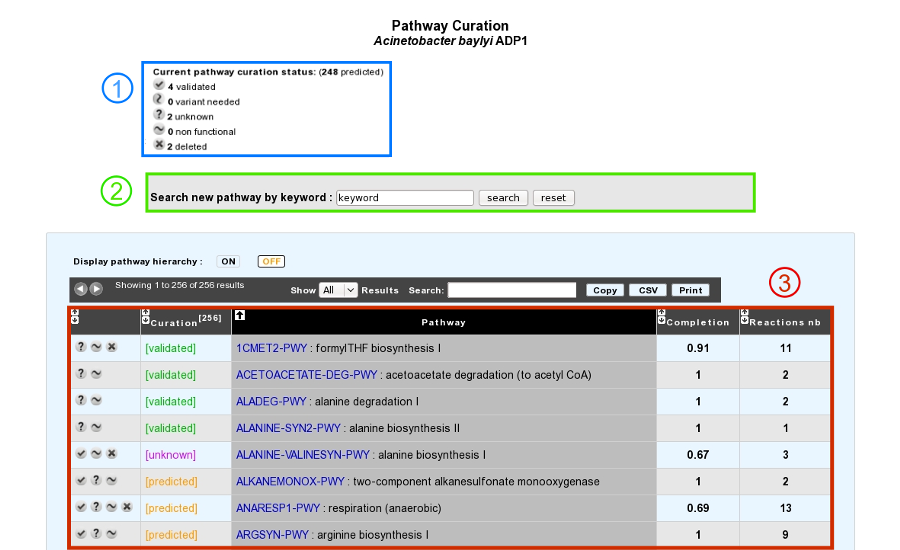
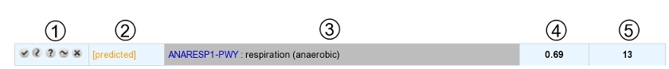
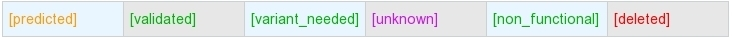
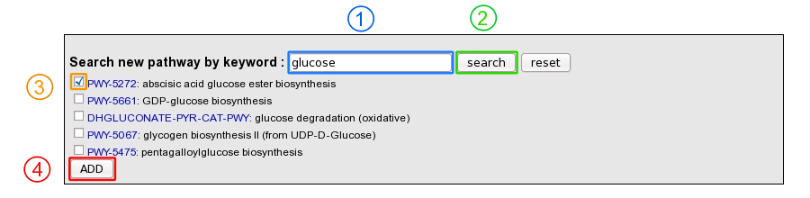

################
Pathway Curation
################

How to access to the Pathway Curation Tool?
-------------------------------------------

Pathway Curation tool is accessible in the **Metabolism** section of the main navigation menu.

What is the usefulness of this tool?
------------------------------------

This tool presents a list of predicted MicroCyc pathways in a given organism, coming from pathway-tools software results, for which statuses can be curated by the annotator **(3)**.

The current state of curation is resumed at the top of the page **(1)**.

It is also possible to add a new `MetaCyc <http://metacyc.org/>`_ pathway in the organism if this one is not predicted by the `BioCyc pathologic algorithm <http://biocyc.org/intro.shtml#pathologic>`_ **(2)**.

How to read the result table?
-----------------------------

* The table is composed of 5 columns:

	**1** : buttons to change the pathway status (see below for a list of possible statuses)

	**2** : current curation status of the pathway

	**3** : pathway identifier and name

	**4** : completion of the pathway in the organism

	**5** : number of reactions in the pathway (excluding spontaneous reactions)

* Above the table, an option allows users to display or not the MetaCyc `hierarchy <http://metacyc.org/META/class-tree?object=Pathways>`_.

What are the different curation statuses?
-----------------------------------------

Users are able to curate the prediction for a given organism by assigning different statuses.

The different statuses are:

* **predicted**: Predicted by the BioCyc pathologic algorithm (default one).
* **validated**: Curated as a functional pathway (all the reactions of the pathway are supposed to exist in the organism).
* **variant_needed**: The predicted pathway is not completely correct for the organism (i.e. some reactions may not be present in the organism but no better pathway definition exists in `MetaCyc <http://metacyc.org/>`_). Thus, a new pathway variant definition is needed.
* **unknown**: Not enough evidence to declare the pathway as functional (i.e. validated status).
* **non_functional**: The pathway has been lost in the organism and is no more functional (i.e. due to gene loss or pseudogenisation events).
* **deleted**: Curated as a false positive prediction.

A complete pathway cannot be deleted.

How to use this tool?
---------------------

The pathway status can be modified using the buttons "validated", "variant_needed", "unknown", "non_functional" and "deleted".

Moreover, it is possible to add a `MetaCyc <http://metacyc.org/>`_ pathway which has not been predicted by using a keyword search tool.

**1**: Enter a keyword relative to the pathway of interest (ex: glucose).

**2**: Click on "search" button.

**3**: Select the correct pathway

**4**: Click on "Add" button in order to set the pathway as present in the organism.
