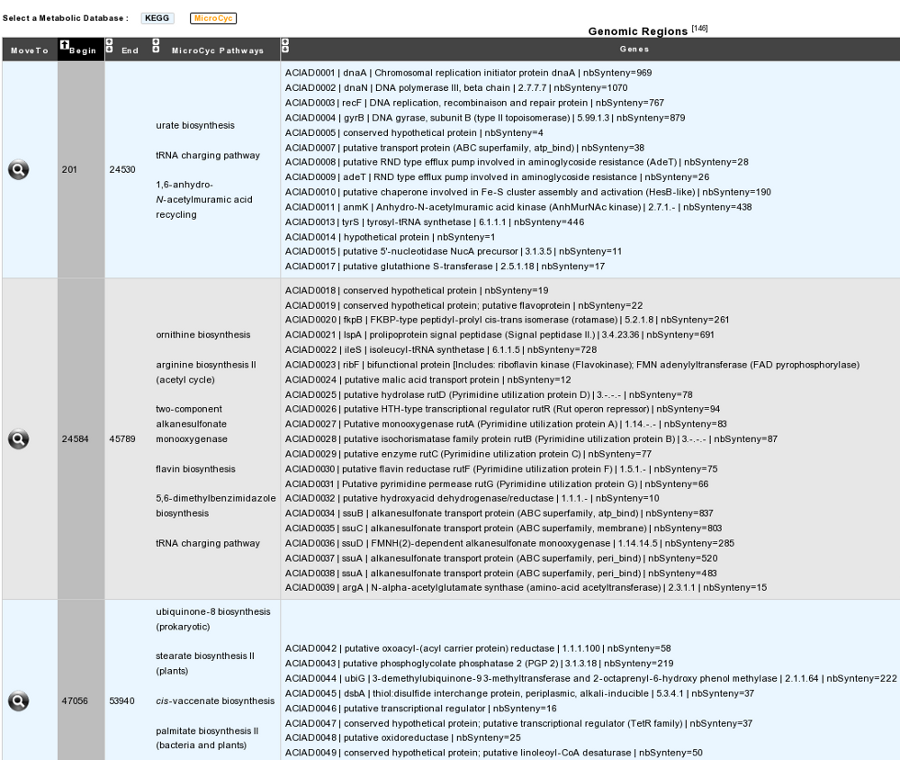

###############
Pathway Synteny
###############
 
How to access to the pathway synteny tool?
------------------------------------------

This tool is accessible in the **Metabolism** section of the main navigation menu.

What is the usefulness of this tool?
------------------------------------

This tool combines, for one query genome, two different neighbourhoods in order to give clues in terms of functional annotation for proteins of unknown function (hypothetical protein). It searches for the genomic regions containing genes involved in synteny groups with the compared bacterial genomes (from our Prokaryotic Genome DataBase PkGDB) AND also involved in metabolic pathways (either KEGG or Metacyc hierarchy).

How to use this tool?
---------------------

You just have to choose the metabolic database of reference in the tool’s header, by clicking on KEGG ou MicroCyc button. Then, wait for the computation results.

How to read this table?
-----------------------

* Each line of the column **Genes** list all genes and their products involved in a group of synteny with an organism of PkGDB.
* Column **Move To** allow the visualization of this region (genes in synteny) in the Genome Browser.
* Columns **Begin** and **End** mark the boundary of this region.
* Column **Pathways** shows metabolic pathways performed by enzymes coded at least by one of the genes in this region.