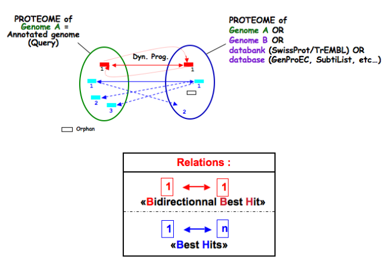

.. _expert:

##########
Annotation
##########

*In progress*

.. _expert_blast_results:

=============
BLAST results
=============

What is the meaning of the minLrap and maxLrap values?
------------------------------------------------------

These values are ratios of alignment lengths computed for each comparison using the BLAST software :

* **minLrap** = Lmatch/min(Lprot1, Lprot2)
* **maxLrap** = Lmatch/max(Lprot1, Lprot2)

where Lmatch = length of the match, Lprot1 = length of protein 1, Lprot2 = length of protein 2.

**if minLrap=1 and maxLrap=1** => the 2 proteins both align on their whole length

**if minLrap=1 ans maxLrap<1** => one of the proteins is longer than the other, or the alignment is partial. Different interpretations are possible:

* the longer protein is a modular protein (domain fusion/fission)
* there is an erroneous start codon for one of the 2 genes
* the smaller gene is a fragment (pseudogene).
* a frameshift (due to a sequencing error or not) causes a premature stop codon in one of the genes.

**if minLrap<1 and maxLrap<1** => the sequences are poorly aligned. We can observe this kind of situation in the case of gene remnants.

What is the meaning of orderQ and orderB values?
------------------------------------------------

The orderQ and orderB values give an information about the rank of the BLAST hit for a protein of the query genome (orderQ) or for a protein of a databank (orderB).

Best bidirectional Best Hits (BBH) will have a 1:1 relationship The following Best hits will have 1<=>n relationship

.. tip:: These indicators can be useful to identify fusion/fission events.

=====
Tools
=====

Which program is used to detect the repeats ?
---------------------------------------------

Repeat detection is performed by the Repsek program.

**More**: http://wwwabi.snv.jussieu.fr/ public/RepSeek/

**Reference**: `Achaz G, Boyer F, Rocha EP, Viari A, Coissac E. Repseek, a tool to retrieve approximate repeats from large DNA sequences. Bioinformatics. 2007 Jan1;23(1):119-21. <http://www.ncbi.nlm.nih.gov/pubmed/17038345>`_

What is Artemis?
----------------
Artemis is a free genome viewer and annotation tool that allows visualisation of sequence features and the results of sequence analyses. It also supports all six-frame translations. It has been developed at the Sanger Institute.

**More**: `http://www.sanger.ac.uk/resources/software/artemis/ <http://www.sanger.ac.uk/resources/software/artemis/>`_

**Reference**: `Rutherford K, Parkhill J, Crook J, Horsnell T, Rice P, Rajandream MA, Barrell B. Artemis: sequence visualization and annotation. Bioinformatics. 2000 Oct;16(10):944-5 <http://www.ncbi.nlm.nih.gov/pubmed/11120685>`_

What is the "BioProcess" classification?
----------------------------------------

This functional classification is based on the `CMR JCVI Role IDs. <http://www.jcvi.org/cms/research/past-projects/cmr/overview/>`_ 

This field is optionally filled in during the expert annotation process.

What is the "Roles" classification?
-----------------------------------

This functional classification corresponds to the MultiFun classification which has been developed by Monica Riley for E. coli (http://genprotec.mbl.edu/).

**Reference**:`Serres MH, Riley M. MultiFun, a multifunctional classification scheme for Escherichia coli K-12 gene products. Microb Comp Genomics. 2000;5(4):205-22. <http://www.ncbi.nlm.nih.gov/pubmed/11471834>`_ 

This field is optionally filled in during the expert annotation process.

What is HAMAP?
--------------

HAMAP (High-quality Automated and Manual Annotation of microbial Proteomes) is a system, based on manual protein annotation, that identifies and semi-automatically annotates proteins that are part of well-conserved families or subfamilies: the HAMAP families. HAMAP is based on manually created family rules and is applied to bacterial, archaeal and plastid-encoded proteins.

**More**: http://www.expasy.ch/sprot/hamap/

**Reference**:

`HAMAP: a database of completely sequenced microbial proteome sets and manually curated microbial protein families in UniProtKB/Swiss-Prot. Lima T et al (2009) Nucleic Acids Res. 2009 Jan;37(Database issue):D471-8. <http://www.ncbi.nlm.nih.gov/pubmed/18849571>`_

What is UniProt?
----------------

The Universal Protein Resource (UniProt) is a comprehensive resource for protein sequence and annotation data. The mission of UniProt is to provide the scientific community with a comprehensive, high-quality and freely accessible ressource of protein sequence and functional information.

The UniProt Knowledgebase consists of two sections:

* **Swiss-Prot** which contains high quality manually annotated and non-redundant protein sequences. This database brings together experimental results, computed features and scientific conclusions.
* **TrEMBL** which contains protein sequences associated with computationally generated annotation and large-scale functional characterization that await full manual annotation.

More than 99% of the protein sequences provided by UniProtKB are derived from the translation of the coding sequences (CDS) which have been submitted to the public nucleic acid databases, the EMBL-Bank/GenBank/DDBJ databases. All these sequences, as well as the related data submitted by the authors, are automatically integrated into UniProtKB/TrEMBL.

**More**: http://www.uniprot.org/

**Reference**: `UniProt Consortium. The Universal Protein Resource (UniProt) in 2010. Nucleic Acids Res. 2010 Jan;38(Database issue):D142-8 <http://www.ncbi.nlm.nih.gov/pubmed/19843607>`_

What is PRIAM?
--------------

PRIAM is a method for automated enzyme detection in a fully sequenced genome, based on all sequences available in the ENZYME database (http://www.expasy.ch/enzyme/). PRIAM relies on sets of position-specific score matrices (PSSMs) automatically tailored for each ENZYME entry. The whole Swiss-Prot database has been used to parametrise and to assess the method.

**More**: http://priam.prabi.fr/

**Reference**: `Clotilde Claudel-Renard, Claude Chevalet, Thomas Faraut and Daniel Kahn / Enzyme-specific profiles for genome annotation: PRIAM Nucleic Acids Research, 2003, Vol. 31, No. 22 6633-6639 <http://www.ncbi.nlm.nih.gov/pubmed/19843607>`_ 

What are MetaCyc Pathways?
--------------------------

MetaCyc pathways are metabolic networks as define in the MetaCyc Database.

`Caspi et al., 2010, "The MetaCyc Database of metabolic pathways and enzymes and the BioCyc collection of Pathway/Genome Databases", Nucleic Acids Research <http://www.ncbi.nlm.nih.gov/pubmed/19850718>`_ 

The presence or absence of a MetaCyc metabolic pathway is predicted by the  `Pathway-tools <http://bioinformatics.ai.sri.com/ptools/>`_ algorithm in this organism.

`P. Karp, S. Paley, and P. Romero "The Pathway Tools Software," Bioinformatics 18:S225-32 2002 <http://www.ncbi.nlm.nih.gov/pubmed/12169551>`_

What is COGnitor?
-----------------

COGnitor compares a sequence to the COG database by using BLASTP. Clusters of Orthologous Groups of proteins (COGs) were established by comparing protein sequences encoded in complete genomes, representing major phylogenetic lineages. Each COG consists of individual proteins or groups of paralogs from at least 3 lineages and thus corresponds to an ancient conserved domain.

**More**: http://www.ncbi.nlm.nih.gov/COG/

**Reference**:

`Tatusov RL, Koonin EV, Lipman DJ. A genomic perspective on protein families. Science. 1997 Oct 24;278(5338):631-7. <http://www.ncbi.nlm.nih.gov/pubmed/9381173>`_

What is FigFam?
---------------
“FIGfams, a new collection of over 100 000 protein families that are the product of manual curation and close strain comparison. Using the Subsystem approach the manual curation is carried out, ensuring a previously unattained degree of throughput and consistency. FIGfams are based on over 950 000 manually annotated proteins and across many hundred Bacteria and Archaea. Associated with each FIGfam is a two-tiered, rapid, accurate decision procedure to determine family membership for new proteins. FIGfams are freely available under an open source license.” (quote from http://www.ncbi.nlm.nih.gov/pmc/articles/PMC2777423/ )

What is PsortB?
---------------

PsortB is an open-source tool for protein sub-cellular localization prediction in bacteria.

**More**: http://www.psort.org/

**Reference**: `Gardy JL et al (2005) PSORTb v.2.0: expanded prediction of bacterial protein subcellular localization and insights gained from comparative proteome analysis. Bioinformatics. Mar1;21(5):617-23. Epub 2004 Oct 22. <http://www.ncbi.nlm.nih.gov/pubmed/15501914>`_ 

What is InterPro?
-----------------

InterPro is an integrated database of predictive protein "signatures" used for the classification and automatic annotation of proteins and genomes. InterPro classifies sequences at superfamily, family and subfamily levels, predicting the occurrence of functional domains, repeats and important sites. InterPro adds in-depth annotation, including GO terms, to the protein signatures.

More: http://www.ebi.ac.uk/interpro/

Reference: `Hunter S, et al. InterPro: the integrative protein signature database. Nucleic Acids Res. 2009 Jan;37(Database issue):D211-5. Epub 2008 Oct 21. <http://www.ncbi.nlm.nih.gov/pubmed/18940856>`_

What is SignalP ?
-----------------

SignalP (version 4.1) predicts the presence and location of signal peptide cleavage sites in amino acid sequences from different organisms: Gram-positive prokaryotes, Gram-negative prokaryotes, and eukaryotes. The method incorporates a prediction of cleavage sites and a signal peptide/non-signal peptide prediction based on a combination of several artificial neural networks and hidden Markov models.

Reference:

`SignalP 4.0: discriminating signal peptides from transmembrane regions. Thomas Nordahl Petersen, Søren Brunak, Gunnar von Heijne & Henrik Nielsen. Nature Methods, 8:785-786, 2011. <http://www.ncbi.nlm.nih.gov/pubmed/21959131>`_

What is TMHMM?
--------------

TMHMM (version 2.0c) is a program for the prediction of transmembrane helices based on a hidden Markov model. The program reads a fasta-formatted protein sequence and predicts locations of transmembrane, intracellular and extracellular regions.

**More**: http://www.cbs.dtu.dk/services/TMHMM/

**References**:

`Sonnhammer, E., et al. (1998) A hidden Markov model for predicting transmembrane helices in protein sequences. Proc. ISMB, 6, 175-182. <http://www.ncbi.nlm.nih.gov/pubmed/9783223>`_

`Krogh, A., et al. (2001) Prediction transmembrane protein topology with a hidden markov model: application to complete genomes. J. Mol. Biol., 305, 567-580 <http://www.ncbi.nlm.nih.gov/pubmed/11152613>`_

What is antiSMASH?
------------------

antiSMASH allows the rapid genome-wide identification, annotation and analysis of secondary metabolite biosynthesis gene clusters in bacterial and fungal genomes. It integrates and cross-links with a large number of in silico secondary metabolite analysis tools that have been published earlier.

**More:** http://antismash.secondarymetabolites.org/

**References:** 

`Blin, K. et al. (2019) antiSMASH 5.0: updates to the secondary metabolite genome mining pipeline. Nucleic Acids Research, 47, W81–W87. <https://doi.org/10.1093/nar/gkz310>`_

.. _cgview:

What is Circular Genome View?
-----------------------------

**CGView** is a Java package which allows to produce high quality, zoomable maps of circular genomes. Its primary purpose is to serve as a component of sequence annotation pipelines, as a mean of generating visual output suitable for the web. Starting with information of one genome and the features to visualize, CGView converts the input into a graphical map (PNG, JPG, or Scalable Vector Graphics format) and completes it with labels, a title, legends, and footnotes.

**More**: http://wishart.biology.ualberta.ca/cgview/index.html

**Reference**: `Stothard P, Wishart DS. Circular genome visualization and exploration using CGView. Bioinformatics. 2005 Feb 15;21(4):537-9 <http://www.ncbi.nlm.nih.gov/pubmed/15479716>`_

.. Important::

    Note that, since version 3.12.2, **MicroScope** uses a fork of the applet which allows to export images directly from the GUI.
    The Wishart Research Group is working on a new version of **CGView** implemented in JavaScript and we are working toward adapting it.
    The Java version of **CGView** is no longer under active development and is based on a deprecated technology.

You can use the CG View toolbar to navigate into the circular map.

From left to right, the buttons are:

* Zoom out
* Zoom in
* View entire map
* Move counterclockwise
* Move clockwise
* Show position in the status bar
* Show help in the status bar
* Export to file

The `Legend` checkbox allows to show/hide the legend.
The `Full view labels` checkbox allows to show/hide the labels when showing the entire map.

If you click on a gene name/label the corresponding Gene window will be opened giving you access the full annotation of the gene.

.. Tip::
    If the application doesn't work, it means that Java is not installed on your computer (get the latest version of java `here <https://www.java.com/>`_)

.. Tip::
    You must allow our software to run without certificate by adding https://mage.genoscope.cns.fr/ to the exception list.
    Read `this FAQ <http://java.com/en/download/faq/exception_sitelist.xml>`_ to know how to proceed.
