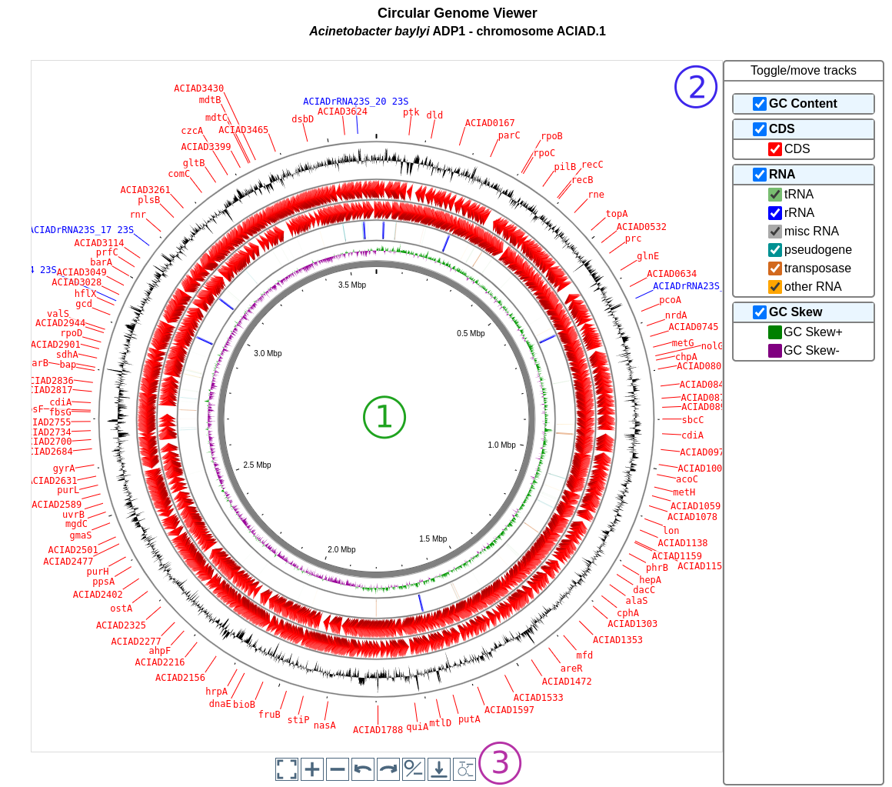
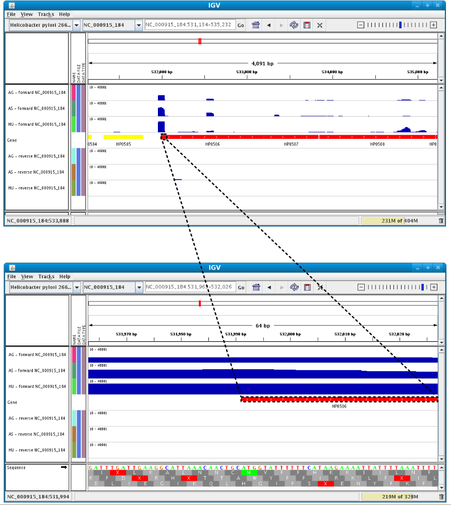

.. _expert:

##########
Annotation
##########

*In progress*

.. _expert_blast_results:

=============
BLAST results
=============

What is the meaning of the minLrap and maxLrap values?
------------------------------------------------------

These values are ratios of alignment lengths computed for each comparison using the BLAST software :

* **minLrap** = Lmatch/min(Lprot1, Lprot2)
* **maxLrap** = Lmatch/max(Lprot1, Lprot2)

where Lmatch = length of the match, Lprot1 = length of protein 1, Lprot2 = length of protein 2.

**if minLrap=1 and maxLrap=1** => the 2 proteins both align on their whole length

**if minLrap=1 ans maxLrap<1** => one of the proteins is longer than the other, or the alignment is partial. Different interpretations are possible:

* the longer protein is a modular protein (domain fusion/fission)
* there is an erroneous start codon for one of the 2 genes
* the smaller gene is a fragment (pseudogene).
* a frameshift (due to a sequencing error or not) causes a premature stop codon in one of the genes.

**if minLrap<1 and maxLrap<1** => the sequences are poorly aligned. We can observe this kind of situation in the case of gene remnants.

What is the meaning of orderQ and orderB values?
------------------------------------------------

The orderQ and orderB values give an information about the rank of the BLAST hit for a protein of the query genome (orderQ) or for a protein of a databank (orderB).

Best bidirectional Best Hits (BBH) will have a 1:1 relationship The following Best hits will have 1<=>n relationship

.. image:: img/blast.png

.. tip:: These indicators can be useful to identify fusion/fission events.

=====
Tools
=====

Which program is used to detect the repeats ?
---------------------------------------------

Repeat detection is performed by the Repsek program.

**More**: http://wwwabi.snv.jussieu.fr/ public/RepSeek/

**Reference**: `Achaz G, Boyer F, Rocha EP, Viari A, Coissac E. Repseek, a tool to retrieve approximate repeats from large DNA sequences. Bioinformatics. 2007 Jan1;23(1):119-21. <http://www.ncbi.nlm.nih.gov/pubmed/17038345>`_

What is the "BioProcess" classification?
----------------------------------------

This functional classification is based on the `CMR JCVI Role IDs. <http://www.jcvi.org/cms/research/past-projects/cmr/overview/>`_

This field is optionally filled in during the expert annotation process.

What is the "Roles" classification?
-----------------------------------

This functional classification corresponds to the MultiFun classification which has been developed by Monica Riley for E. coli (http://genprotec.mbl.edu/).

**Reference**:`Serres MH, Riley M. MultiFun, a multifunctional classification scheme for Escherichia coli K-12 gene products. Microb Comp Genomics. 2000;5(4):205-22. <http://www.ncbi.nlm.nih.gov/pubmed/11471834>`_

This field is optionally filled in during the expert annotation process.

What is HAMAP?
--------------

HAMAP (High-quality Automated and Manual Annotation of microbial Proteomes) is a system, based on manual protein annotation, that identifies and semi-automatically annotates proteins that are part of well-conserved families or subfamilies: the HAMAP families. HAMAP is based on manually created family rules and is applied to bacterial, archaeal and plastid-encoded proteins.

**More**: http://www.expasy.ch/sprot/hamap/

**Reference**:

`HAMAP: a database of completely sequenced microbial proteome sets and manually curated microbial protein families in UniProtKB/Swiss-Prot. Lima T et al (2009) Nucleic Acids Res. 2009 Jan;37(Database issue):D471-8. <http://www.ncbi.nlm.nih.gov/pubmed/18849571>`_

What is UniProt?
----------------

The Universal Protein Resource (UniProt) is a comprehensive resource for protein sequence and annotation data. The mission of UniProt is to provide the scientific community with a comprehensive, high-quality and freely accessible ressource of protein sequence and functional information.

The UniProt Knowledgebase consists of two sections:

* **Swiss-Prot** which contains high quality manually annotated and non-redundant protein sequences. This database brings together experimental results, computed features and scientific conclusions.
* **TrEMBL** which contains protein sequences associated with computationally generated annotation and large-scale functional characterization that await full manual annotation.

More than 99% of the protein sequences provided by UniProtKB are derived from the translation of the coding sequences (CDS) which have been submitted to the public nucleic acid databases, the EMBL-Bank/GenBank/DDBJ databases. All these sequences, as well as the related data submitted by the authors, are automatically integrated into UniProtKB/TrEMBL.

**More**: http://www.uniprot.org/

**Reference**: `UniProt Consortium. The Universal Protein Resource (UniProt) in 2010. Nucleic Acids Res. 2010 Jan;38(Database issue):D142-8 <http://www.ncbi.nlm.nih.gov/pubmed/19843607>`_

What are MetaCyc Pathways?
--------------------------

MetaCyc pathways are metabolic networks as defined in the MetaCyc Database.

`Caspi et al., 2010, "The MetaCyc Database of metabolic pathways and enzymes and the BioCyc collection of Pathway/Genome Databases", Nucleic Acids Research <http://www.ncbi.nlm.nih.gov/pubmed/19850718>`_

The presence or absence of a MetaCyc metabolic pathway is predicted by the  `Pathway-tools <http://bioinformatics.ai.sri.com/ptools/>`_ algorithm in this organism.

`P. Karp, S. Paley, and P. Romero "The Pathway Tools Software," Bioinformatics 18:S225-32 2002 <http://www.ncbi.nlm.nih.gov/pubmed/12169551>`_

What is FigFam?
---------------
“FIGfams, a new collection of over 100 000 protein families that are the product of manual curation and close strain comparison. Using the Subsystem approach the manual curation is carried out, ensuring a previously unattained degree of throughput and consistency. FIGfams are based on over 950 000 manually annotated proteins and across many hundred Bacteria and Archaea. Associated with each FIGfam is a two-tiered, rapid, accurate decision procedure to determine family membership for new proteins. FIGfams are freely available under an open source license.” (quote from http://www.ncbi.nlm.nih.gov/pmc/articles/PMC2777423/ )

What is PsortB?
---------------

PsortB is an open-source tool for protein sub-cellular localization prediction in bacteria.

**More**: http://www.psort.org/

**Reference**: `Gardy JL et al (2005) PSORTb v.2.0: expanded prediction of bacterial protein subcellular localization and insights gained from comparative proteome analysis. Bioinformatics. Mar1;21(5):617-23. Epub 2004 Oct 22. <http://www.ncbi.nlm.nih.gov/pubmed/15501914>`_

What is InterPro?
-----------------

InterPro is an integrated database of predictive protein "signatures" used for the classification and automatic annotation of proteins and genomes. InterPro classifies sequences at superfamily, family and subfamily levels, predicting the occurrence of functional domains, repeats and important sites. InterPro adds in-depth annotation, including GO terms, to the protein signatures.

More: http://www.ebi.ac.uk/interpro/

Reference: `Hunter S, et al. InterPro: the integrative protein signature database. Nucleic Acids Res. 2009 Jan;37(Database issue):D211-5. Epub 2008 Oct 21. <http://www.ncbi.nlm.nih.gov/pubmed/18940856>`_

What is SignalP ?
-----------------

SignalP (version 4.1) predicts the presence and location of signal peptide cleavage sites in amino acid sequences from different organisms: Gram-positive prokaryotes, Gram-negative prokaryotes, and eukaryotes. The method incorporates a prediction of cleavage sites and a signal peptide/non-signal peptide prediction based on a combination of several artificial neural networks and hidden Markov models.

Reference:

`SignalP 4.0: discriminating signal peptides from transmembrane regions. Thomas Nordahl Petersen, Søren Brunak, Gunnar von Heijne & Henrik Nielsen. Nature Methods, 8:785-786, 2011. <http://www.ncbi.nlm.nih.gov/pubmed/21959131>`_

What is TMHMM?
--------------

TMHMM (version 2.0c) is a program for the prediction of transmembrane helices based on a hidden Markov model. The program reads a fasta-formatted protein sequence and predicts locations of transmembrane, intracellular and extracellular regions.

**More**: http://www.cbs.dtu.dk/services/TMHMM/

**References**:

`Sonnhammer, E., et al. (1998) A hidden Markov model for predicting transmembrane helices in protein sequences. Proc. ISMB, 6, 175-182. <http://www.ncbi.nlm.nih.gov/pubmed/9783223>`_

`Krogh, A., et al. (2001) Prediction transmembrane protein topology with a hidden markov model: application to complete genomes. J. Mol. Biol., 305, 567-580 <http://www.ncbi.nlm.nih.gov/pubmed/11152613>`_

What is antiSMASH?
------------------

antiSMASH allows the rapid genome-wide identification, annotation and analysis of secondary metabolite biosynthesis gene clusters in bacterial and fungal genomes. It integrates and cross-links with a large number of in silico secondary metabolite analysis tools that have been published earlier.

**More:** http://antismash.secondarymetabolites.org/

**References:**

`Blin, K. et al. (2019) antiSMASH 5.0: updates to the secondary metabolite genome mining pipeline. Nucleic Acids Research, 47, W81–W87. <https://doi.org/10.1093/nar/gkz310>`_

.. _artemis:

What is Artemis?
----------------

Artemis is a free genome viewer and annotation tool that allows visualisation of sequence features and the results of sequence analyses.
It also supports all six-frame translations.
It has been developed at the Sanger Institute.

.. Tip::
   Artemis is based on the Java Web Start technology.
   See how to use :ref:`JWS`.

**More**: `http://www.sanger.ac.uk/resources/software/artemis/ <http://www.sanger.ac.uk/resources/software/artemis/>`_

**Reference**: `Rutherford K, Parkhill J, Crook J, Horsnell T, Rice P, Rajandream MA, Barrell B. Artemis: sequence visualization and annotation. Bioinformatics. 2000 Oct;16(10):944-5 <http://www.ncbi.nlm.nih.gov/pubmed/11120685>`_

.. _cgview:

What is CGView?
---------------

CGView (see `<https://js.cgview.ca/>`_) is a Circular Genome Viewing tool for visualizing and interacting with small genomes. 
This tool is integrated on several pages of MicroScope.

The viewer displays several rings called tracks (see below).
Each track displays one or several types of objects.
An object (or feature) can be represented:

* as an arrow for features localized on a specific strand;
  in this case, the track is composed of 2 rings: the outermost one displays the negative strand and the innermost one the positive strand
  (usually with the same color code)
* as a rectangle for features not localized on a specific strand
* as a bar plot for numeric features such as GC content and GC skew

In the example below, from the outside:

* the first track displays the GC content
* the second track displays one type of features (the CDS),
* the third track displays several types of features
  corresponding to various types of RNA
* etc.

.. Warning: the base image is also used in cgview.rst

The tracks, their features and the color coding are chosen on each page to display the relevant informations
but the user interface presented here is the same.

The user interface is made of 3 parts:

 1. The viewer itself.
    You can zoom in and out and move along the sequence directly.
    You can hover a feature to get more details about it.
    The feature may be linked to other pages (indicated by the text *Click for more details*).
    The innermost track contains the sequence.

 2. The panel on the right allows to control the appearance of the graph.
    Each track is represented by a box (in bold font) and each type of features in a track is represented by a checkbox.
    You can toggle the visibility of the whole track or of individual type by clicking on it.
    You can also drag & drop the tracks to change their order on the viewer.

 3. The panel under the viewer shows buttons with neat functionalities.
    From left to right, you can :

   * recenter the view
   * zoom in
   * zoom out
   * move to the left
   * move to the right
   * switch between linear and circular view
   * download an image of the viewer (as a PNG)
   * toggle label visibility

.. _morpheus:

What is Morpheus ?
------------------

Morpheus is a versatile matrix visualization and analysis software.
View your dataset as a heat map, then explore the interactive tools in Morpheus. Cluster, create new annotations, search, filter, sort, display charts, and more.

**More**: https://software.broadinstitute.org/morpheus/documentation.html

.. _jalview:

What is JalView ?
-----------------

Jalview is a free, open source program developed for the interactive editing, analysis and visualization of multiple sequence alignments.
It can also work with sequence annotation, secondary structure information, phylogenetic trees and 3D molecular structures.

**More**: http://www.jalview.org/

.. Tip::
   JalView is based on the Java Web Start technology.
   See how to use :ref:`JWS`.

.. _igv:

What is IGV ?
-------------

The Integrative Genomics Viewer (IGV) is a high-performance, easy-to-use, interactive tool for the visual exploration of genomic data.
It supports flexible integration of all the common types of genomic data and metadata, investigator-generated or publicly available, loaded from local or cloud sources.

It is mainly used in RNASeq and variant analysis (see for instance :ref:`RNA-Seq homepage <rnaseq_Overview>`, :ref:`Read Count <rnaseq_ReadCountAnalysis>` and :ref:`DESeq Analysis <rnaseq_DiffExprAnalysis>`)
to allow the visualization of the coverage of the reference genome by the reads and to qualitatively compare coverage for various samples (experimental conditions or clones).

**More**: https://software.broadinstitute.org/software/igv/

.. Tip::
   IGV is based on the Java Web Start technology.
   See how to use :ref:`JWS`.

After clicking the “*Launch IGV*” button the first window appears with a lower part already displaying the annotations of the reference genome (see below).

.. image:: img/gen1.png

Section **#1** contains genome annotations. Colors corresponding to a specific genomic object are:

* red : CDS
* yellow : fCDS
* green : tRNA
* blue : rRNA, miscRNA

To see genome coverage, users can load data in the drop down menu “*File/Load from Server*”.
A list of available datasets for import will then appear in a new window. Tick the checkbox corresponding to the experiments to load in the browser and click “*OK*”.

.. image:: img/gen2.png

.. note:: **Warning**: The loading process may take a while, so please be patient!

Then, the coverage is visible :

.. image:: img/gen3.png

Users can also organize the display :
*Example : to compare the same type of experiment user can group forward and reverse experiment. (just click and drag)*

.. image:: img/gen4.png

Users can enlarge the view by drag’n dropping the mouse on the area of interest.

It is possible to zoom in to see gene sequence and translation.

