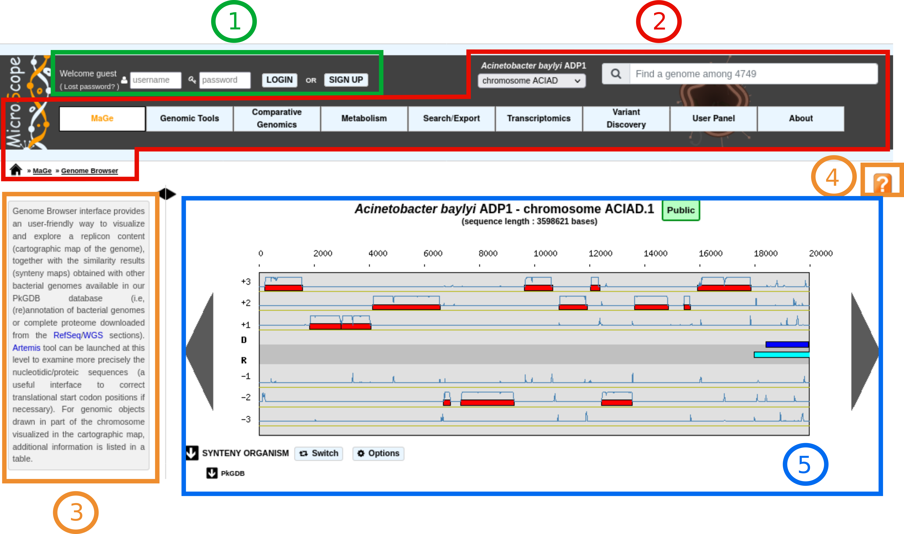
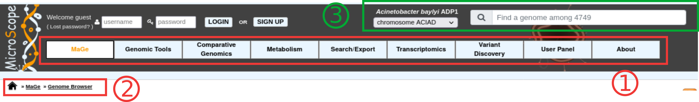
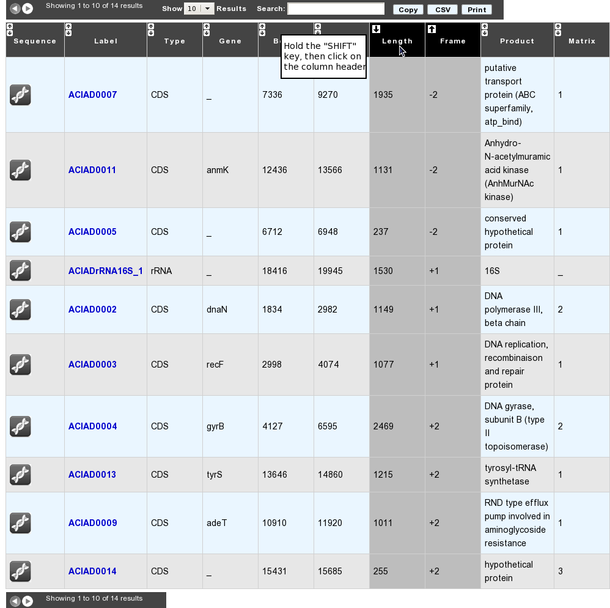
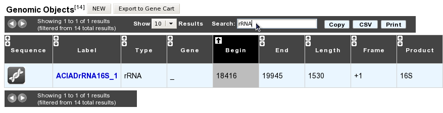
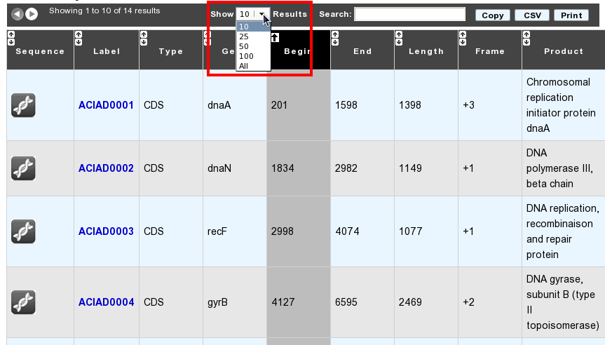
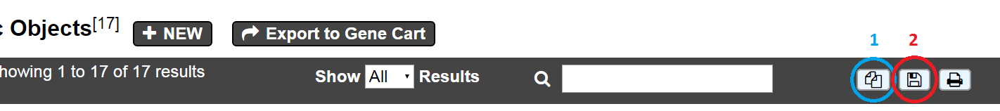
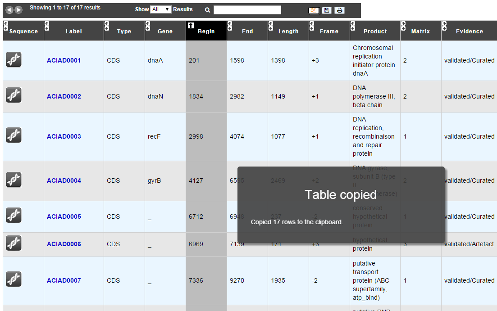
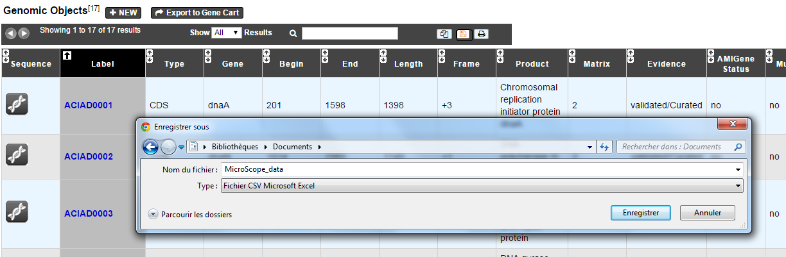
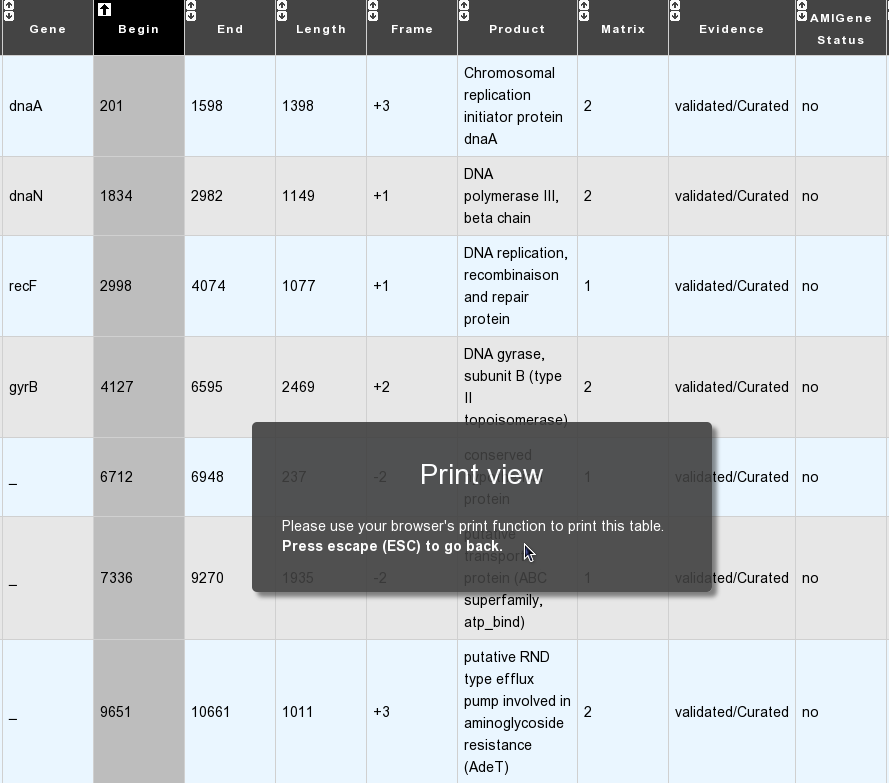

.. _interface-overview:

#########
Interface
#########

========
Overview
========

MicroScope's interface is organized around the notion of **tools** (also called **methods**).
That is, most pages display the results computed by a dedicated tool for the current **reference genome** or a **reference sequence**.
The current object is displayed in the top right corner of the navifation interface and on the page itself.

Some exceptions to this rule are:

* the :ref:`mage`
* the :ref:`keywords` in Multiple Mode

The picture below gives an overview of the typical interface (in this case the :ref:`viewer`):

The window is composed of several parts:

* **Item #1 Login Interface:** this parts allows you to log in (see :ref:`here <login>` for more information).
  Once logged in, you will have access to all public sequences, as well as private sequences to which you have access (see :ref:`here <access-right-management>` for more information).
  Some functionalities are accessible only if you are logged in.
  You can also click on the **SIGN UP** button to :ref:`register`.
* **Item #2 Navigation interface:** this part of the interface allows to navigate between the tools, change the reference sequence, etc. (see below for a detailled description).
* **Item #3 Quick documentation sidebar:** this comopnent offers a quick description of the current page.
* **Item #4 Link to documentation:** clicking on this button will redirect to the help page of the current page.
* **Item #5 Result part:** the central part of the interface is used to display the results of the current page.
  Many pages use tables to display the results (see below for a detailled description of the tables).

====================
Navigation interface
====================

The navigation interface is composed of several parts:

* **Item #1. Navigation menu:** This menu is used to navigate between the different tools.
  Tools are grouped into sections (the entries you see on the image).
  The organization of this tutorial matches those sections.

* **Item #2. Sequence selector \& Genome selector:** This component is used to switch to another replicon of the current genome or to change the current genome.
  See :ref:`here <simple-selector>` for more information.

* **Item #3. Navigation Submenu:** As you explore and annotate, this menu will show you your position in the MicroScope tool tree, providing users with an easy way to locate themselves on the platform.

======================
Browsing Result Tables 
======================

How to sort results?
--------------------

Most of result tables provide a default sort (grey-coloured column). 
To sort results as you wish, simply click on the corresponding column header. Each click will alternate between ASC (*ascending order*) sort or DESC (*descending order*) sort. 
Also, the system provides a multi-sort functionality, to sort and switch on multiple columns. Simply hold your «**SHIFT**» key and click on column headers you want to multi-sort.

How to filter results?
----------------------

Each result table provides a text area called «*Search*:» . 
Enter some characters into this box in order to filter results: each row matching your keywords will be kept, whereas the others will be hidden dynamically.

 

How to choose the number of results to display per page?
--------------------------------------------------------

Each result table provides a select menu called «*Show X Results*». 
Change the value to display the corresponding number of results per page. 
Values are: **10** (default), **25**, **50**, **100** or **All**.

 

How to export results?
----------------------

Each result table provides buttons called *Copy* (1) and *CSV* (2).

* Using the *Copy* button will copy to clipboard each row of your result table in a tab-delimited text format

	
	
* Using the *CSV* button will export your result table in a CSV file, fully compatible with spreadsheets like Microsoft Excel, or Open Office Calc

How to print results?
---------------------

Clicking on the *Print* button will display only the result table within your current window, hiding all the others HTML elements. Then, use your browser’s menu bar to print the displayed table.

.. tip:: You can leave the «Print Mode» and go back to the original window by clicking your «**ESC (Escape)**» key.

