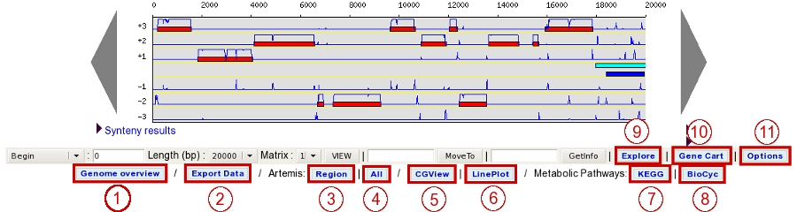
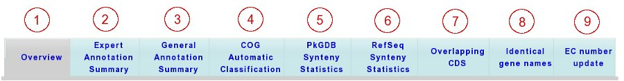
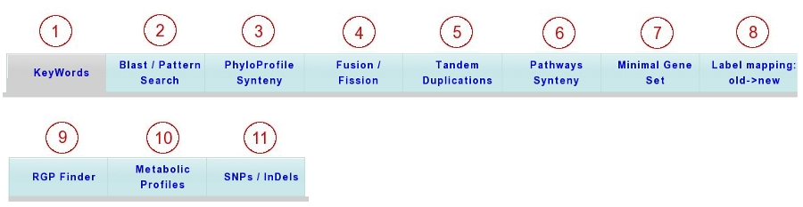

#########
Interface
#########

========
Overview
========

.. image:: img/img1.png
    :width: 100%

===============
Navigation Menu
===============

How to use the Main Navigation Menu?
------------------------------------

.. image:: img/img2.png
	
* **Item #1. Login Interface:** 

Fill the *username* and *password* fields as described in the Email sent to you at account creation. After you login, you will have access to all public sequences, as well as private sequences corresponding to your project. Furthermore, you may have annotation rights on certain sequences (if defined in your account parameters).

.. tip:: Considering the account creation: **we will create new accounts only following requests from project leaders**. Please ask your project leader to use his own `Account & Right Management <http://microscope.readthedocs.org/en/latest/content/userpanel/rightsmanagement.html>`_ interface in order to open your account.

* **Item #2. Reference Sequence selection menu:** 

From this menu, you can select your Reference Genome/Replicon. Click on the *Change* button to open a popup organism selection interface, select your reference organism, then click on the *Set Selection* button. This action will reload the main webpage with the data corresponding to the Organism you selected as reference.

The popup interface will display all the Organisms for which you have, at least, *Read rights*. This corresponds to Public sequences + Account Restricted sequences.

The select menu below the *Change* button lists the corresponding organism replicons. Change the selection in this submenu to switch to the replicon you want to explore.

.. tip:: After logging in, you will have access to the **My Favourite Organisms** functionality available in the **User Panel** section. Considering you have registered some favourites in our database with this interface, you’ll note that if you hover your mouse pointer the *Change* button, a popup will appear. This lists your favourite organism selection. By clicking on one of this organisms, the system will set this one as the new reference organism. This allows a quick access to a personal set of organisms.

* **Item #3. Navigation Submenu:** 

During your exploration and annotation work, this menu will indicate your position in the MicroScope’s tools tree, offering users an easy way to locate themselves on the platform.

* **Item #4. Text Format functionality:** 

This button will export the displayed web page into a text-converted file easily importable into a spreadsheet like Microsoft Excel or OpenOffice Calc. 
Click on the button, save the file to your computer, then load it into your preferred spreadsheet program. This file is dynamically created, so you may have to edit (delete) some of the content in order to keep only the data of interest.

* **Item #5. Help button:**

By clicking on this button, you’ll be redirected to the MicroScope Tutorial. You will get a list of help articles related to the tool you’re using at the moment. In case of no correspondences, you’ll be invited to browse the whole content of the tutorial.

======================
Browsing Result Tables 
======================

How to sort results?
--------------------

Most of result tables provides a default sort (grey-coloured column). 
To sort results as you wish, simply click on the corresponding column header. Each click will alternate between ASC (*ascending order*) sort or DESC (*descending order*) sort. 
Also, the system provides a multi-sort functionality, to sort and switch on multiple columns. Simply hold your «**SHIFT**» key and click on column headers you want to multi-sort.

.. image:: img/img3.png

How to filter results?
----------------------

Each result table provides a text area called «*Search*:» . 
Enter some characters into this box in order to filter results: each row matching your keywords will be kept, whereas the others will be hidden dynamically.

 

.. image:: img/img4.png

How to choose the number of results to display per page?
--------------------------------------------------------

Each result table provides a select menu called «*Show X Results*». 
Change the value to display the corresponding number of results per page. 
Values are: **10** (default), **25**, **50**, **100** or **All**.

 

.. image:: img/img5.png

How to export results?
----------------------

Each result table provides buttons called *Copy* and *CSV*.

.. warning:: Please note that these buttons need `Adobe Flash Player <https://get.adobe.com/fr/flashplayer/>`_ to be installed on your browser to work properly.

* Using the *Copy* button will copy to clipboard each row of your result table in a tab-delimited text format

.. image:: img/interface.png
	
	
* Using the *CSV* button will export your result table in a CSV file, fully compatible with spreadsheets like Microsoft Excel, or Open Office Calc

.. image:: img/interface2.png

How to print results?
---------------------

Clicking on the *Print* button will display only the result table within your current window, hiding all the others HTML elements. Then, use your browser’s menu bar to print the displayed table.

.. tip:: You can leave the «Print Mode» and go back to the original window by clicking your «**ESC (Escape)**» key.

.. image:: img/img8.png

===================
Old » New Interface
===================

The MicroScope interface changed on 3rd June 2010. Here are the tool correspondences between the old interface (developped and maintained between 2002 and May 2010) and the new one.
 
 
What about the old *Viewer* interface ?
---------------------------------------
 

 
The corresponding tools are available by following this path in the `new interface <http://microscope.readthedocs.org/en/latest/content/overview/interface.html>`_ :
 
+---------------+-----------------------------+---------------------------------------------------------------------------------------------+
|   ITEM #      |    OLD INTERFACE BUTTON     |                                          NEW INTERFACE                                      |
+===============+=============================+=============================================================================================+
| 2             | Export data                 | **Export » Download Data**                                                                  | 
+---------------+-----------------------------+---------------------------------------------------------------------------------------------+
| 3             | Artemis Region              | **MaGe » Genome Browser** ( Menu Bar below Synteny Maps )                                   |
+---------------+-----------------------------+---------------------------------------------------------------------------------------------+
| 4             | Artemis All                 | **MaGe » Genome Browser** ( Menu Bar below Synteny Maps )                                   |
+---------------+-----------------------------+---------------------------------------------------------------------------------------------+
| 5             | CGView                      | **Genomic Tools » Circular Genome Viewer**                                                  |
+---------------+-----------------------------+---------------------------------------------------------------------------------------------+
| 6             | LinePlot                    | **Comparative Genomics » LinePlot**                                                         |
+---------------+-----------------------------+---------------------------------------------------------------------------------------------+
| 7             | Kegg                        | **Metabolism » Kegg**                                                                       |
+---------------+-----------------------------+---------------------------------------------------------------------------------------------+
| 8             | BioCyc                      | **Metabolism » MicroCyc**                                                                   |
+---------------+-----------------------------+---------------------------------------------------------------------------------------------+
| 10            | Gene Cart                   | **User Panel » Gene Carts**                                                                 |
+---------------+-----------------------------+---------------------------------------------------------------------------------------------+
| 11            | Options                     | **MaGe » Genome Browser Options** OR **User Panel » Display Preferences**                   |
+---------------+-----------------------------+---------------------------------------------------------------------------------------------+

What about the old *Genome Overview* interface?
-----------------------------------------------

The corresponding tools are available by following this path in the `new interface <http://microscope.readthedocs.org/en/latest/content/overview/interface.html>`_ :

+---------------+-----------------------------+---------------------------------------------------------------------------------------------+
|   ITEM #      |    OLD INTERFACE BUTTON     |                                          NEW INTERFACE                                      |
+===============+=============================+=============================================================================================+
| 1             | Overview                    | **Genomic Tools » Genome Overview** (upper part)                                            | 
+---------------+-----------------------------+---------------------------------------------------------------------------------------------+
| 2             | Expert Annotation Summary   | **MaGe » Expert Annotations Summary**                                                       |
+---------------+-----------------------------+---------------------------------------------------------------------------------------------+
| 3             | General Annotation Summary  | **Genomic Tools » Genome Overview** (lower part)                                            |
+---------------+-----------------------------+---------------------------------------------------------------------------------------------+
| 4             | COG Automatic Classification| **Genomic Tools » COG Automatic Classification**                                            |
+---------------+-----------------------------+---------------------------------------------------------------------------------------------+
| 5             | PkGDB Synteny Statistics    | **Comparative Genomics » PkGDB Synteny Statistics**                                         |
+---------------+-----------------------------+---------------------------------------------------------------------------------------------+
| 6             | RefSeq Synteny Statistics   | **Comparative Genomics » RefSeq Synteny Statistics**                                        |
+---------------+-----------------------------+---------------------------------------------------------------------------------------------+
| 7             | Overlapping CDS             | **MaGe » Overlapping CDS**                                                                  |
+---------------+-----------------------------+---------------------------------------------------------------------------------------------+
| 8             | Identical Gene Names        | **MaGe » Identical Gene Names**                                                             |
+---------------+-----------------------------+---------------------------------------------------------------------------------------------+
| 9             | EC number Update            | **MaGe » EC number Update** (not available for guests)                                      |
+---------------+-----------------------------+---------------------------------------------------------------------------------------------+

What about the old *Explore* interface?
---------------------------------------

The corresponding tools are available by following this path in the `new interface <http://microscope.readthedocs.org/en/latest/content/overview/interface.html>`_ :

+---------------+-----------------------------+-------------------------------------------------------------------------------------------------------------------+
|   ITEM #      |    OLD INTERFACE BUTTON     |                                             NEW INTERFACE                                                         |
+===============+=============================+===================================================================================================================+
| 1             | KeyWords                    | **Searches » Search by Keywords**                                                                                 | 
+---------------+-----------------------------+-------------------------------------------------------------------------------------------------------------------+
| 2             | Blast / Pattern Search      | **Searches » Blast & Pattern Searches**                                                                           |
+---------------+-----------------------------+-------------------------------------------------------------------------------------------------------------------+
| 3             | PhyloProfile Synteny        | **Comparative Genomics » Genes Phyloprofile Organism** OR **Comparative Genomics » Genes Phyloprofile Replicon**  |
+---------------+-----------------------------+-------------------------------------------------------------------------------------------------------------------+
| 4             | Fusion / Fission            | **Comparative Genomics » Fusion / Fission**                                                                       |
+---------------+-----------------------------+-------------------------------------------------------------------------------------------------------------------+
| 5             | Tandem Duplications         | **Genomic Tools » Tandem Duplications**                                                                           |
+---------------+-----------------------------+-------------------------------------------------------------------------------------------------------------------+
| 6             | Pathways Synteny            | **Metabolism » Pathways Synteny**                                                                                 |
+---------------+-----------------------------+-------------------------------------------------------------------------------------------------------------------+
| 7             | Minimal Gene Set            | **Genomic Tools » Minimal Gene Set**                                                                              |
+---------------+-----------------------------+-------------------------------------------------------------------------------------------------------------------+
| 8             | Label Mapping: Old > New    | **MaGe » Old » New Labels** (not available for guests)                                                            |
+---------------+-----------------------------+-------------------------------------------------------------------------------------------------------------------+
| 9             | RGP Finder                  | **Comparative Genomics » Genomic Islands**                                                                        |
+---------------+-----------------------------+-------------------------------------------------------------------------------------------------------------------+
| 10            | Metabolic Profiles          | **Metabolism » Metabolic Profiles**                                                                               |
+---------------+-----------------------------+-------------------------------------------------------------------------------------------------------------------+
| 11            | SNPs / InDels               | **Experimental Data » Evolution Projects**                                                                        |
+---------------+-----------------------------+-------------------------------------------------------------------------------------------------------------------+

