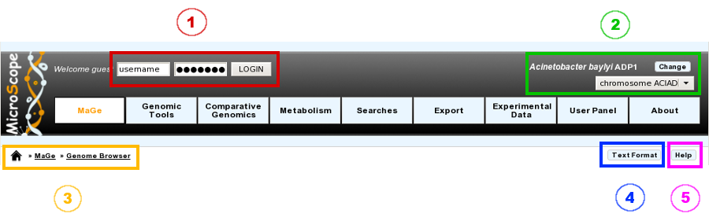

#########
Interface
#########

========
Overview
========

.. image:: img/img1.png

===============
Navigation Menu
===============

How to use the Main Navigation Menu?
------------------------------------

* **Item #1. Login Interface:** 
Fill the username and password fields as described in the Email sent to you at account creation. After you login, you will have access to all public sequences, as well as private sequences corresponding to your project. Furthermore, you may have annotation rights on certain sequences (if defined in your account parameters).

::**Tip**: Considering the account creation: **we will create new accounts only following requests from project leaders**. Please ask your project leader to use his own «**Account & Right Management**» interface in order to open your account.

* **Item #2. Reference Sequence selection menu:** 
From this menu, you can select your Reference Genome/Replicon. Click on the Change button to open a popup organism selection interface, select your reference organism, then click on the Set Selection button. This action will reload the main webpage with the data corresponding to the Organism you selected as reference.

The popup interface will display all the Organisms for which you have, at least, Read rights. This corresponds to Public sequences + Account Restricted sequences.

The select menu below the Change button lists the corresponding organism replicons. Change the selection in this submenu to switch to the replicon you want to explore.

**Tip**: After logging in, you will have access to the **My Favourite Organisms** functionality available in the **User Panel** section. Considering you have registered some favourites in our database with this interface, you’ll note that if you hover your mouse pointer the *Change* button, a popup will appear. This lists your favourite organism selection. By clicking on one of this organisms, the system will set this one as the new reference organism. This allows a quick access to a personal set of organisms.

* **Item #3. Navigation Submenu:** 
During your exploration and annotation work, this menu will indicate your position in the MicroScope’s tools tree, offering users an easy way to locate themselves on the platform.

* **Item #4. Text Format functionality:** 
This button will export the displayed web page into a text-converted file easily importable into a spreadsheet like Microsoft Excel or OpenOffice Calc. 
Click on the button, save the file to your computer, then load it into your preferred spreadsheet program. This file is dynamically created, so you may have to edit (delete) some of the content in order to keep only the data of interest.

* **Item #5. Help button:**
By clicking on this button, you’ll be redirected to the MicroScope Tutorial. You will get a list of help articles related to the tool you’re using at the moment. In case of no correspondences, you’ll be invited to browse the whole content of the tutorial.
