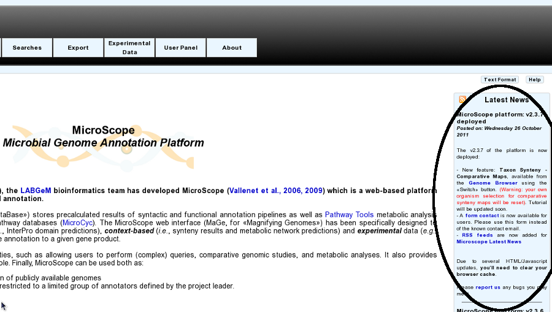

###########
Latest news
###########

How to be advised about MicroScope latest news?
-----------------------------------------------

As soon as we release a new version of the Platform (new features, improvements), or if LABGeM team needs to communicate some general information about the platform, an article will be added in the «Latest News» panel, available from the **platform’s homepage**.

Is there «RSS Feeds»?
---------------------

Yes, we provide «RSS Feeds» you can subscribe to by clicking on RSS pictures, available:

* in the footer of webpages:

..image:: img/img15.png

* in the «Latest News» panel:

..image:: img/img15.png
