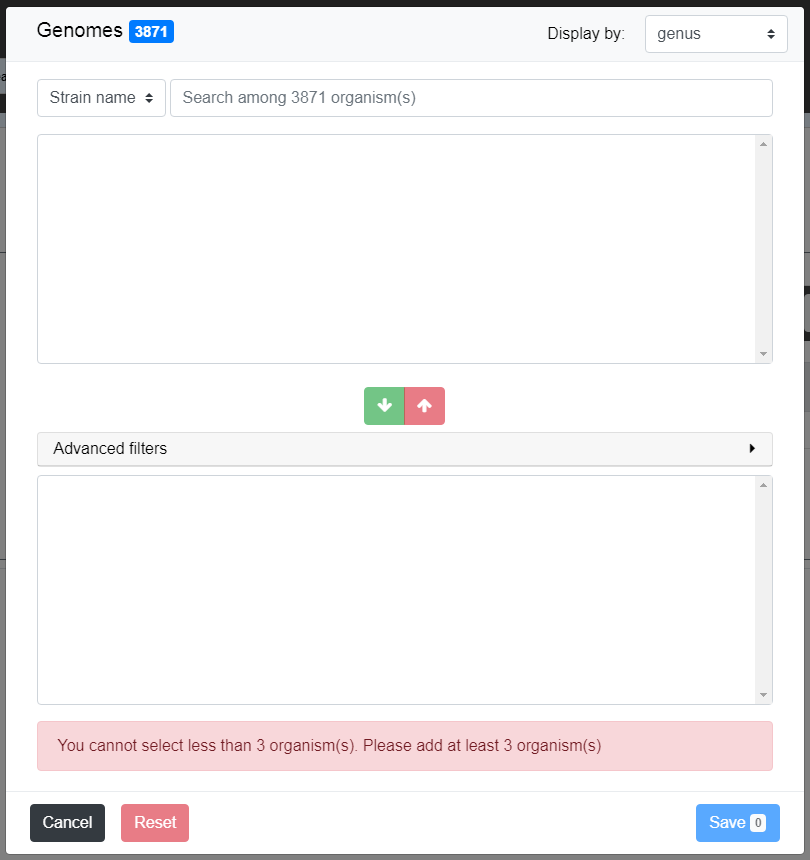
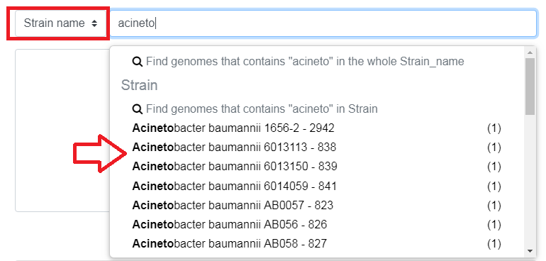
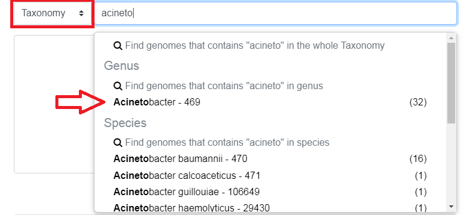
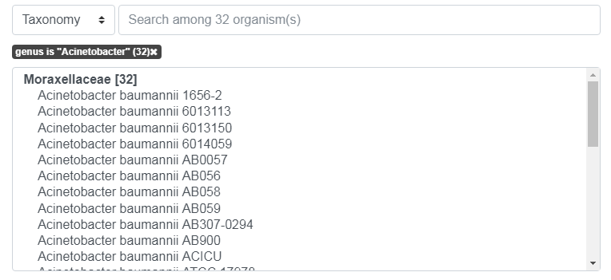
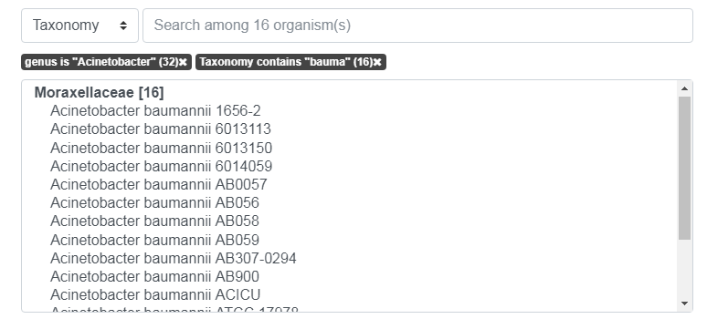
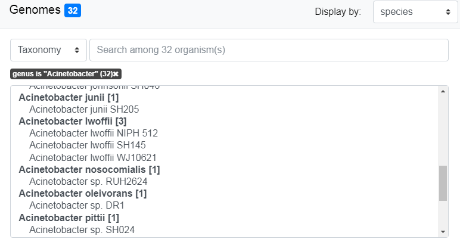
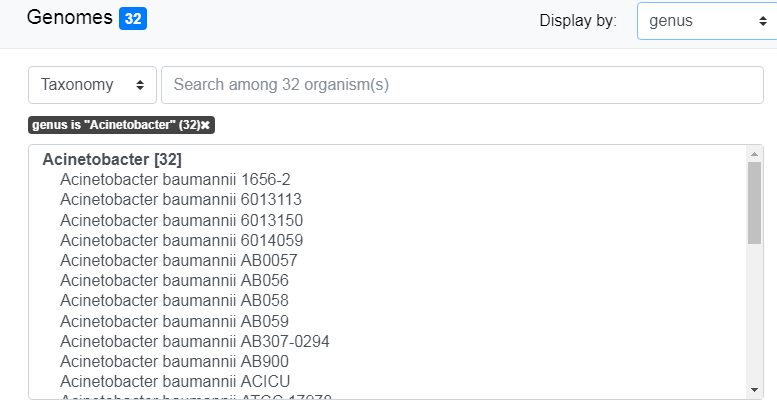

##################
Organism Selector
##################

.. _selector:

========
Overview
========

Since version 3.13.0, **MicroScope** use an internally developed organism selector.

.. image:: img/selector_close.PNG

===========================
Different kind of selector
===========================

There are two kind of complex selectors in the plateform for selection of **Genomes** or selection of **Sequence**.  

Selection of **Genomes** means you are going to select the entire organism including all the replicon.  

Selection of **Sequence** means you are going to select the replicon you want to work on.  

According to the tool you are willing to use, you may be asked to use one of the selector. They both work the same way and have to be use like describe bellow.

===============
Overall use
===============

.. image:: img/selector_partname.png

To open the selector, click on the edit button. 
You can now select your organism(s) by writing the organism name in the **search field**.
Select them by cliking on their name in the **pre-selection zone** (first selection zone) and 
use the green arrow to transfer them in the **selection zone** (second selection zone).
You may add more genome to the **selection zone** using the same mechanism, or remove some of them using the red button.
When satisfied by the organism list in the **selection zone**, you can use them for your analysis by clicking ont "Save".

=================
Step by Step use
=================

Once the selector is open, you have to find the organism(s) you are interested in by using the **search field**

=================
Pre-selection
=================

The **pre-selection zone** allows you to see all organisms accessible of the plateform and make filter on them before selecting them.

How the **search field** works ?
------------------------------------

Writing in the **search field**, will bring suggestions to you. These suggestions can be change by using the drop down menu on the left:

* - *Strain name*/*Sequence* filter by name of organism/sequence

* - *Taxonomy* filter by taxonomy search

* - *MICGC* allow to select an entire :ref:`micgc` (organism group)

What are the filters ?
------------------------------------

Using one of the suggestion will allow you to make filter, which is usefull to pre-select the organisms you will want to work on. Making a filter will put all the organisms following it in the **pre-selection zone**. You can add several filter to improve the accuracy of your pre-selection.

Here, we pre-select all the "Acinetobacter" and find 32 organisms.

We add to the "Acinetobacter" filter an other filter call "bauma" in order to select all the baumannii inside the Acinetobacter group. We pre-select 16 organisms.

What is the display menu ?
------------------------------------

You can change the display output of the **pre-selection zone** (and **selection zone**) by changing the value of the display drop down menu (top right of the screen).

The display by "species" with "Acinetobacter" filter active group all pre-selected organism by species.

The display by "genus" with "Acinetobacter" filter active show all the 32 organisms in one single group.

How to select my organisms of interest ?
-------------------------------------------

To select you organisms, move the mouse with the button down on the wanted organisms in the **pre-selection zone** (shift + click works too). Then press the green button to put them in the **selection zone**.

.. tip::
	* You can make your own filter by pressing *enter* at any time in the **search field**.
	* You can select the group of organism by double clicking on the bold tittle inside the **pre-selection zone**.

===================
Selection zone
===================

What is it for ?
------------------------------------

The **selection zone** is there to allow you to see all the selected organisms for the analysis.
You can remove some of them by moving the mouse with the button down and pressing the red button to remove them from the **selection zone**. If the active filter allow them, they will appear in the **pre-selection zone**.  

When you are satisfied with your selection, press the save button to continu the analysis.

What is "Advance filter" ?
------------------------------------

This part allow you to make filter in the **selection zone** to remove more efficiently organisms. It works exactly the same as the first **search field**.

=======================
Other functionalities
=======================

Cancel functionality
------------------------------------
This button cancels all the changes done in the current selector (*i.e* the list of selected organims is not changed).

Reset functionality
------------------------------------
The reset button will change both zones (**selection zone** and **pre-selection zone**) to their initial value (*i.e* when the page was opened).

Save functionality
------------------------------------

This button allows the save of your organisms/sequences list for further analysis.
