.. _selector:

.. TODO:
   We don't mention strain metadata for now because it's not in the public instance.
   See also :ref:`metadata`

#############################
Sequence and Genome selection
#############################

Since **MicroScope** version 3.13.0, the selection of sequences and genomes is based on a new selector
that has been designed to allow interactive and efficient selection of several sequences or genomes
in large lists.
It features selection based on several criteria and suggestions.

In this section, selection of **Genome** means that you are going to select the entire organism including all the replicons.
Selection of **Sequence** means that you are going to select the replicon you want to work on.
When talking indistinctly of genome or sequence, we use the term **object**.

Sequences and genomes come either from **MicroScope** (PkGDB) or from **NCBI RefSeq**.

There are two kinds of selectors in the platform (the :ref:`simple-selector` and the :ref:`advanced-selector`) which are described in the following sections.

Generally speaking a page use either a simple selector or 1 or 2 advanced ones.
For instance, the :ref:`keywords` page use a simple selector in single mode and
an advanced selector in multiple mode.

However, some pages use several selectors (of any type), using both **PkGDB** or **NCBI RefSeq**.
For instance, the :ref:`phyloprofile` page uses 4 advanced selectors (2 from **PkGDB** and 2 from **RefSeq**).

.. _simple-selector:

***************
Simple Selector
***************

This selector is used to select:

  - a single genome based on the strain name
  - a single sequence based on the sequence name

It's similar to the old selector in MicroScope but offers suggestions.

This selector is used in the homepage to select the reference genome
and more generally in pages where you must select a reference object (e.g. :ref:`lineplot`).

It is also used for instance in the following pages:

  - :ref:`pattern_searches` (for **Sequence Selection**)
  - :ref:`viewer` (for **Genome Selection** but coupled with a replicon selector)

Note that your :ref:`favourite organisms <favourite-organisms>` will always
show up first in this selector.

When the page opens, the selector is displayed like this (it may take some time to load):

Note that the exact appearance of this selector may depend on the page.

Example
=======

To select a reference genome on the home page,
type in some characters of its strain name.
A list of genomes matching this characters will open.
From this list, you can select the genome you want.

For example, if you type "escher", the following list will open:

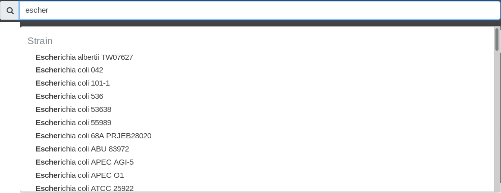

Note that the search is case-insensitive.

Also you can type any character (not just the beginning).
For example, if you type "k12", the following list will open:

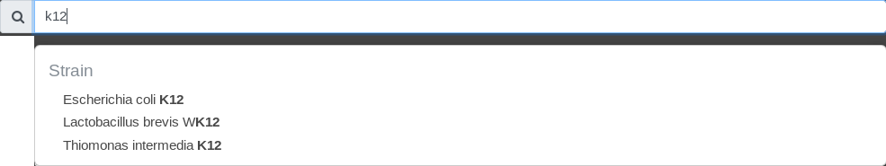

.. _advanced-selector:

*****************
Advanced Selector
*****************

This selector is used to select one or several objects based on a combination of search.

This selector is used for instance in the following pages:

  - :ref:`blast_searches` (for **Sequence Selection**)
  - :ref:`genoclust` (for **Genome Selection**)
  - :ref:`phyloprofile` (for **Genome Selection** and **Sequence Selection**)
  - :ref:`favourite-organisms` (for **Genome Selection**)

Overview
========

When the page opens, the selector is displayed like below (it may take some time to load):

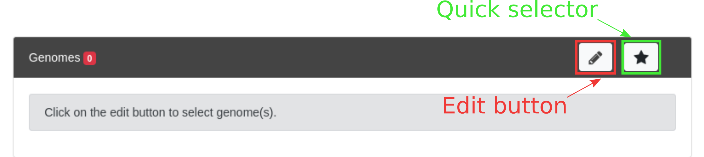

To start selecting objects click on the **Edit** button.
The selector opens as shown below:

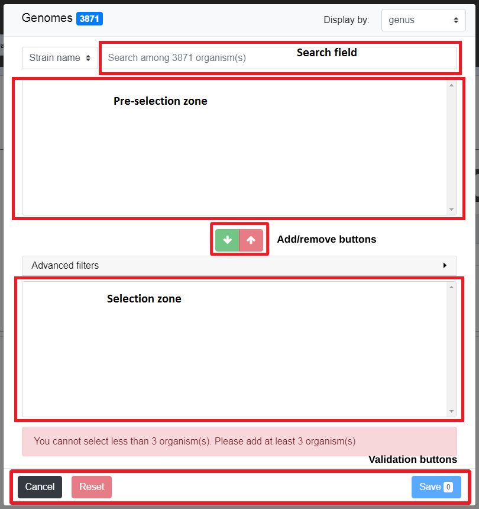

The window is divided in 5 parts:

  - the **Search Criterion** and **Search Field** are used to create filters on the list of objects from the data source; see :ref:`search-field-filters` for detailed explanation on those fields
  - the **Pre-selection Zone** is used to select objects among the filters results
  - the **Selection Zone** shows the list of currently selected objects
  - the **Add/Remove buttons** allows to transfer objects between the Pre-selection Zone and the Selection Zone

The general usage of the selectors is as follows.
You can use the **Search Criterion** and **Search Field** to filter
the list of all objects from the data source.

Filters can be constructed from:

 * the *Strain name* when selecting a genome or the *Sequence* when selecting a sequence
 * the *Taxonomy* of the object
 * the *MICGC* to which the object belong (see :ref:`genoclust`)
 * some *Metadata* about the species of the object (see :ref:`species_metadata`)

.. TODO: add strain metadata above

See :ref:`search-field-filters` for detailled explanation on filters.

The **Pre-selection Zone** will display the objects that match the filters.
You can then select objects from this list and add them to the **Selection Zone** with the **Add Button** (green arrow).

If you want to remove objects from the **Selection Zone**, select them and use the **Remove Button** (red arrow).
See :ref:`selection-zone` to learn more about the **Selection Zone** (including the use of filters in it).

You can use the **Pre-selection Zone** several times with different filters.
This allows to create more complex selections.

When satisfied with the list in the **Selection Zone**, click on **Save**.
The selection window will close and you will return to the page you are interested in
for further analysis.

The **Reset** button will revert both zones (**Selection Zone** and **Pre-selection Zone**)
to their initial value (*i.e.* when the page was opened).
The selection window stays open so you can restart the selection.

The **Cancel** button button cancels all the changes done in the current selector
(*i.e* the list of selected objects is not changed) and closes the selection window.

Example
=======

In this example, will we show how to use the advanced selector to select some genomes
from the phylum Actinobacteria and whose strain name contains some characters.

If you want to select sequences, the procedure is similar (the main difference being that the **Search Criterion** contains *Sequence* and not *Strain name*).

Select by taxonomy
------------------

The first step is to filter genomes in the Actinobacteria phylum.
To do so, open the selector and select *Taxonomy* in the **Search Criterion**.
Then type "actinobacteria" in the **Search Field**.
You will notice that suggestions are shown as you are typing.

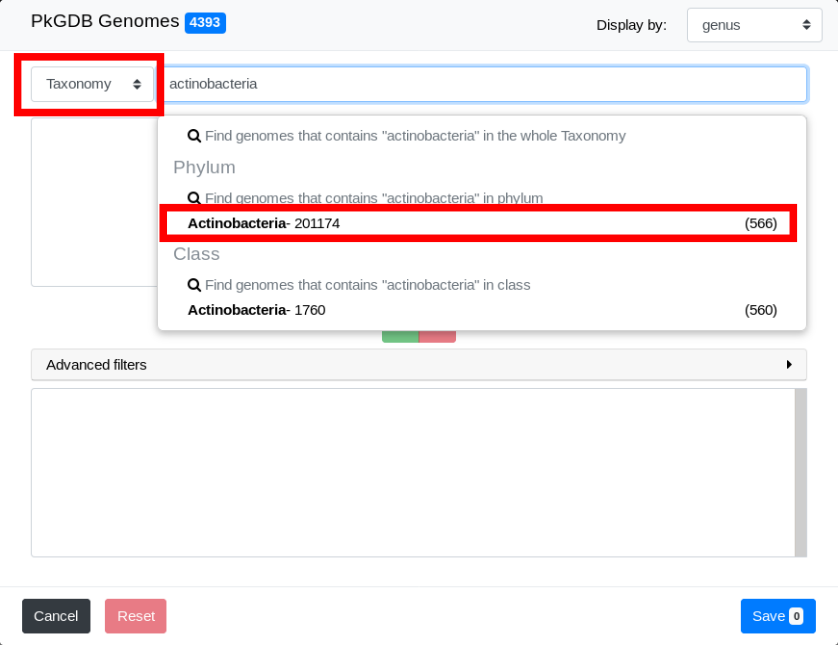

Filters are shown in the drop down list.
In taxonomy mode, filters can operate on any taxonomic level.
Click on "Actinobacteria".

The list of all genomes in the Actinobacteria phylum is now in the **Pre-selection Zone**. 

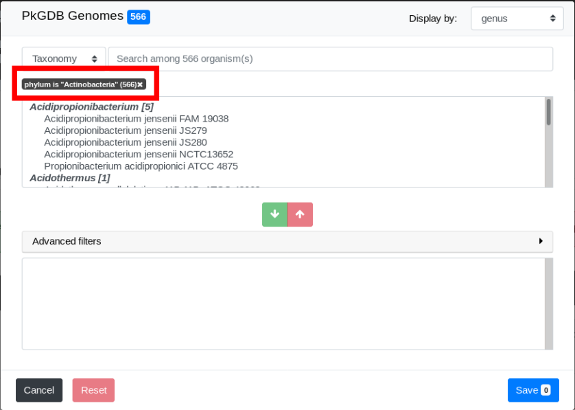

Note that the filter and the number of genomes filtered appear on the interface.
In this example, we have specified the phylum exactly.
Hence the filter is "phylum is 'Actinobacteria'".
See :ref:`search-field-filters` for more detailled explanations.

By default, genomes are grouped by Genus.
Use the "Display by" menu to group by phylum.

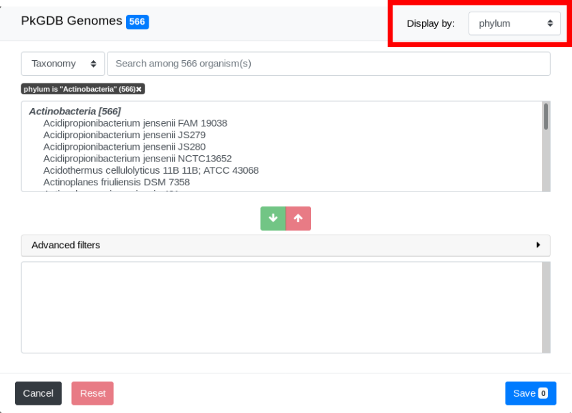

Select by strain name
---------------------

We will now select genomes whose strain name contains "bifi".
To do so, select *Strain name* in the **Search Criterion** and type "bifi" in the **Search Field**.

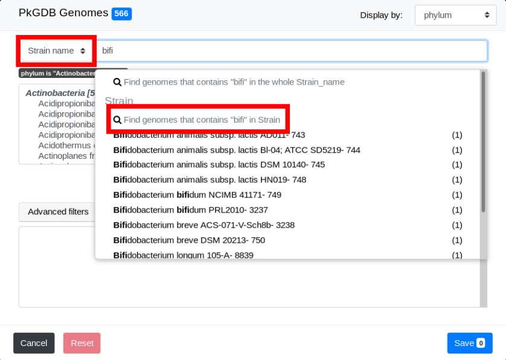

The list of genomes that match both filters is displayed:

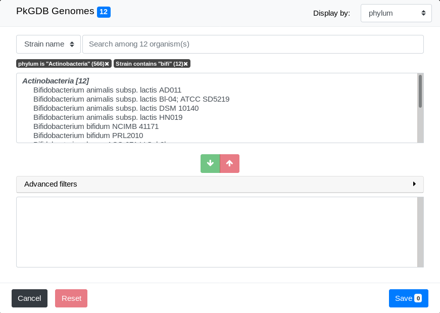

Final selection
---------------

We can now select some genomes from the filtered list in **Pre-selection Zone**.
To do so, simply select one of them by clicking on it and click on the **Add Button**.

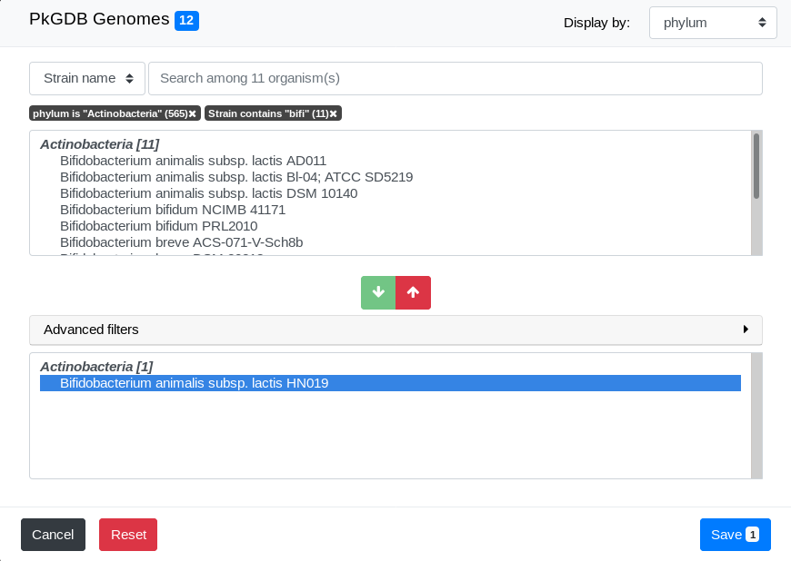

As you can see, the number of genomes in the **Pre-selection Zone** is updated.
See :ref:`select-objects-of-interest` for a detailled description of how to select them.

Congratulations, you have made your first advanced selection in MicroScope !
The rest of this page explains some details about the advanced selector.

Detailed description
====================

.. _search-field-filters:

The search field and the filters
--------------------------------

The **Search Criterion** allows to choose on which aspect you want to filter.
Typing in the **Search Field**, will bring suggestions.

* *Strain name*/*Sequence* filters by name of genome/sequence

  .. image:: img/selector_search.png

* *Taxonomy* filters by taxonomic (NCBI based) information

  .. image:: img/selector_search2.png

* *MICGC* filters objects in a MICGC (see :ref:`genoclust`)

* *Species metadata* filters by metadata about the species of the object

  .. image:: img/selector_search3.png

.. TODO: add strain metadata here

Those suggestions are in fact filters.
There are 2 kinds of filters:

  - partial filter (shown in red in the image below): the genus must contain "Acinetobacter"
  - exact filter (shown in green in the image below): the genus must be exactly "Acinetobacter"

Pressing *enter* at any time in the **Search Field** creates partial filter.

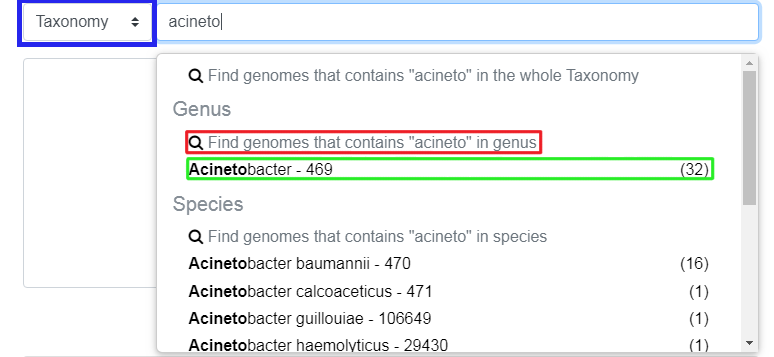

Clicking on a filter will add it.

You can add several filters to improve the accuracy of your pre-selection.

To remove a filter, click on the little "x" next to its name.

What is the display menu?
-------------------------

By default, objects in the **Pre-selection Zone** and **Selection Zone** are grouped by genus.
You can change this by modifying the value of the display drop down menu.

.. image:: img/selector_display.png

The display by "species" with "Acinetobacter" filter active will organize all pre-selected genome by species.

.. image:: img/selector_display2.png

The display by "genus" with "Acinetobacter" filter active will show all the 32 genomes in one single group.

.. _select-objects-of-interest:

How to select objects of interest?
----------------------------------

To select an object, move the mouse with the button down on the wanted genomes in the **Pre-selection Zone** (shift + click works too).
Then press the green button to put them in the **Selection Zone**.

.. tip::
   You can select the group of genome/sequence by double clicking on the bold tittle inside the **Pre-selection Zone**.

.. _selection-zone:

The selection zone
------------------

The **Selection Zone** is there to allow you to see all the selected object for the analysis.
You can remove some of them by moving the mouse with the button down and pressing the red button to remove them from the **Selection Zone**.
If the active filter allow them, they will appear in the **Pre-selection Zone**.

When you are satisfied with your selection, press the save button to continue the analysis.

What is "Advanced filter"?
--------------------------

This part allow you to make filter in the **Selection Zone** to remove objects more efficiently.
It works exactly the same as the first **search field**.
