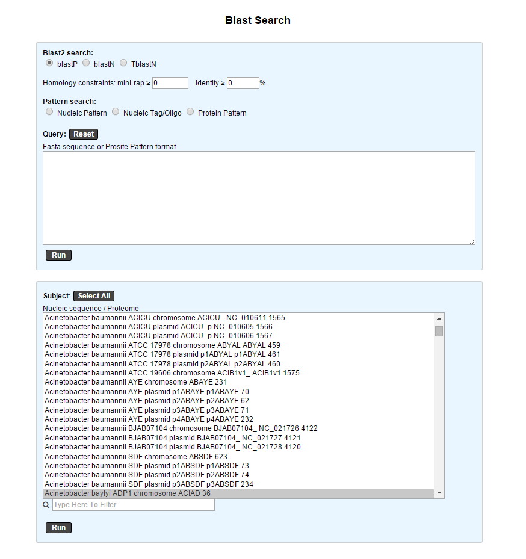
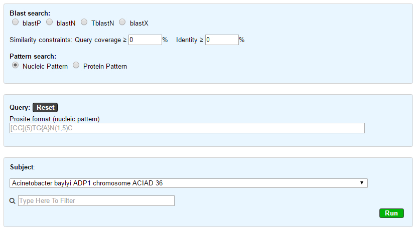

.. _blast_pattern_searches:

########################
Blast & Pattern Searches
########################

The Basic Local Alignment Search Tool finds regions of local similarity between sequences. The program compares nucleotidic or protein sequences to sequence(s) stored in our database (PkGDB), and it computes the statistical significance of matches. This interface allows the user to compare the sequences at the nucleic level (BlastN BlastX) or proteic level (BlastP and tBlastN) or to search for nucleic or proteic patterns (Prosite format).

.. _blast_searches:

**************
Blast Searches
**************

We use `ncbi-blast <https://blast.ncbi.nlm.nih.gov/Blast.cgi>`_ tools to run blast alignement. All query must be in fasta format.

**BlastN** run the user nucleotide query against nucleotide sequence in PkGDB.
 
**tBlastN** run the user protein query against nucleotide sequence in PkGDB (reverse translation).
 
**BlastP** run the user protein query against protein sequence in PkGDB.
 
**BlastX** run the user nucleotide query against protein sequence in PkGDB (translation).

The fields:

- % identity

- % query coverage (alignement length)/(query length)

can be use to filter blast result.   

This form use the advanced organism selector to select the reference organisms.
See :ref:`here <advanced-selector>` for help on how to use it.

.. _pattern_searches:

****************
Pattern Searches
****************

We use `EMBOSS <http://emboss.sourceforge.net/apps/>`_ tools to run pattern search (fuzznuc and fuzzpro). 

Protein and nucleic pattern search require a pattern in `prosite format <http://prosite.expasy.org/scanprosite/scanprosite_doc.html>`_ :

- The standard IUPAC one-letter codes for the amino acids are used.
- The symbol 'x' is used for a position where any amino acid is accepted (N for any nucleotide).
- Ambiguities are indicated by listing the acceptable amino acids for a given position, between square brackets '[ ]'. For example: [ALT]   stands for Ala or Leu or Thr.
- Ambiguities are also indicated by listing between a pair of curly brackets '{ }' the amino acids that are not accepted at a given         position. For example: {AM} stands for any amino acid except Ala and Met.
- Each element in a pattern is separated from its neighbor by a '-'.
- Repetition of an element of the pattern can be indicated by following that element with a numerical value or, if it is a gap ('x'), by   a numerical range between parentheses.
- When a pattern is restricted to either the N- or C-terminal of a sequence, that pattern either starts with a '<' symbol or respectively   ends with a '>' symbol. In some rare cases (e.g. PS00267 or PS00539), '>' can also occur inside square brackets for the C-terminal       element. 'F-[GSTV]-P-R-L-[G>]' means that either 'F-[GSTV]-P-R-L-G' or 'F-[GSTV]-P-R-L>' are considered.

Examples :

  * **[AC]-x-V-x(4)-{ED}**: this pattern is translated as: [Ala or Cys]-any-Val-any-any-any-any-{any but Glu or Asp}.

  * **< A-x-[ST](2)-x(0,1)-V**: this pattern, which must be in the N-terminal of the sequence ('<'), is translated as: Ala-any-[Ser or Thr]-[Ser or Thr]-(any or none)-Val.

  * **IIRIFHLRNI**: this pattern describes all sequences which contain the subsequence 'IIRIFHLRNI'.

  * **ATTCCAGATC**: this pattern describes all sequences which contain the subsequence 'ATTCCAGATC'.

