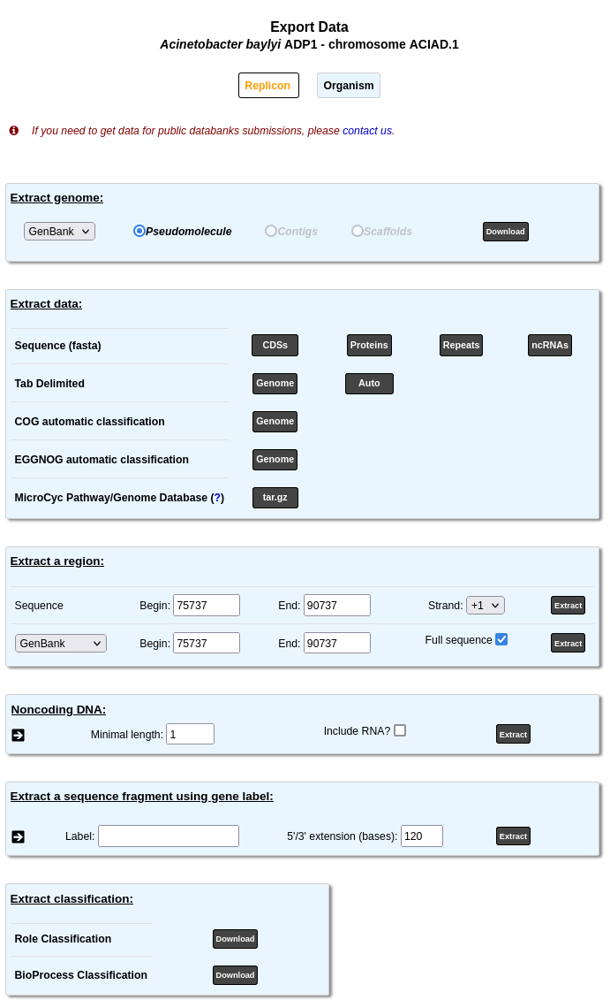
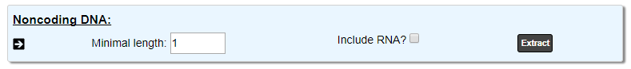
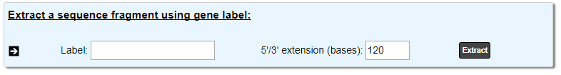
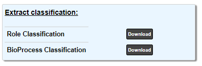
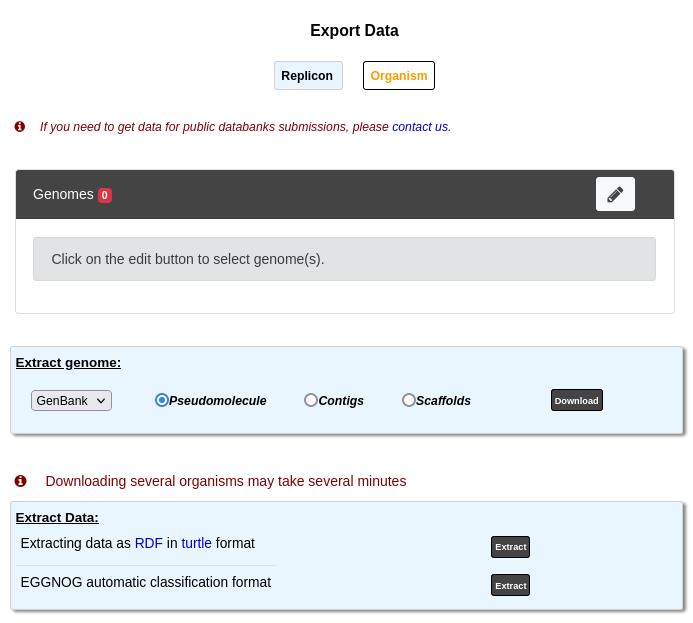

.. _export:

###########
Export Data
###########

This page allows to export data from MicroScope in several formats.
The page has 2 modes.
They are presented below with their export possibilities.

*************
Replicon mode
*************

This tool allows to retrieve data stored in PkGDB from a specific sequence.
These information can be downloaded in the most common file formats (EMBL, GenBank, Fasta, GFF, Tab delimited).
Moreover, data on role categories used in MicroScope, and/or MicroCyc metabolic Pathway/Genome database (PGDBs) can be downloaded too.
See below for a more precise presentation.

To use this mode, first, select a reference replicon from the :ref:`CHANGE button (Item #2) <interface-overview>` available in the top right corner of the interface.
Or select an organism from your :ref:`Favourite Organisms <favourite-organisms>` selection.

.. _export_replicon_genome:

Extract genome
==============

.. image:: img/download_extract_genome.png

This part allows you to download the sequence in various formats.
You can choose to extract:

* the pseudomolecule
* the contigs
* the scaffolds

Use the drop down list to choose the format among:
* `FASTA <http://www.ncbi.nlm.nih.gov/blast/fasta.shtml>`_
* `GENBANK <http://www.ncbi.nlm.nih.gov/genbank/>`_
* `EMBL <http://www.ebi.ac.uk/embl/Documentation/User_manual/usrman.html>`_
* `GFF3 <https://en.wikipedia.org/wiki/General_feature_format>`_.

Extract data
============

.. image:: img/download_extract_data.png

The first line of buttons allows to download several parts of the sequence (in the `FASTA <http://www.ncbi.nlm.nih.gov/blast/fasta.shtml>`_ format):

* **CDSs** will download the nucleic sequence of all the CDS of the sequence
* **Proteins** will download the proteic sequence of all the CDS of the sequence
* **Repeats** will download the nucleic sequence of the repeated regions of the sequence
* **ncRNAs** will download the nucleic sequence of all the non-coding RNAs of the sequence

The second line allows to extract the annotations (in tabulation delimited format):

* **Genome** will download the current annotation of all genomic objects in the sequence
* **Auto** will download the automatic annotation of all genomic objects in the sequence

The **Genome** button on the third line allows to download the :ref:`cog`.

The **Genome** button on the fourth line allows to download the :ref:`eggnog`.

Finally, you can obtain the :ref:`Microcyc pathways <microcyc>`.

Extract a region
================

.. image:: img/download_extract_region.png

The first line allows you to extract a region of the nucleic sequence: select the *Begin*, *End* positions and precise the strand you want to get.
The default values correspond to the region where the :ref:`Genome Browser <viewer>` is centered.
The data are exported in the `FASTA <http://www.ncbi.nlm.nih.gov/blast/fasta.shtml>`_ format.
Click on **Extract** to retrieve the results.

The second part allow you to extract the annotations of the objects in the region indicated by *Begin* and *End*.
With the **Full Sequence** option, you will obtain the annotation of the objects in the region with the coordinates on the full sequence.
If this option is disabled, you will obtain the annotation within the region but the location will be computed relatively to the region (in this case, the sequence of the region is included).
Use the drop down list to choose the format.

Noncoding DNA
=============

Extract the ncDNA sequences from a genome.
Indicate a minimal length and include, if necessary, the RNAs.

Extract a sequence fragment
===========================

This tool allows to  extract a sequence fragment by indicating the label of the Genomic Object to extract and the 5’/3’ extension length.

Extract Classification
======================

The **Role Classification** button allows to get the complete :ref:`Role Classification <mage-roles>` in a text format.

The **BioProcess Classification** button allows to get the complete :ref:`BioProcess Classification <mage-bioprocess>` in a text format.

*************
Organism mode
*************

This tool allows to retrieve data stored in PkGDB from a group of genomes.
Extraction of several genomes may take several minutes.
This page uses the :ref:`advanced-selector` to select the genomes to export.

The **Extract Genome** and **EGGNOG** parts are similar to the **Replicon** mode
except of course they retrieve information for all the selected genomes.

Therefore, we only describe the **Export Data as RDF** part is described.

Export Data as RDF
==================

.. image:: img/rdf_button_screenshot.png

Select one or several genomes to export data in RDF to load it for example in a SPARQL triplestore.

The RDF file format used by the MicroScope platform is the `Turtle format <https://www.w3.org/TR/turtle/>`_.

MicroScope Ontology
-------------------

.. image:: img/rdf_mso_diagram.svg
   :alt: MicroScope Ontology (see online documentation).

____________________________________________________________________________

.. figure:: img/rdf_example_partial_entities_diagram.svg
   :alt: Partial example of data representation using MicroScope Ontology (see online documentation).

   Partial example of data representation using MicroScope Ontology.

SPARQL Request examples
-----------------------

Prefixes
^^^^^^^^

.. code-block:: sparql

   PREFIX rdf: <http://www.w3.org/1999/02/22-rdf-syntax-ns#>
   PREFIX rdfs: <http://www.w3.org/2000/01/rdf-schema#>
   PREFIX xsd: <http://www.w3.org/2001/XMLSchema#>
   PREFIX mso: <https://mage.genoscope.cns.fr/microscope/ontology/#>
   PREFIX mage: <https://mage.genoscope.cns.fr/microscope/mage/info.php?id=>
   PREFIX dcterms: <http://purl.org/dc/terms/>
   PREFIX dc: <http://purl.org/dc/elements/1.1/>
   PREFIX obo: <http://purl.obolibrary.org/obo/>
   PREFIX skos: <http://www.w3.org/2004/02/skos/core#>
   PREFIX sio: <http://semanticscience.org/resource/>
   PREFIX faldo: <http://biohackathon.org/resource/faldo#>
   PREFIX up_core: <http://purl.uniprot.org/core/>
   PREFIX ec: <http://purl.uniprot.org/enzyme/>
   PREFIX ncbi_tax: <https://www.ncbi.nlm.nih.gov/Taxonomy/Browser/wwwtax.cgi?id=>
   PREFIX rh: <http://rdf.rhea-db.org/>
   PREFIX metacyc: <https://metacyc.org/META/NEW-IMAGE?type=NIL&object=>

Requests
^^^^^^^^

.. code-block:: sparql

    # All genes of an organism from its taxID
    # Organism: Acinetobacter sp. ADP1
    # Taxonomy ID: 62977
    SELECT DISTINCT ?genes WHERE {
        ?genes rdf:type obo:SO_0000704 ;
               obo:RO_0002162 ?org .
        ?org mso:taxon ncbi_tax:62977 .
    }

.. code-block:: sparql

    # All proteins of an organism from its taxID
    # Organism: Acinetobacter sp. ADP1
    # Taxonomy ID: 62977
    SELECT DISTINCT ?protein WHERE {
        ?transcript obo:SO_transcribed_from ?genes ;
                    obo:SO_translate_to ?protein .
        ?genes rdf:type obo:SO_0000704 ;
               obo:RO_0002162 ?org .
        ?org mso:taxon ncbi_tax:62977 .
    }

.. code-block:: sparql

    # All genes (and nucleic sequence), proteins (and amino acid sequence)
    # of an organism from its taxID
    # Organism: Acinetobacter sp. ADP1
    # Taxonomy ID: 62977
    SELECT DISTINCT ?genes ?protein ?desc ?nucSeq ?protSeq WHERE {
        ?genes rdf:type obo:SO_0000704 ;
               mso:hasSequence ?nucSeqObj ;
               obo:RO_0002162 ?org .
        ?org mso:taxon ncbi_tax:62977 .
        ?nucSeqObj rdfs:value ?nucSeq .
        ?transcript obo:SO_transcribed_from ?genes ;
                    obo:SO_translate_to ?protein .
        ?protein a mso:Protein ;
                 dc:description ?desc ;
                 mso:hasSequence ?protSeqObj .
        ?protSeqObj rdfs:value ?protSeq .
    }

.. code-block:: sparql

    # Get Gene-Protein-Reaction (GPR) associations
    # of an organism from its taxID
    # Organism: Acinetobacter sp. ADP1
    # Taxonomy ID: 62977
    SELECT DISTINCT ?genes ?protein ?reaction WHERE {
      ?transcript obo:SO_transcribed_from ?genes ;
                  obo:SO_translate_to ?protein .
      ?genes rdf:type obo:SO_0000704 ;
             obo:RO_0002162 ?org .
      ?org mso:taxon ncbi_tax:62977 .
      ?reaction mso:isCatalyzedBy ?protein .
    }
