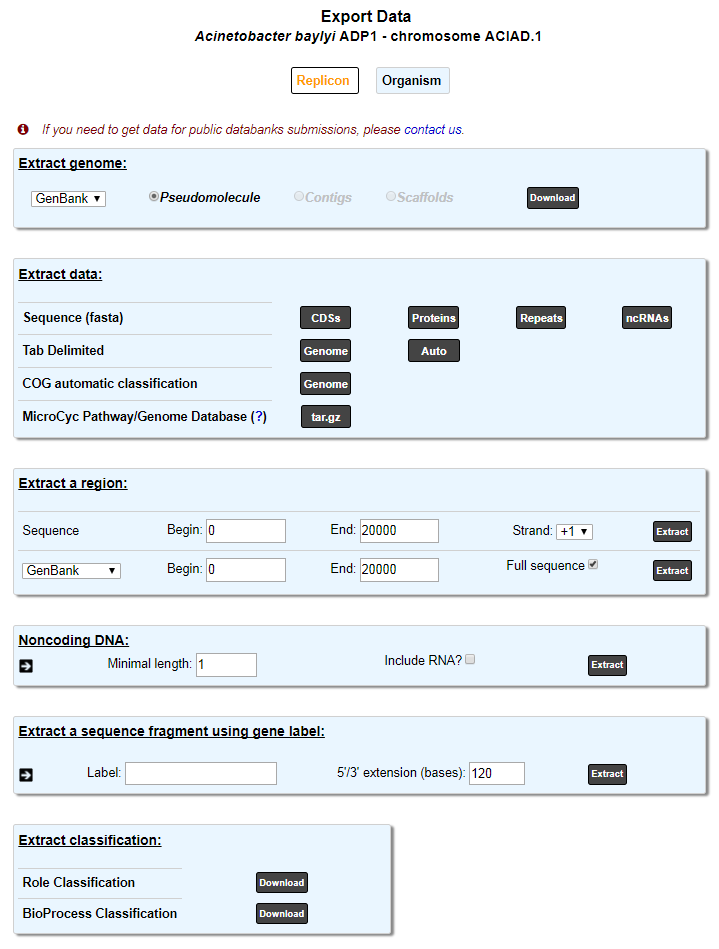
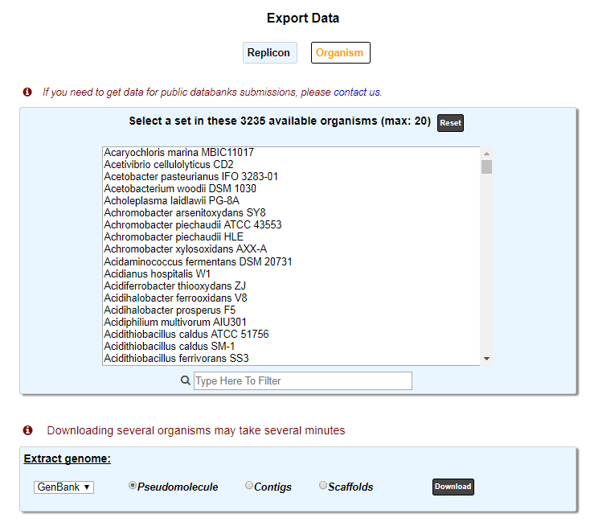
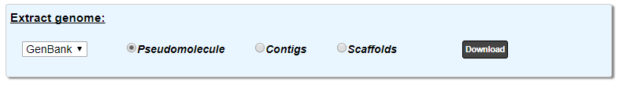
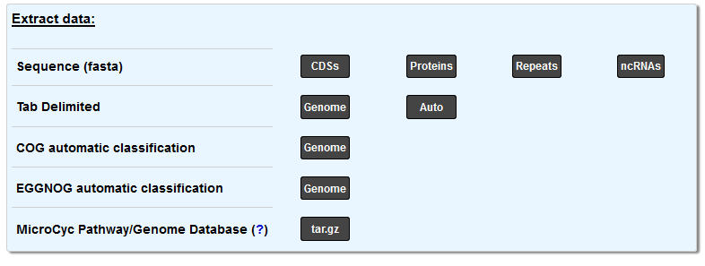
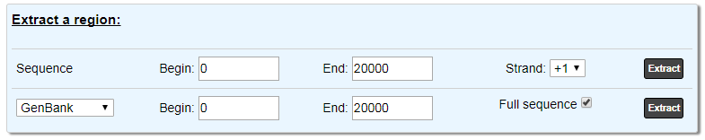
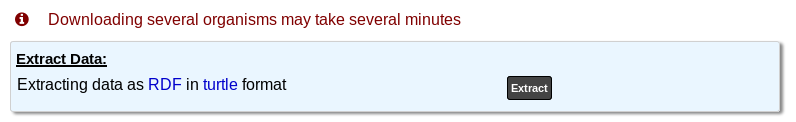

###########
Export Data
###########

Replicon mode
----------------------

This tool allows to retrieve from a specific organism data stored in PkGDB : complete sequences, non coding DNA, coding sequences (nucleic or proteic), annotated data on genomic objects.

These information can be downloaded in the most common file formats (EMBL, GenBank, Fasta, GFF, Tab delimited). Moreover, data on role categories used in MicroScope, and/or MicroCyc metabolic Pathway/Genome database (PGDBs) can be downloaded too.

First, select a reference replicon from the :ref:`CHANGE button (Item #2) <interface>` available in the top right corner of the interface. Or select an organism from your :ref:`Favourite Organisms <favourite-organisms>` selection.

Organism mode
---------------------

This tool allows to retrieve from a group of organism sequences data stored in PkGDB. Extraction of several organisms may take several minutes.

Extract genome:
-------------------

In both mode, you can extract the genome(s):

* Pseudomolecule (all the genomes)
* Contigs (genomes split by contigs)
* Scaffolds (genomes split by scaffolds)

In all the formats: `FASTA <http://www.ncbi.nlm.nih.gov/blast/fasta.shtml>`_, `GENBANK <http://www.ncbi.nlm.nih.gov/genbank/>`_,  `EMBL <http://www.ebi.ac.uk/embl/Documentation/User_manual/usrman.html>`_, `GFF3 <https://en.wikipedia.org/wiki/General_feature_format>`_

Extract data:
-------------------

In replicon mode, you can extract in `FASTA <http://www.ncbi.nlm.nih.gov/blast/fasta.shtml>`_:

* CDSs (All the CDS of the genome in nucleic)
* Proteins (All the CDS of the genome in proteic)
* Repeats (All the repeat region of the genome in nucleic)
* ncRNAs (All the non-coding RNA of the genome in nucleic)

You can also extract in Tabulation delimited format:

* Genome (All the current genomic objects annotation)
* Auto (All the automatic genomic objects annotation)

You can download COG automatic classification (http://www.ncbi.nlm.nih.gov/COG/):

* Genome (All the COG automatic annotation)

You can download EGGNOG automatic classification (http://eggnogdb.embl.de/#/app/home) (Also available in Organism mode):

* Genome (All the EGGNOG automatic annotation)

finally, you can obtain the `Microcyc pathway <https://biocyc.org/download.shtml>`_

Extract region:
-------------------

* Select the *Begin*, *End* positions and precise the strand you want to get. The default values correspond to the region where the :ref:`Genome Browser <viewer>` is centered.

The **Sequence** part allow you to extract the sequence (nucleic) in fasta format in the coordinate.

The second part allow you  to extract the annotation in different format (genbank, embl, gff3, tabulation).

Activating the **Full sequence** option allow you to obtain the whole genome sequence with the annotation of the objects within the coordinates.
If this option is disable, you will obtain the genome sequence and the annotation within the coordinate, the annotation location will be recalculate.

Noncoding DNA
-------------

.. image:: img/download_extract_ncrna.PNG

Extract the ncDNA sequences from a genome. Indicate a minimal length and include, if necessary, the RNAs.

Extract a sequence fragment
---------------------------

.. image:: img/download_extract_label.PNG

You can extract a sequence fragment:

* Indicate directly a Genomic Object Label to extract and manage, if necessary, the 5’/3’ extension length.

Extract Classification
---------------------------

.. image:: img/download_extract_classification.PNG

Get the complete :ref:`Role Classification <mage-roles>` in a text format.

Get the complete :ref:`BioProcess Classification <mage-bioprocess>` in a text format.

Export Organism Data to RDF
---------------------------

Select one or several organisms to export data in RDF to load it for example in a SPARQL triplestore.

The RDF file format used by MicroScope platform is the `Turtle format <https://www.w3.org/TR/turtle/>`__.

MicroScope Ontology
^^^^^^^^^^^^^^^^^^^

.. image:: img/rdf_mso_diagram.svg
   :alt: MicroScope Ontology (see online documentation).

____________________________________________________________________________

.. figure:: img/rdf_example_partial_entities_diagram.svg
   :alt: Partial example of data representation using MicroScope Ontology (see online documentation).

   Partial example of data representation using MicroScope Ontology.

SPARQL Request examples
^^^^^^^^^^^^^^^^^^^^^^^

Prefixes
"""""""""

.. code-block:: sparql

   PREFIX rdf: <http://www.w3.org/1999/02/22-rdf-syntax-ns#>
   PREFIX rdfs: <http://www.w3.org/2000/01/rdf-schema#>
   PREFIX xsd: <http://www.w3.org/2001/XMLSchema#>
   PREFIX mso: <https://mage.genoscope.cns.fr/microscope/ontology/#>
   PREFIX mage: <https://mage.genoscope.cns.fr/microscope/mage/info.php?id=>
   PREFIX dcterms: <http://purl.org/dc/terms/>
   PREFIX dc: <http://purl.org/dc/elements/1.1/>
   PREFIX obo: <http://purl.obolibrary.org/obo/>
   PREFIX skos: <http://www.w3.org/2004/02/skos/core#>
   PREFIX sio: <http://semanticscience.org/resource/>
   PREFIX faldo: <http://biohackathon.org/resource/faldo#>
   PREFIX up_core: <http://purl.uniprot.org/core/>
   PREFIX ec: <http://purl.uniprot.org/enzyme/>
   PREFIX ncbi_tax: <https://www.ncbi.nlm.nih.gov/Taxonomy/Browser/wwwtax.cgi?id=>
   PREFIX rh: <http://rdf.rhea-db.org/>
   PREFIX metacyc: <https://metacyc.org/META/NEW-IMAGE?type=NIL&object=>

Requests
""""""""

.. code-block:: sparql

    # All genes of an organism from its taxID
    # Organism: Acinetobacter sp. ADP1
    # Taxonomy ID: 62977
    SELECT DISTINCT ?genes WHERE {
        ?genes rdf:type obo:SO_0000704 ;
               obo:RO_0002162 ?org .
        ?org mso:taxon ncbi_tax:62977 .
    }

.. code-block:: sparql

    # All proteins of an organism from its taxID
    # Organism: Acinetobacter sp. ADP1
    # Taxonomy ID: 62977
    SELECT DISTINCT ?protein WHERE {
        ?transcript obo:SO_transcribed_from ?genes ;
                    obo:SO_translate_to ?protein .
        ?genes rdf:type obo:SO_0000704 ;
               obo:RO_0002162 ?org .
        ?org mso:taxon ncbi_tax:62977 .
    }

.. code-block:: sparql

    # All genes (and nucleic sequence), proteins (and amino acid sequence)
    # of an organism from its taxID
    # Organism: Acinetobacter sp. ADP1
    # Taxonomy ID: 62977
    SELECT DISTINCT ?genes ?protein ?desc ?nucSeq ?protSeq WHERE {
        ?genes rdf:type obo:SO_0000704 ;
               mso:hasSequence ?nucSeqObj ;
               obo:RO_0002162 ?org .
        ?org mso:taxon ncbi_tax:62977 .
        ?nucSeqObj rdfs:value ?nucSeq .
        ?transcript obo:SO_transcribed_from ?genes ;
                    obo:SO_translate_to ?protein .
        ?protein a mso:Protein ;
                 dc:description ?desc ;
                 mso:hasSequence ?protSeqObj .
        ?protSeqObj rdfs:value ?protSeq .
    }

.. code-block:: sparql

    # Get Gene-Protein-Reaction (GPR) associations
    # of an organism from its taxID
    # Organism: Acinetobacter sp. ADP1
    # Taxonomy ID: 62977
    SELECT DISTINCT ?genes ?protein ?reaction WHERE {
      ?transcript obo:SO_transcribed_from ?genes ;
                  obo:SO_translate_to ?protein .
      ?genes rdf:type obo:SO_0000704 ;
             obo:RO_0002162 ?org .
      ?org mso:taxon ncbi_tax:62977 .
      ?reaction mso:isCatalyzedBy ?protein .
    }
