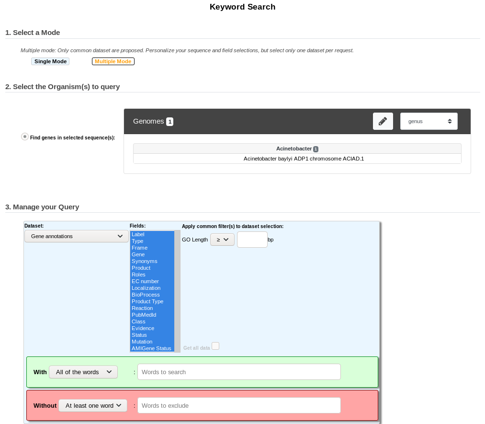
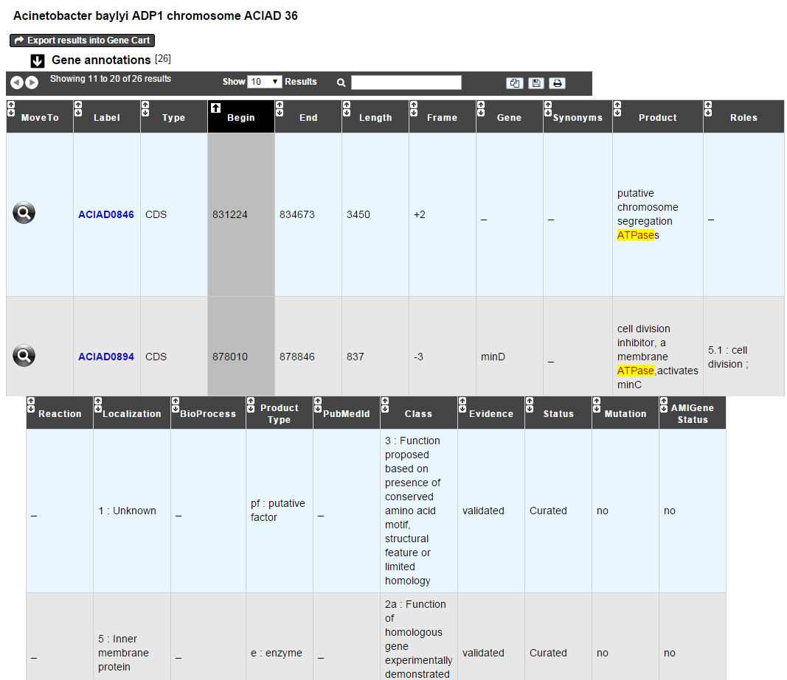
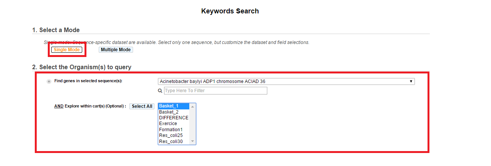
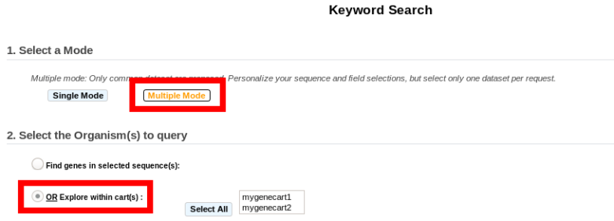
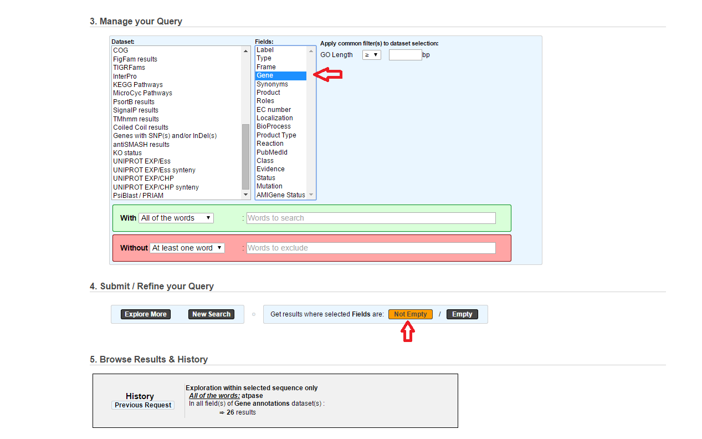

.. _keywords:

####################
Keywords Search Tool
####################

What are Single/Multiple Modes?
-------------------------------

* **The Single Mode**: This mode is sequence-specific. It means that you can perform a keywords search within a single sequence at once, but it allows the annotator to search within one or multiple dataset at a time for the selected sequence.
* **The Multiple Mode**: In the contrary, the Multiple Mode allows the annotator to explore by keywords the annotations of several sequences at a time, but within one dataset at once.

.. _interface:

How to read the interface?
--------------------------

The Single Mode
~~~~~~~~~~~~~~~

.. image:: img/search_by_keyword.png
	:width: 100%

* **Item #1**. Replicon selection. The search will be performed on this replicon’s annotations.
  This interface uses the simple selector (in **Sequence Selection** mode).
  See :ref:`here <simple-selector>` for help on this selector.
* **Item #2**. Gene Carts selection, for searching within their content. (optional)
* **Item #3**. Dataset selection (see :ref:`datasets`).
* **Item #4**. Fields selection (see :ref:`fields`).
* **Item #5**. Optional Filters (see :ref:`filters`).
* **Item #6**. Search all data of the selected dataset for the chosen replicon (*Get all data*).
* **Item #7**. Words you want to match (options: *All the words / At least one word / Exact phrase*).
* **Item #7**. Words you don’t want to match (options: *All the words / At least one word / Exact phrase*).

The Multiple Mode
~~~~~~~~~~~~~~~~~
 

The interface is rather similar but uses the advanced selector (in **Sequence Selection** mode).
See :ref:`here <advanced-selector>` for help on how to use this selector.

.. _datasets:

What about the Dataset?
-----------------------

The available dataset list is project-specific, even if the main part of dataset list is common to all projects. Each dataset corresponds to a specific type of data in our database, PkGDB.

Some dataset refers to the central table of PkGDB and will return a list of candidate genes matching the keywords search for the selected sequence (Gene Annotations, MaGe Curated Annotations, etc.).
Some others will match a set of reference annotations showing similarities with the selected sequence (Escherichia coli, Bacillus subtilis, etc.), or will refer to relational tables of PkGDB containing the results of a specific method (Swissprot, TrEMBL, InterPro, TMHMM results, etc.).
In the last two cases, the functional annotation of the candidate genes may differ from those in the selected hit.

The use of a given dataset over another one will depend of the kind of data the annotator looks for.

The common dataset are these ones:

1. **Gene annotation or features:**

* **Gene Annotations**: allows to search into automatic and expert annotations (validated genes) of a selected sequence.
* **MaGe Curated Annotations**: for searching within only all validated genes.
* **My Annotated Genes**: for searching only within your own validated genes.
* **Databank/Automatic Annotations**: refers to annotations from databank files or from our annotation pipeline.
* **Genomic Object Features**: will return the gene or protein features such as GC%, MW, Pi, etc.
* **Annotation Comments**: allows to search within the Comments specific field of the Gene Editor.
* **Annotation Note**: Same as above, but within the Note field of the Gene Editor.
* **Gene essentiality status**: essentiality of the genes according to experimental data from mutant collections.

2. **Comparative results on reference Annotations**:

* **Genomes of the Project**: will return BlastP/Synteny results of your selected sequence against the set of genomes of the MicroScope project where the selected sequence is involved to.
* **Escherichia coli**: will return BlastP/Synteny results of your selected sequence against Escherichia coli expert annotations.
* **Bacillus subtilis**: will return BlastP/Synteny results of your selected sequence against Bacillus subtilis expert annotations.
* **DB of essential gene results**: will return genes of your selected sequence matching Essential gene entries

3. **Comparative or funtional methods results:**

* **Putative Enzyme in Synteny**: will return genes of your selected sequence which are annotated as Putative Enzyme and involved in a synteny.
* **CHP in Synteny**: will return genes of your selected sequence annotated as Conserved Hypothetical Protein and involved in a synteny.
* **SwissProt**: will return genes of your selected sequence matching UniProtKB/SwissProt entries (by using alignments constraints). UniProtKB/Swiss-Prot (reviewed) is a high quality manually annotated and non-redundant protein sequence database, which brings together experimental results, computed features and scientific conclusions.
* **SwissProt EXP**: will return genes of your selected sequence matching UniProtKB/SwissProt entries (by using alignments constraints) which have publications with experimental results about the enzymatic function. It is a subset of **SwissProt** dataset.
* **TrEMBL**: will return genes of your selected sequence matching UniProtKB/TrEMBL entries (by using alignments constraints). UniProtKB/TrEMBL (unreviewed) contains protein sequences associated with computationally generated annotation and large-scale functional characterization.
* **TrEMBL EXP**: will return genes of your selected sequence matching UniProtKB/TrEMBL entries (by using alignments constraints) which have publications with experimental results about the enzymatic function. It is a subset of **TrEMBL** dataset.
* **UniFIRE**: `UniFire <https://www.uniprot.org/help/automatic_annotation>`_ (the UNIprot Functional annotation Inference Rule Engine) is a tool to apply the UniProt annotation rules.
* **KOfamScan**: will return genes of your selected sequence having KEGG Ortholog entries (KO) predicted by KOfamScan.
* **COG**: will return genes of your selected sequence involved in a `COG <http://www.ncbi.nlm.nih.gov/COG/>`_ (Clusters of Orthologous Groups of proteins).
* **FigFam results**: will return genes of your selected sequence associated with `FigFam <http://seed-viewer.theseed.org/seedviewer.cgi?page=FigFamViewer>`_ results.
* **TIGRFams**: will return genes of your selected sequence matching TIGRFams entries
* **InterPro**: will return genes of your selected sequence matching InterPro entries
* **KEGG Pathways**: will return genes of your selected sequence matching KEGG Pathways entries
* **MicroCyc Pathways**: will return genes of your selected sequence matching MicroCyc Pathways entries
* **PsortB Results**: will return genes of your selected sequence matching PSortB entries
* **SignalP Results**: will return genes of your selected sequence matching SignalP entries
* **TMHMM Results**: will return genes of your selected sequence matching TMHMM entries
* **Coiled Coil Results**: will return genes of your selected sequence that code for proteins with a coiled coil structure
* **Genes with SNP(s) and/or InDel(s)**: will return genes of your selected sequence having SNP(s) and/or InDel(s)
* **antiSMASH results**: will return genes of your selected sequence being part of a biosynthetic gene cluster predicted by antiSMASH
* **Resistome results**: will return genes of your selected sequence matching described antibiotic resistance entries
* **Virulome results**: will return genes of your selected sequence matching described virulence factor entries
* **LipoP results**: will return genes of your selected sequence corresponding to putative lipoproteins according to LipoP method
* **dbCAN results**: will return genes of your selected sequence matching carbohydrate active enzyme entries classified by dbCAN
* **IntegronFinder results**: will return genes of your selected sequence being part of an integron predicted by IntegronFinder
* **MacSyFinder results**: will return genes of your selected sequence being part of a macromolacular gene cluster predicted by MacSyFinder
* **PanRGP results**: will return genes of your selected sequence being part of a region of genomic plasticity predicted by :ref:`panRGP`

.. _fields:

What are the Fields?
--------------------

Fields are data subgroups in a given dataset. Fields refer to specific data for a given dataset.

Example: the Label field of the Gene Annotation dataset refers to the Genomic Objects Labels. If you select this field, the system will look for your keywords into the Label data contained in our databases.

.. tip:: if you’re not sure about the specific Fields you should have to select in order to get some results, feel free to select by default all of the fields. With some practice, you will know how to refine your Field(s) selection in order to search for particular data.

.. _filters:

What are Filters?
-----------------

The Filters are useful to restrict the results by using some specific numeric data, such as an Isoelectric Point value, a given length for a CDS, an Identity % value, a minLrap / maxLrap value, etc.

Filters are specific to a given dataset and their use are optional. Also it is possible to search for results by using only Filters fields, without filling some keywords in the With or Without fields.

How to read the With / Without keyword fields and their options?
----------------------------------------------------------------

* **WITH field**: Fill the text area with the keyword(s) you’re looking for. If the keyword matches some data contained in the Field(s) selection, the corresponding Genomic Object(s) will be displayed as result(s). 3 options are available:

	* **All of the words**: *All of the keywords* filled in the text area must match the data contained in the Field(s) selection in order to get a result.
	* **At least one word**: *At least one of the keywords* filled in the text area must match the data contained in the Field(s) selection in order to get a result.
	* **Exact phrase**: The system will look for the keywords or the sentence, *with an exact syntax*, into the data contained in the Field(s) selection. This option is very selective.

* **WITHOUT field**: Fill the text area with the keyword(s) you want to *exclude* from the potential results. If the keyword matches some data contained in the Field(s) selection, the corresponding Genomic Object(s) will **NOT** be displayed as result(s). 3 options are available:

	* **All of the words**: if *all of the keywords* filled in the text area match the data contained in the Field(s) selection, the corresponding Genomic Object will be excluded from results.
	* **At least one word**: if *at least one of the keywords* filled in the text area match the data contained in the Field(s) selection, the corresponding Genomic Object will be excluded from results.
	* **Exact phrase**: if the keywords or the sentence, *with an exact syntax*, match the data contained in the Field(s) selection, the corresponding Genomic Object will be excluded from results.

How to perform a search
-----------------------

Single Mode
~~~~~~~~~~~

	* **1**. Select the reference replicon you want to explore (see **Item #1** :ref:`here <interface>`)
	* **2**. Select eventually one or more Gene(s) Cart(s) (see **Item #2** :ref:`here <interface>`, optional).

.. note:: If you select some Gene Carts, two constraints will be applied: the reference sequence previously selected AND the Gene Carts content. This means that if you select Acinetobacter baylyi ADP1 as reference sequence and then select some Gene Carts, the search will be performed on the Genomic Objects 1) contained in the Gene Cart(s) AND 2) belonging to Acinetobacter baylyi ADP1. If some of your Gene Carts contain Genomic Objects that do not belong to Acinetobacter baylyi ADP1, the search process will ignore them.

	* **3**. Select one or more data of interest (see **Item #3** `:ref:`here <datasets>`). If you select more than one Dataset, the Fields select menu will be unavailable.
	* **4**. Eventually, restrict the Fields to a specific selection (see **Item #4** :ref:`here <datasets>`, optional). By default, select all of the Fields.
	* **5**. Eventually, specify your own Filters values (see **Item #5** :ref:`here <datasets>`, optional). By default, leave the fields empty. If you select several Dataset, only the common Filters to these Dataset will be available.
	* **6**. Fill the **With** (see **Item #7** :ref:`here <interface>`) or **Without** (see **Item #8** :ref:`here <interface>`) keywords fields.

.. note:: To perform a search, you need to fill at least one of these fields: (**With**, **Without**, and / or **Filters**) or use (**Item #6** :ref:`here <interface>`) when it's active.

	* **7**. Click on the **SEARCH** button.
	* **8**. Browse the results. Matched keywords will be highlighted in yellow.
	* **9**. Eventually, proceed to a Refined Search from the previous results, or :ref:`export the results into a Gene Cart <genecarts>`.

Multiple Mode
~~~~~~~~~~~~~

	* **1**. Select one or more reference replicon(s) you want to explore (see **Item #1** :ref:`here <interface>`) **OR** select one or more Gene(s) Cart(s) (see **Item #2** :ref:`here <interface>`, optional).

.. note:: Unlike the Single Mode, the Multiple Mode allows the user to perform a search within several replicons at a time. This means that you should use the Multiple Mode if you want to perform a search within a Gene Cart containing Genomic Objects from different organisms.

	* **2**. Select the Dataset of interest (see **Item #3** :ref:`here <interface>`) (only one Dataset at a time in this mode).
	* **3**. Eventually, restrict the Fields to a specific selection (see **Item #4** :ref:`here <interface>`, optional). By default, select all of the Fields.
	* **4**. Eventually, specify your own Filters values (see **Item #5** :ref:`here <interface>`, optional). By default, leave the fields empty.
	* **5**. Fill the With (see **Item #7** :ref:`here <interface>`) or Without (see **Item #8** :ref:`here <interface>`) keywords fields.

.. note:: To perform a search, you need to fill at least one of these fields: (**With**, **Without**, and / or **Filters**) or use (see **Item #6** :ref:`here <interface>`) when it's active.

	* **6**. Click on the **SEARCH** button.
	* **7**. Browse the results. Matched keywords will be highlighted in yellow.
	* **8**. Eventually, proceed to a Refined Search from the previous results, or :ref:`export the results into a Gene Cart <genecarts>`.

How to refine a search?
-----------------------

* After having performed a search and assuming you got some results, you can choose to extract some data about the genes within your set of results by using the **Get Genes** button.

* After having performed a search and assuming you got some results, you can choose to refine them by proceeding a new search within this set of results. For this, you have to proceed the exact same way than previously, except you’ll have to click on the **EXPLORE MORE** button instead of the **NEW SEARCH** one. By doing this, a **Get Genes** will be perform, and the genes within your previous set of result will be provide as input of your current search. This method provides a good way to refine successively a set of candidate genes.

How to read search results?
---------------------------

Your search results will be displayed in a tab:

* **MoveTo**: If you click on the magnifying lense, the Genome Browser will popup for this Genomic Object
* **Label**: it gives you the label of the genomic object. If you click on it, the Gene Annotation Editor will popup for this Genomic Object
* **Type**: CDS, fCDS, tRNA, rRNA misc_RNA...
* **Begin**: begin position of the genomic object on the sequence
* **End**: end position of the genomic object on the sequence
* **Lenght**: length of the genomic object, in nucleotides
* **Frame**: reading frame of the genomic object
* **Gene**: gene name if any
* **Synonyms**: alternative name for the gene (if any)
* **Product**: product description of the protein
* **Roles**: functional categories associated with the protein using the Roles functional classification
* **EC Number**: EC number associated with the protein, if any
* **Reaction**: if any, gives the reactions implying the database protein (reactions given by Rhea and MetaCyc)
* **Localization**: cellular localization of the protein
* **BioProcess**: functional categories associated with the protein using the BioProcess functional classification
* **Product Type**: description of the product type of the protein
* **PubMed ID**: PubMed references linked to the annotation of the protein
* **Class**: indicates the class of the annotation (see :ref:`here <mage_class_field>` for more information).
* **Evidence**: indicates if the annotation is automatic or manually validated
* **Status**:  indicates the status of the expert annotation. (see :ref:`here <mage_status>` for more information)
* **Mutation**: indicates if there is or no a mutation on the gene
* **AMIGene Status**: no/Wrong/New

How to export and save results in a Gene Cart?
----------------------------------------------

Once you get some results, an **EXPORT TO GENE CART** button will be available above the results list. Click on this button and follow the instructions about the Gene Cart functionality.

How to explore within a Gene Cart content?
------------------------------------------

**Single mode**: once you've selected your organism, select the Gene Cart you want to explore. Then click on "Search".

**Multiple mode**: select "OR Explore within cart(s)", then click on the Gene Cart(s) you want to explore. Finally, click on "Search"

What are the Empty/Not Empty Buttons?
-------------------------------------

Those buttons allow you to get results where the selected fields are empty/not empty. For example, you're looking for all the genes that have the word "ATPase" in their product name, and amongst those results you only want to get those which have the "Gene" field completed. For this purpose, after searching for "ATPase" and seeing the results of your query, you have to select the "gene" field, and then click on the "Not empty" button.

