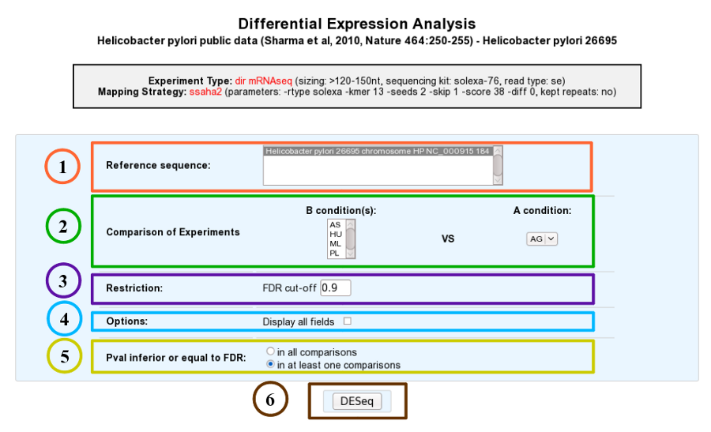
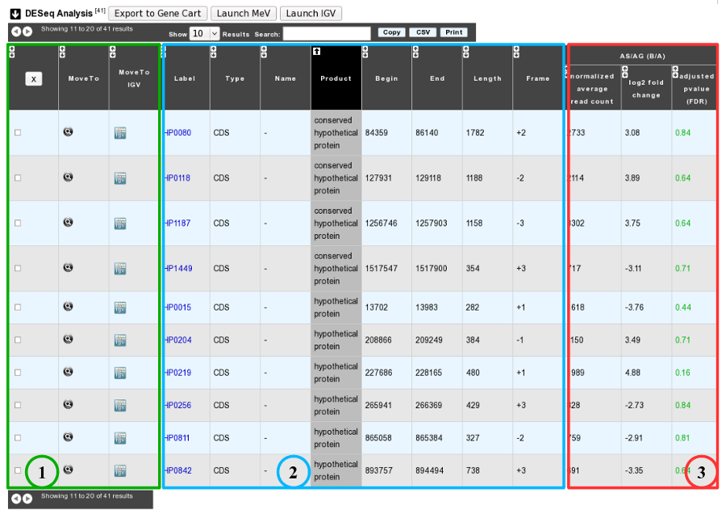
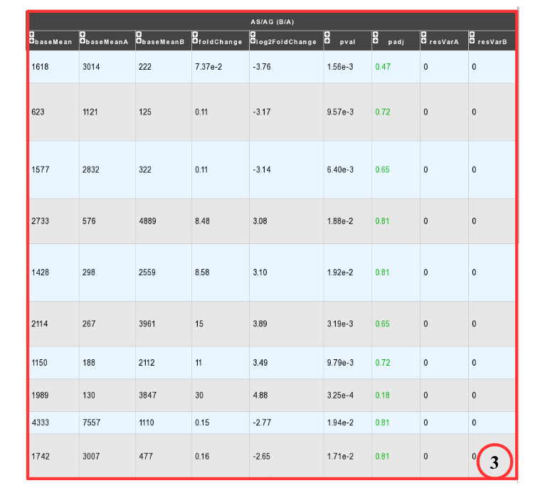
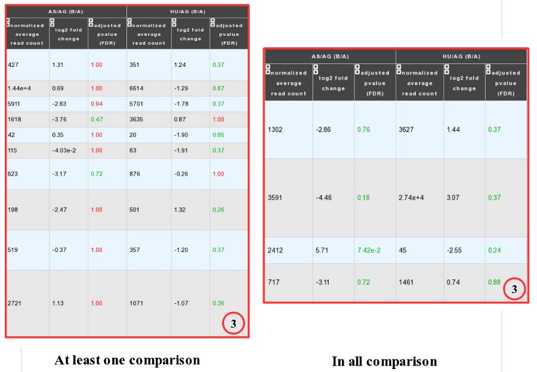

.. _rnaseq_DiffExprAnalysis:

#######################################
RNASeq Differential Expression Analysis
#######################################

How to read Differential Expression Analysis interface?
-------------------------------------------------------

This tool evaluates the difference in expression level of genes for two experimental conditions and highlights those for which this difference is statistically significant. Results can be obtained by following 6 steps, described below:

* **1**. Choose one or several reference sequences.
* **2**. Select at least one B condition to compare to A condition (which will be used as reference).
* **3**. The *p-value adjusted* (padj) column contains the p-values, adjusted for multiple testing with the Benjamini-Hochberg procedure (see the standard R function p.adjust), which controls *false discovery rate* (FDR) . It’s possible to restrict the result for the ones which are under a fixed FDR cut-off.  *Example : A FDR adjusted p-value (or q-value) of 0.05 implies that 5% of significant tests will result in false positives.*
* **4**. Choose to have all the fields of the result table or a light version. The fields will be fully described in the next section.
* **5**. If several B conditions are chosen, the fixed FDR cut-off can be fixed in all comparisons or in at least one comparisons for each gene.
* **6**. Submit query.

How to read the table of results?
---------------------------------

**Case 1 : One B condition selected.**

* **1**. Export functions. This section allows users to make all genes (or subsets of genes) available for other analysis tools. 3 main operations are possible here:

	* select subsets of genes (by selecting checkboxes on the first column) and export them into a :ref:`Gene Cart <genecarts>` by using the “Export To Gene Cart” button.
	* See one selected gene into the :ref:`MaGe Genome Browser <viewer>` by clicking on the magnifying glass.
	* Direct link to the selected gene in Integrative Genome Viewer.
	
* **2**. The second part reports the main genomic object features : Label (Link to more Genomic Object information), Type, Name, Product, Begin, End, Length, Frame.
* **3**.

	* **Light Result** part: Normalized average read count, log2foldchange, adjusted p-value, FDR (all the result are under the chosen value)
	* **DESeq Module Result** part:

* baseMean = normalized average read count.
* baseMeanA = normalized average read count for condition A.
* baseMeanB = normalized average read count for condition B.
* foldChange .
* log2foldchange.
* p-value = non adjusted pvalue.
* padj = adjusted p-value, FDR (all the result are under the chosen value)
* resVarA et resVarB = These columns contain the ratio of the variance as estimated from the counts for just this gene over the -* variance as predicted from the mean.

All these results are fully described in : 
http://bioconductor.org/packages/2.6/bioc/vignettes/DESeq/inst/doc/DESeq.pdf

**Case 2 : Two B conditions or more selected.**

Users can choose to see the union or intersection result.

