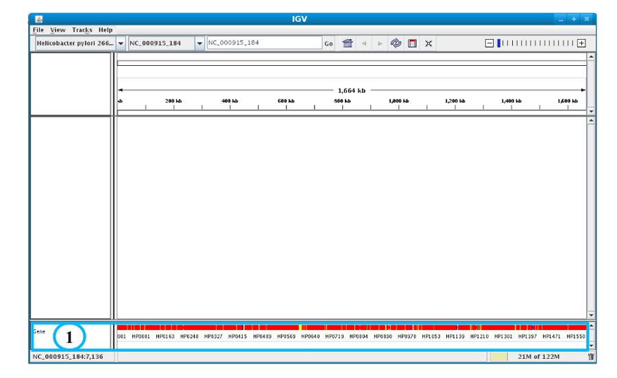
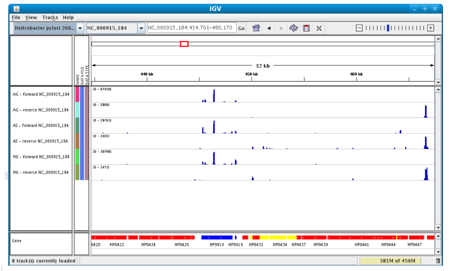
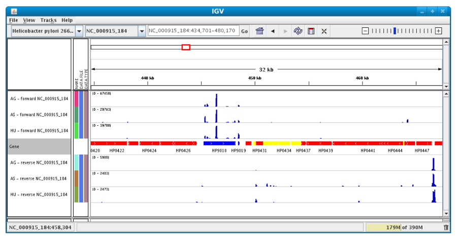

###################################
RNASeq Integrative Genomics Browser
###################################

(http://www.broadinstitute.org/igv/)

Integrative Genomics Browser (IGV) is a third party software that enables the visualization of the coverage of the reference genome by transcripts and to qualitatively compare coverage for various experimental conditions. 

First, click on “*Launch IGV*” button : users can use this one from the `RNA-Seq homepage <http://microscope.readthedocs.org/en/latest/content/transcriptomic/rnaseqOverview.html>`_ or from `Read Count <http://microscope.readthedocs.org/en/latest/content/transcriptomic/rnaseqReadCountAnalysis.html>`_ and `DESeq Analysis <http://microscope.readthedocs.org/en/latest/content/transcriptomic/rnaseqDiffExprAnalysis.html>`_ pages.

The first window appears with a lower part already displaying the annotations of the reference genome (see below).

Section **#1** contains genome annotations. Colors corresponding to a specific genomic object are:

* red : CDS
* yellow : fCDS
* green : tRNA
* blue : rRNA, miscRNA

To see genome coverage, users can load data in the drop down menu “*File/Load from Server*”. 
A list of available datasets for import will then appear in a new window. Tick the checkbox corresponding to the experiments to load in the browser and click “*OK*”.

.. note:: **Warning**: The loading process may take a while, so please be patient!

Then, the coverage is visible :

.. image:: img/gen3.png

Users can also organize the display : 
*Example : to compare the same type of experiment user can group forward and reverse experiment. (just click and drag)*

Users can enlarge the view by drag’n dropping the mouse on the area of interest.

.. image:: img/gen5.png

It is possible to zoom in to see gene sequence and translation.