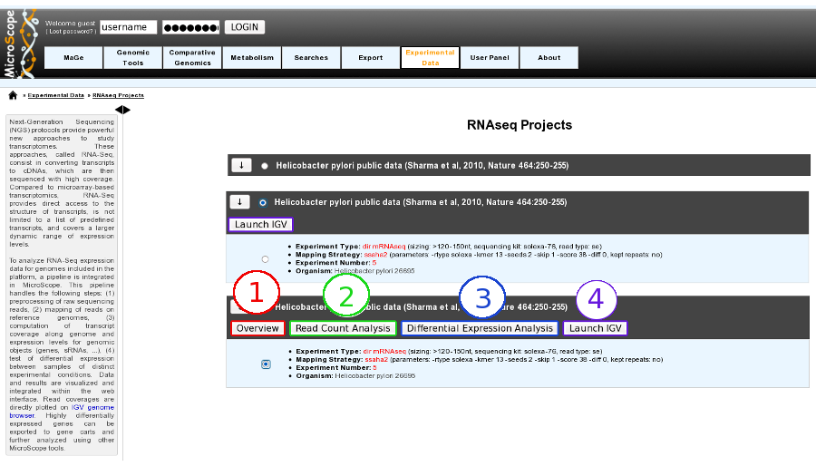
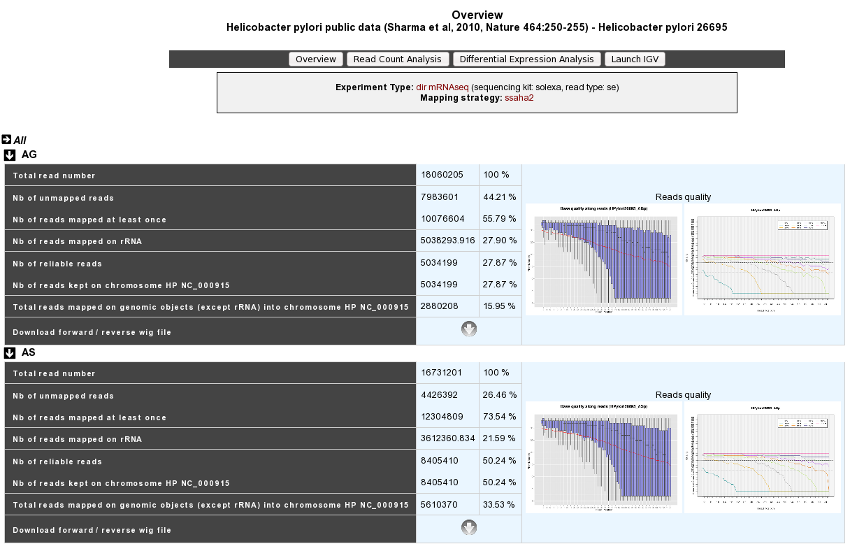

###############
RNAseq Overview
###############

Getting started
---------------

RNA-Seq homepage displays the list of available projects.

By Clicking on the arrow available on the left of each project, user can expand the associated experiment(s). 
Users can choose to select the whole project or pick up one specific experiment by using radio buttons. 

Selecting a whole project will allow the user to use `Integrative Genomics Viewer <http://microscope.readthedocs.org/en/latest/content/transcriptomic/rnaseq.html#integrative-genomics-browser>`_ tool (IGV - http://www.broadinstitute.org/igv/), whereas choosing a specific experiment will open the access to more functionalities:

* Overview tool (**Item #1**)
* `Read Count Analysis <http://microscope.readthedocs.org/en/latest/content/transcriptomic/rnaseq.html#read-count-analysis>`_  (**Item #2**)
* `Differential Expression Analysis <http://microscope.readthedocs.org/en/latest/content/transcriptomic/rnaseq.html#differential-expression-analysis>`_  (**Item #3**)
* `Integrative Genomics Viewer <http://microscope.readthedocs.org/en/latest/content/transcriptomic/rnaseq.html#integrative-genomics-browser>`_ (**Item #4**)

Overviewing RNA-Seq experiments results
---------------------------------------

This section allows users to have a complete summary of the mapping process for each experiment that have been performed on the studied organism. Results are reported in tables that can be easily expanded/collapsed by clicking on the small horizontal arrow.

An Example is given below in the case of *Helicobacter Pylori* public data :

For each experiment, user will have access to the following data:

* The total read number;
* The number of unmapped reads;
* The number of reads mapped at least once;
* The number of reads that matched rDNA : Each mapped read is not count once but 1/(number of times mapped on genome);
* The number of reliable reads (with mapping quality values not null);
* Nb of reads kept on ... : Number of mapped reads against a specific chromosome or plasmid;
* Total reads mapped on genomic objects (except rRNA) into ... : Number of mapped reads except rRNA.
