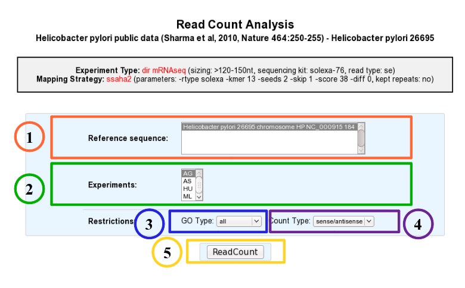
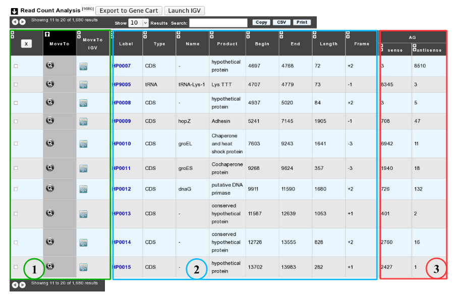

.. _rnaseq_ReadCountAnalysis:

##########################
RNAseq Read Count Analysis
##########################

Analyzing Read Count
--------------------

According to this tool, it is possible to know exactly how many reads matched a given genomic object of the reference sequence. Results are accessible following a 5 steps process which is described below.

* **1**. Choose one or several reference sequences.
* **2**. Select at least one experiment and compute the associated read count number per genomic object. (check publication for terminology of experiments, which is displayed in the head of the interface: Sharma et al, 2010, Nature 464:250-255 for the given example)
* **3**. It is possible to restrict the query to one or several given classes of genomic objects ( CDS, fCDS, rRNA, tRNA, miscRNA or all ).
* **4**. Query can be constrained upon the strand of the transcripts (direct, reverse, both)
* **5**. Submit query.

As usual, results are reported in a table which is composed of 3 main sections (see below).

* **1**. Export functions. This section allows users to make all genes (or subsets of genes) available for other analysis tools. 3 main operations are possible here:

	* select subsets of genes (by selecting checkboxes on the first column) and export them into a :ref:`Gene Cart <genecarts>` by using the “*Export To Gene Cart*” button.
	* See one selected gene into the :ref:`MaGe Genome Browser <viewer>` by clicking on the magnifying glass.
	* Direct link to the selected gene in Integrative Genome Viewer.
	
* **2**. The second part reports the main genomic object features : Label (Link to more Genomic Object information), Type, Name, Product, Begin, End, Length, Frame.
* **3**. RNA-Seq Result part : Read count (direct and/or reverse)
