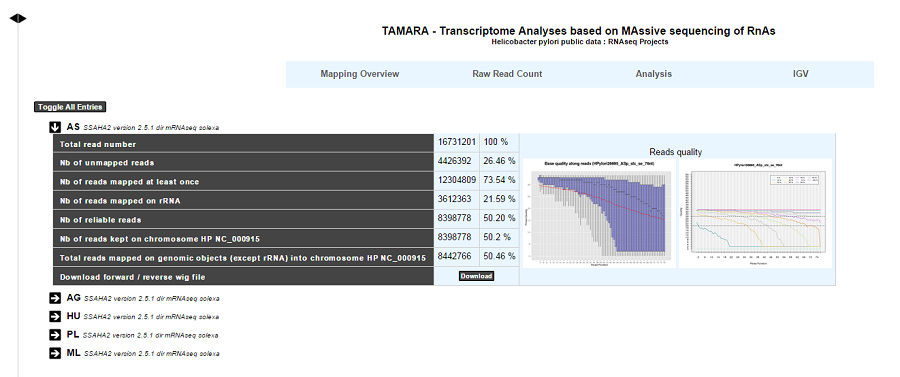
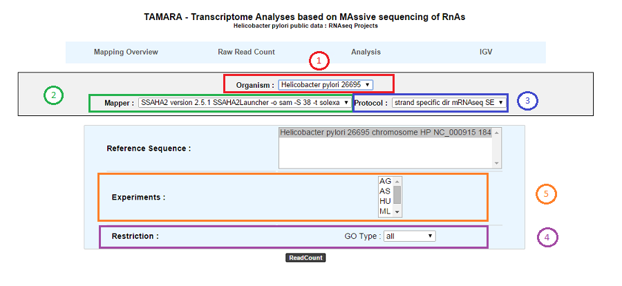
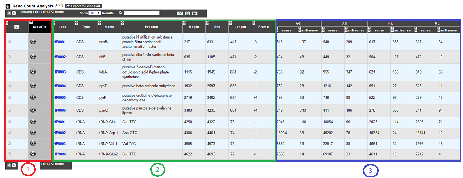
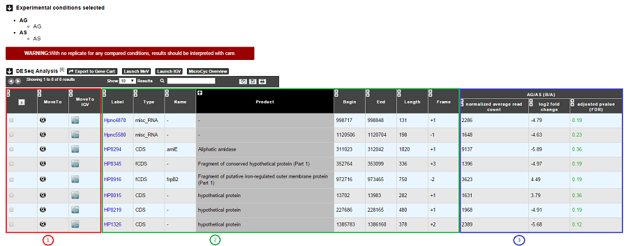
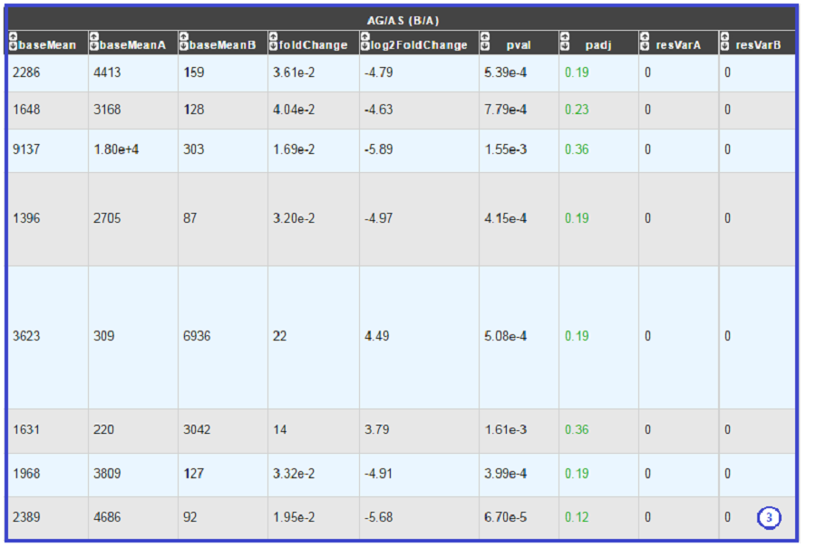

##################
RNAseq Projects V2
##################

========
Overview
========

Overviewing RNA-Seq or Evolution experiments results

This section allows users to have a complete summary of the mapping process for each experiment that have been performed on the studied organism. Results are reported in tables that can be easily expanded/collapsed by clicking on the small horizontal arrow.

An Example is given below in the case of *Helicobacter Pylori* public data :

For each experiment, user will have access to the following data:

* The total read number;
* The number of unmapped reads;
* The number of reads mapped at least once;
* The number of reads that matched rDNA : Each mapped read is not count once but 1/(number of times mapped on genome);
* The number of reliable reads (with mapping quality values not null);
* Nb of reads kept on ... : Number of mapped reads against a specific chromosome or plasmid;
* Total reads mapped on genomic objects (except rRNA) into ... : Number of mapped reads except rRNA.

===================
Read Count Analysis
===================

Analyzing Read Count
--------------------

According to this tool, it is possible to know exactly how many reads matched a given genomic object of the reference sequence. Results are accessible following a 5 steps process which is described below.

* **1**. Choose an organism and one or several reference sequences.
* **2**. If several choices are available, you can choose the mapping strategy.
* **3**. If several choices are available, you can choose the exprimental protocol.
* **4**. It is possible to restrict the query to one or several given classes of genomic objects ( CDS, fCDS, rRNA, tRNA, miscRNA or all ).
* **5**. Select at least one experiment and compute the associated read count number per genomic object. (check publication for terminology of experiments, which is displayed in the head of the interface: *Sharma et al, 2010, Nature 464:250-255* for the given example)

As usual, results are reported in a table which is composed of 3 main sections (see below).

* **1**. Export functions. This section allows users to make all genes (or subsets of genes) available for other analysis tools. 3 main operations are possible here:

	* select subsets of genes (by selecting checkboxes on the first column) and export them into a `Gene Cart <../userpanel/genesbasket.html>`_ by using the “*Export To Gene Cart*” button.
	* See one selected gene into the `MaGe Genome Browser <../mage/viewer.html>`_ by clicking on the magnifying glass.
* **2**. The second part reports the main genomic object features : Label (Link to more Genomic Object information), Type, Name, Product, Begin, End, Length, Frame.
* **3**. RNA-Seq Result part : Read count (direct and/or reverse)

================================
Differential Expression Analysis
================================

How to read Differential Expression Analysis interface?
-------------------------------------------------------

This tool evaluates the difference in expression level of genes for two experimental conditions and highlights those for which this difference is statistically significant. Results can be obtained by following 6 steps, described below:

.. image:: img/rd3.png

* **1**. Choose an oraganism and one or several reference sequences.
* **2**. If several choices are available, you can choose the mapping strategy.
* **3**. If several choices are available, you can choose the experimental protocol.
* **4**. The *p-value adjusted* (padj) column contains the p-values, adjusted for multiple testing with the Benjamini-Hochberg procedure (see the standard R function p.adjust), which controls false *discovery rate* (FDR) . It’s possible to restrict the result for the ones which are under a fixed FDR cut-off. *Example : A FDR adjusted p-value (or q-value) of 0.05 implies that 5% of significant tests will result in false positives.*
* **5**. Select at least one B condition to compare to A condition (which will be used as reference).
* **6**. Graphical Option :

	* Choose to have all the fields of the result table or a light version. The fields will be fully described in the next section.
	* If several B conditions are chosen, the fixed FDR cut-off can be fixed in all comparisons or in at least one comparisons for each gene.
	
	
How to read the table of results?
---------------------------------

**Case 1 : One B condition selected.**

* **1**. Export functions. This section allows users to make all genes (or subsets of genes) available for other analysis tools. 3 main operations are possible here:

	* Select subsets of genes (by selecting checkboxes on the first column) and export them into a `Gene Cart <../userpanel/genesbasket.html>`_ by using the “Export To Gene Cart” button.
	* See one selected gene into the `MaGe Genome Browser <../mage/viewer.html>`_ by clicking on the magnifying glass.
	* Direct link to the selected gene in Integrative Genome Viewer.
	* Direct link to MeV.
	* Direct link to MicroCyC.
	
* **2**. The second part reports the main genomic object features : Label (Link to more Genomic Object information), Type, Name, Product, Begin, End, Length, Frame.
* **3**.

	* **Light Result** part: Normalized average read count, log2foldchange, adjusted p-value, FDR (all the result are under the chosen value)
	* **DESeq Module Result** part:

* baseMean = normalized average read count.
* baseMeanA = normalized average read count for condition A.
* baseMeanB = normalized average read count for condition B.
* foldChange .
* log2foldchange.
* p-value = non adjusted pvalue.
* padj = adjusted p-value, FDR (all the result are under the chosen value)
* resVarA et resVarB = These columns contain the ratio of the variance as estimated from the counts for just this gene over the -* variance as predicted from the mean.

All these results are fully described in : 
http://bioconductor.org/packages/2.6/bioc/vignettes/DESeq/inst/doc/DESeq.pdf

**Case 2 : Two B conditions or more selected.**

.. image:: img/rd6.png

Users can choose to see the union or intersection result.
