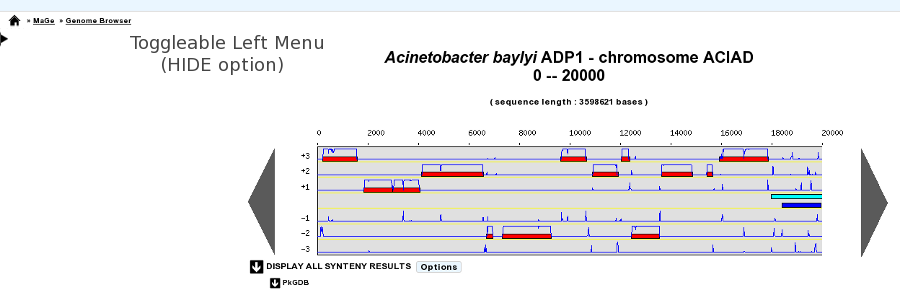
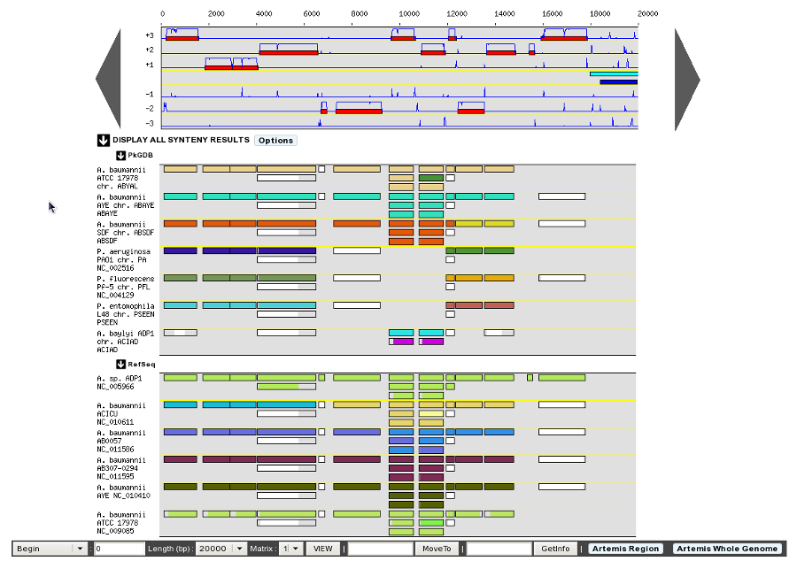
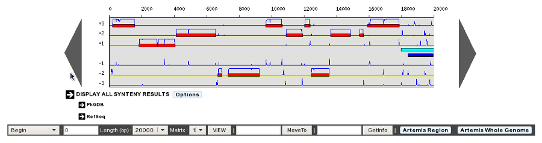
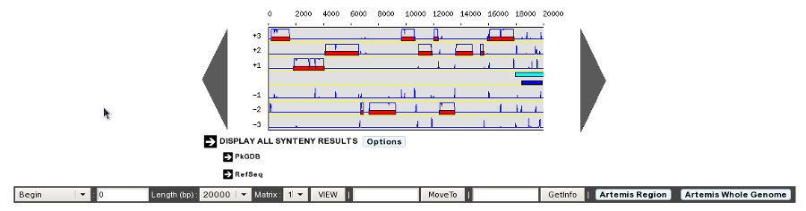
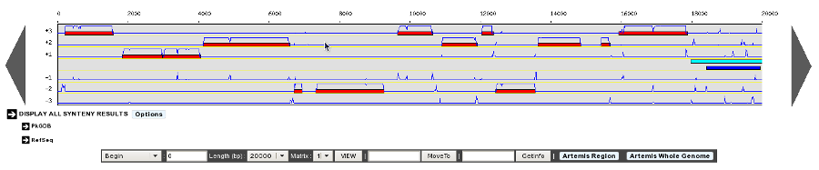

###################
Display Preferences
###################

This tool allows the user to change his/her settings of the various interfaces proposed in the MicroScope platform: hide or show the tool descriptions, change genome and synteny map size, selection of specific genomes for the synteny maps, etc.

General Options
---------------

* **Default position of Toggleable Left Menu: HIDE / SHOW (default)**

This option will define the default position of the toggleable menu displayed on the left part of the interface (as known as Quick Documentation Sidebar). By default, the sidebar is visible, but you can hide it systematically by changing the option to HIDE. This chosen option will be saved into your account settings, so you only need to set it once.

.. figure:: img/display1.png

	Sidebar SHOW option

	Sidebar HIDE option

Genome Browser Options
----------------------

* **Default display of Genome Browser Synteny Maps: HIDE / SHOW (default)**

Determine the behaviour of the Synteny Maps in the Genome Browser. By default the Synteny Maps are visible but you can choose to make them hidden by switching to the HIDE option. The chosen option will be saved into your account settings.

	Synteny maps SHOW option

	Synteny maps HIDE option

* **Genome map size: 400 - 1600 pixels**

This option will determine the Genome Browser width. By default, the width is set to 700 pixels. But if you’re using a wide-screen you may prefer a larger width for a better visual comfort.

	400 Pixels Width

	1300 Pixels Width

* **PkGDB Organisms: Synteny map selection**
Choose your own selection of **PkGDB Organisms** displayed in the Synteny Maps.

The default selection is calculated during the sequence integration process, by considering the best synteny correspondences with the reference genome and taking the 10 best results.

* **NCBI RefSeq Organisms: Synteny map selection**
Choose your own selection of **RefSeq Organisms** displayed in the Synteny Maps.

The default selection is calculated during the sequence integration process, by considering the best synteny correspondences with the reference genome and taking the 10 best results.
