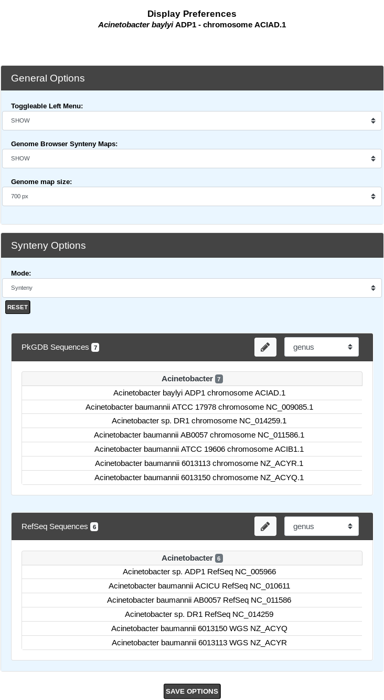

.. _display-preferences:

###################
Display Preferences
###################

This tool allows the user to change his/her settings of the various interfaces proposed in the MicroScope platform: hide or show the tool descriptions, change genome and synteny map size, selection of specific genomes for the synteny maps, etc.

By clicking on **SAVE OPTIONS**, the values are saved into your account settings, so you only need to set them once.

General Options
---------------

* **Toggleable Left Menu**

This option defines the default position of the toggleable menu displayed on the left part of the interface (known as :ref:`Quick Documentation Sidebar <interface-overview>`).
By default, the sidebar is visible (SHOW).
You can hide it by changing the option to HIDE.
See images below to understand the difference.

.. figure:: img/display1.png
	:align: center

	**Sidebar SHOW option**

.. figure:: img/display2.png
	:align: center

	**Sidebar HIDE option**

* **Genome Browser Synteny Maps**

This option determines the behaviour of the :ref:`Synteny Maps <viewer_synteny>` in the :ref:`Genome Browser <viewer>`.
By default the :ref:`Synteny Maps <viewer_synteny>` are visible (SHOW) but you can choose to make them hidden by switching to the HIDE option.
See images below to understand the difference.

.. figure:: img/display3.png
	:align: center

	**Synteny maps SHOW option**

.. figure:: img/display4.png
	:align: center

	**Synteny maps HIDE option**

* **Genome map size**

This option determines the with of the :ref:`Genome Browser <viewer>`.
By default, the width is set to 700 pixels.
But if you’re using a wide-screen you may prefer a larger width for better visual comfort.
See images below .
You can use values between 400 and 1600 pixels.

.. figure:: img/display5.png
	:align: center

	**400 Pixels Width**

.. figure:: img/display6.png
	:align: center

	**1300 Pixels Width**

Synteny Options
---------------

The **Synteny Options** allows to choose your own selection of organisms displayed in the :ref:`Synteny Maps <viewer_synteny>` **for the current reference sequence** (displayed on top of the page).

This functionnality uses the advanced selector for **Sequence Selection**.
See :ref:`here <advanced-selector>` for help on how to use it.

The first selector is to choose **PkGDB** sequences to display.
The second selector is to choose **NCBI RefSeq** sequences to display.

The default selection (for both sources) is calculated during the sequence integration process,
by considering the best synteny correspondences with the reference genome and taking the 10 best results.
