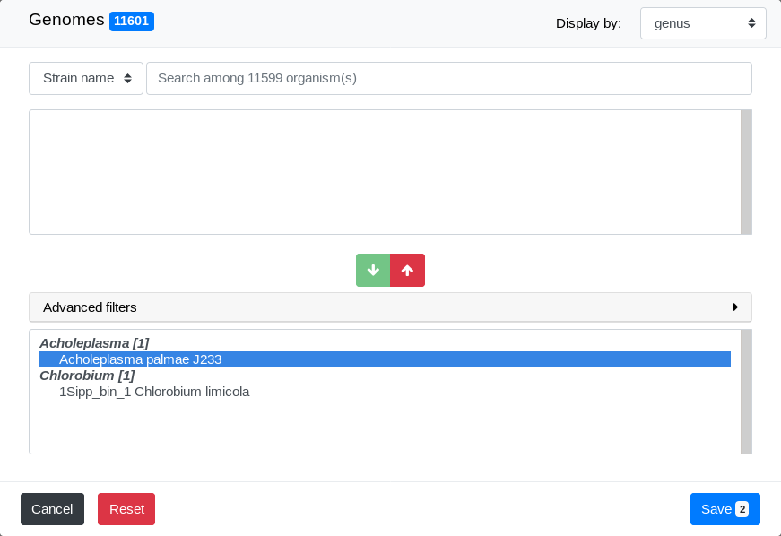
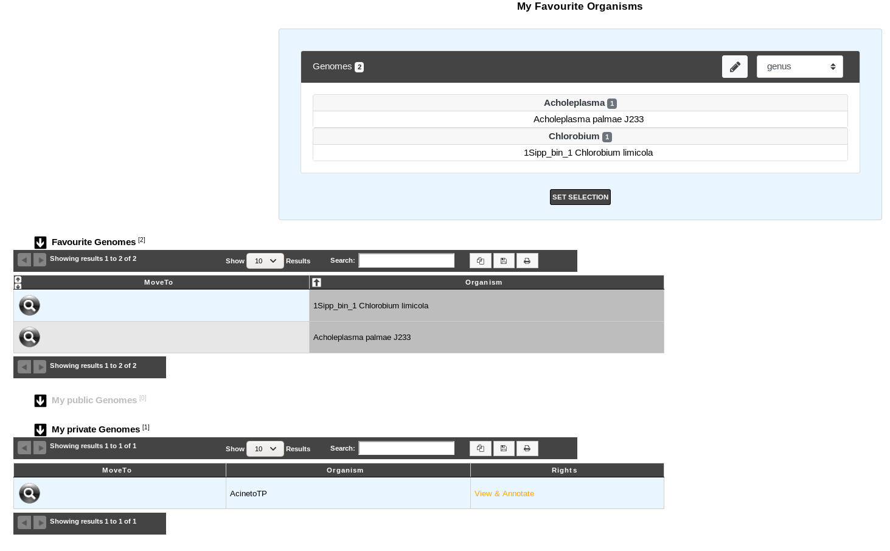
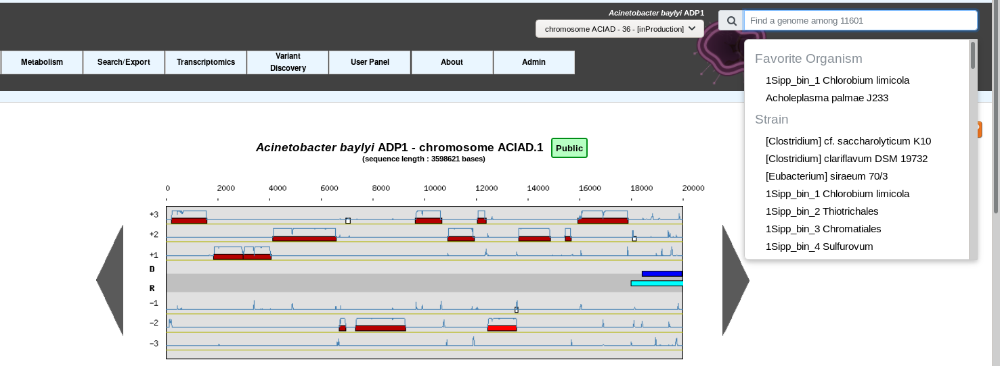

.. _favourite-organisms:

######################
My Favourite Organisms
######################

MicroScope allows to select up to 50 favourite organisms.
Those organisms are showed first when using the :ref:`selector <selector>` for faster access
(see :ref:`favourite-organisms-usage`).

This functionality is disabled for guests and only available for logged Annotators.

How to make my own selection of favourites organisms?
-----------------------------------------------------

This functionnality uses the advanced selector (in **Genome Selection** mode).
See :ref:`here <advanced-selector>` for help on how to use it.

When you open the selector, the list of your current favourite organisms
is displayed in the **Selection Zone**.

You can then add or remove organisms with the selector.
You can use the **Cancel**, **Reset** and **Save** buttons.

Once on the page, click on the **SET SELECTION** button to validate.

.. _favourite-organisms-usage:

How to use my favourites organisms selection?
---------------------------------------------

The image below shows the organism selector on the :ref:`viewer`.
To show the list of your favourite organisms, simply click on the selector.

The list that opens will show your favourite organisms.
