.. _genecarts:

##########
Gene Carts
##########

The result of many tools available in the MicroScope platform is a list of candidate genes which can be saved in a «Gene Cart». The «Gene Carts» interface allows the user to perform various operations on these gene carts: intersection, union, difference, download corresponding nucleic or protein sequences, launch  `JalView tool <http://www.jalview.org/>`_ to perform multiple alignments, etc. Moreover these carts can be explored using the Keywords Search tool.

.. tip:: Gene Carts content is saved within your account settings, so your selections will persist into our databases even if you logout from your session.

Gene Cart Overview
------------------

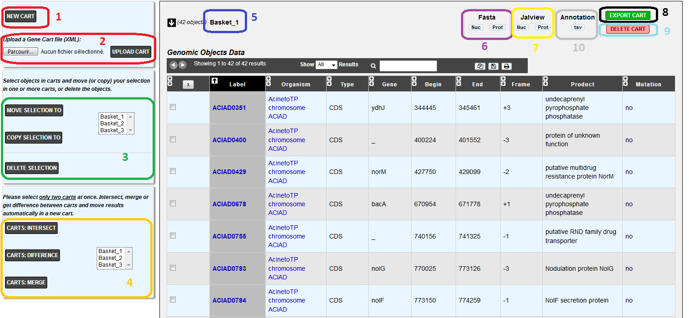

* **Item #1. Create / Add a new Cart:**
 
	By default, the system creates 1 Gene Cart. But, by clicking on this button you can add up to **20** new Carts to your account.
	
* **Item #2. Upload a Gene Cart:**
 
	Select a XML file containing Gene Cart data from your computer by using the «**Browse**» button, then click on the «**Upload Cart**» button to import the XML file content into the Gene Cart interface.
	
* **Item #3. Genomic Objects operations:**

	This menu allows the user to perform operations on Gene Carts content.
	
		* :ref:`Move <genecarts-move>` a selection of Genomic Objects contained in a Gene Cart into another one.
		* :ref:`Copy <genecarts-copy>` a selection of Genomic Objects contained in a Gene Cart into another one.
		* :ref:`Delete <genecarts-delete>` a selection of Genomic Objects from Gene Cart.
	
* **Item #4. Gene Carts operations:**
	
	This menu allows the user to perform operations on Gene Carts.

		* Get the :ref:`intersection <genecarts-intersection>` between 2 Gene Carts content and move the result into a new Cart.
		* Get the :ref:`difference <genecarts-difference>` between 2 Gene Carts content and move the result into a new Cart.
		* :ref:`Merge <genecarts-merge>` the content of 2 Gene Carts into a new Cart.

.. tip:: You can do this kind of operations **only on 2 Gene Carts at a same time**.

* **Item #5. Gene Cart name:**

	:ref:`Change the name <genecarts-rename>` of a Gene Cart.

* **Item #6. FASTA tool:**

	Export the Nucleic or Proteic content of a Gene Cart in FASTA format.
	
* **Item #7. JalView tool:**

	Launch the `JalView <http://www.jalview.org/>`_ tool (Nucleic or Proteic) for a given Gene Cart content.

* **Item #8. Export Gene Cart:**

	Export a Gene Cart content into a XML file which can be shared with your collaborators.

* **Item #9. Delete Gene Cart:**
 
	Delete definitively a Gene Cart. ( **Warning: the content will also be deleted** ).

* **Item #10. Delete Gene Cart:**
 
	Export the gene annotation in tsv format file.

.. _genecarts-move:

How to move Genomic Objects to another Gene Cart?
-------------------------------------------------

1. Select some Genomic Objects in the Gene Cart of interest.

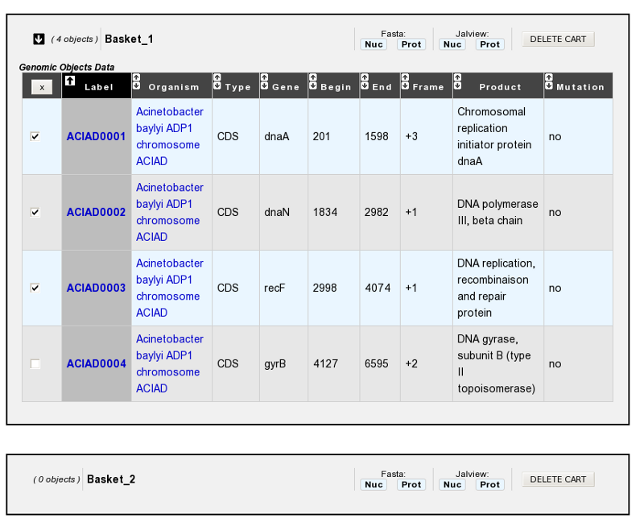

2. In the select menu, choose the Gene Cart where you want to copy this selection. It will be the ’destination’ Cart.

.. image:: img/bas3.png
	:width: 25%

3. Click on the **MOVE SELECTION TO** button.
4. The Genomic Objects selected in the first Cart will be deleted and moved into the ’destination’ Cart.

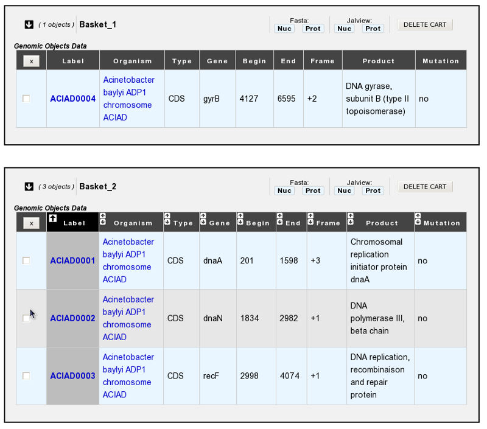

.. _genecarts-copy:

How to copy Genomic Objects to another Gene Cart?
-------------------------------------------------

1. Select some Genomic Objects in the Gene Cart of interest.

.. image:: img/bas5.png
	:width: 100%

2. In the select menu, choose the Gene Cart where you want to copy this selection. It will be the ’destination’ Cart.

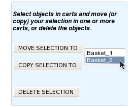

3. Click on the **COPY SELECTION TO** button.
4. The Genomic Objects selected in the first Cart will be copied into the ’destination’ Cart. These Genomic Objects will remain in the first cart and won’t be deleted.

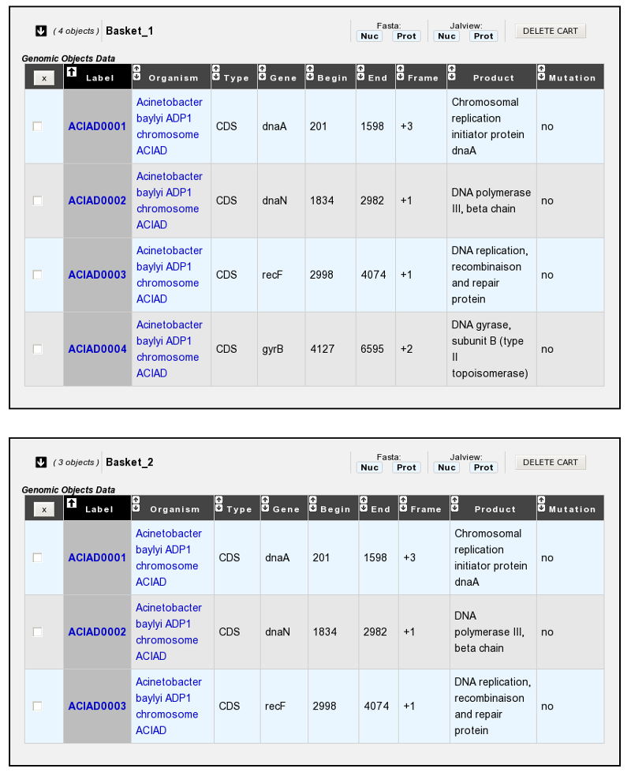

.. _genecarts-delete:

How to delete Genomic Objects from Gene Cart?
---------------------------------------------

1. Select some Genomic Objects in the Gene Cart of interest.

.. image:: img/bas8.png
	:width: 100%

2. Click on the **DELETE SELECTION** button.
3. The selected Genomic Objects will be deleted from the Cart. ( **Warning: the delete will be definitive and you’ll lost the genomic objects from the Cart** ).

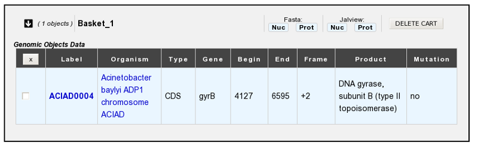

.. _genecarts-intersection:

How to get the intersection between 2 Gene Carts?
-------------------------------------------------

1. Fill **at least** 2 Gene Carts with some content.

.. image:: img/bas10.png
	:width: 100%

2. In the select menu, choose the 2 Gene Carts you want to intersect. This means **you’ll get the common Genomic Objects contained in the 2 Carts**.

.. image:: img/bas11.png
	:width: 25%

3. Click on the CARTS: **INTERSECT** button
4. The intersection between the 2 Gene Carts content will be moved into a new Cart, called by default ’**INTERSECT**’. 

.. warning:: **If you need to perform another ’Intersect Operation’, do not forget to rename the Cart called ’INTERSECT’. Else, the content will be overwrited.**

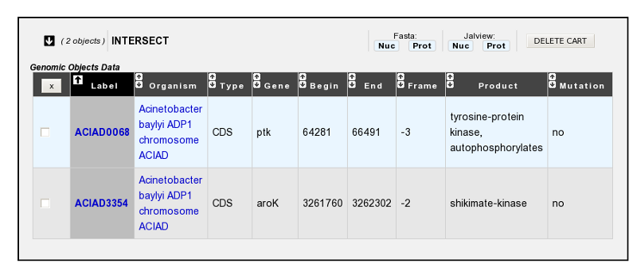

.. _genecarts-difference:

How to get the difference between 2 Gene Carts?
-----------------------------------------------

1. Fill **at least** 2 Gene Carts with some content.

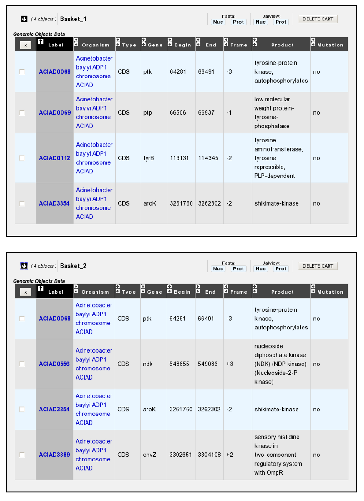

2. In the select menu, choose the 2 Gene Carts you want to get the difference. This means **you’ll get the specific Genomic Objects of each Cart** (The common Genomic Objects will be removed).

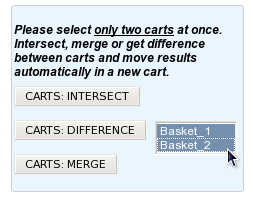

3. Click on the **CARTS: DIFFERENCE** button.
4. The difference between the 2 Gene Carts content will be moved into a new Cart, called by default ’**DIFFERENCE**’. 

.. warning:: **If you need to perform another ’Difference Operation’, do not forget to rename the Cart called ’DIFFERENCE’. Else, the content will be overwrited.**

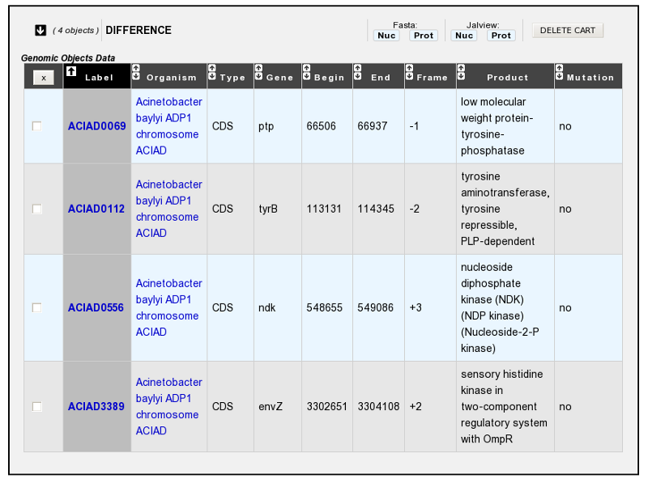

.. _genecarts-merge:

How to merge 2 Gene Carts?
--------------------------

1. Fill **at least** 2 Gene Carts with some content.

.. image:: img/bas16.png
	:width: 100%

2. In the select menu, choose the 2 Gene Carts you want to merge. This means **the content of the Carts will be merged into a new one** (Doubloons will be removed).

.. image:: img/bas17.png
	:width: 25%

3. Click on the **CARTS: MERGE** button.
4. The Genomic Objects of the 2 Gene Carts will be moved into a new Cart, called by default ’**MERGE**’. 

.. warning:: **If you need to perform another ’Merge Operation’, do not forget to rename the Cart called ’MERGE’. Else, the content will be overwrited.**

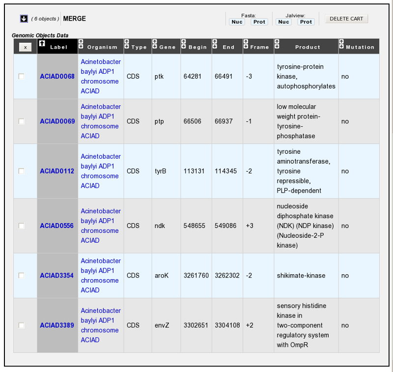

.. _genecarts-rename:

How to rename a Gene Cart?
--------------------------

Please note: 
- Allowed characters for names are **[a-z], [0-9], _ , -** and **+**. 
- Names based on **numeric-only** characters are not allowed.

1. Click on the Cart’s name you want to change.

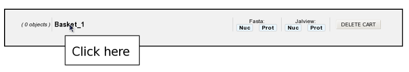

2. Rename the Cart as you wish. Some special characters are not accepted.

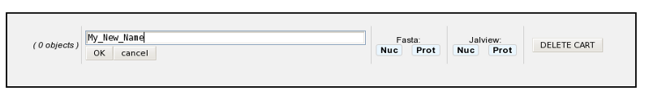

3. Click on the **OK** button.

How to fill a Gene Cart with some Genomic Objects?
--------------------------------------------------

Some MicroScope’s tools allow the possibility to save Genomic Objects into a Gene Cart.
Overall, check for the availability of a **EXPORT TO GENE** CART button above a Genomic Objects list.

1. Click on the **EXPORT TO GENE CART** button to open the ’Export Interface’ popup.

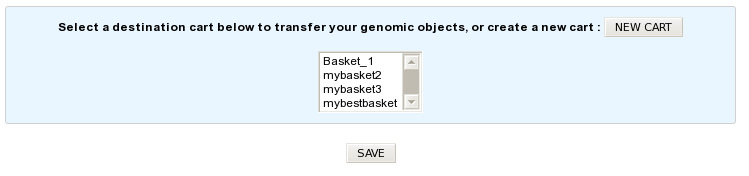

2. Select your ’destination’ Cart in the select menu. (Create a new one if necessary by clicking on the **NEW CART** button).
3. Click on the **SAVE** button.
4. All the Genomic Objects listed below the **EXPORT TO GENE CART** button will be transferred and saved into your ’destination’ Cart.
