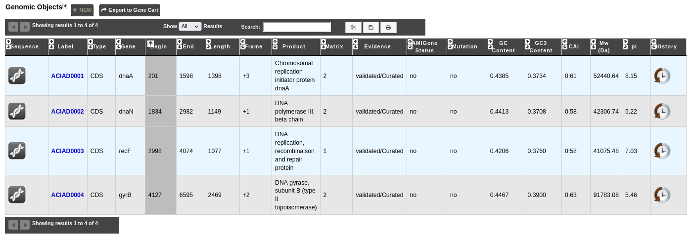
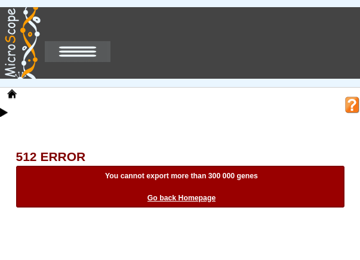
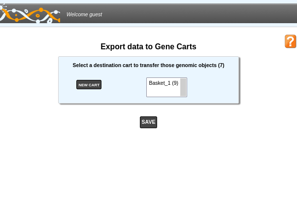
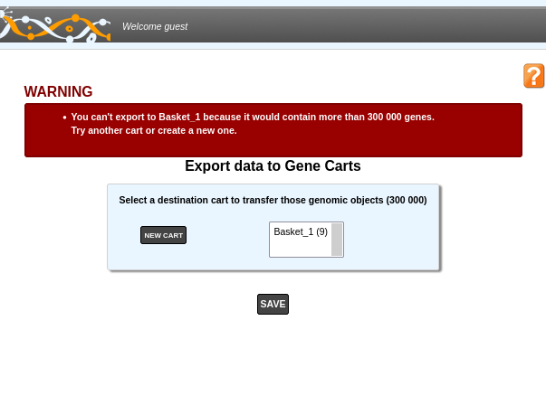

.. TODO
    Move presentation of gene carts (including how to export from a tool) in overview.
    This page will be about the User Cart interface.
    Correct presentation of set operations.

.. _genecarts:

##########
Gene Carts
##########

************
Introduction
************

When using MicroScope you will often use its tools to find a list of genes sharing some features (same function, etc.).
Using Gene carts, you will be able to save a list of Genomic Objects (like CDS) from results obtained through various MicroScope tools.
The contents of these carts can be extracted or explored for instance with the :ref:`keywords` tool (see :ref:`here <keywords-from-genecart>` for more details).
Technically speaking a gene cart is a named set of Genomic Objects from one or several genomes.
For the sake of simplicity, we will use "gene" and "Genomic Object" interchangeably.

A gene cart can be created in several ways:
  1. From a result page: for instance, the genes displayed in the :ref:`viewer` can be exported in a gene cart.
     See :ref:`the interface to export the result of a tool into a cart <genecarts-popup>`.
  2. By combining other carts.
     See :ref:`the interface to manage gene carts <genecarts-interface>` (available in the **User Panel** section).

.. tip:: If you have :ref:`an account <register>`, the content of gene carts is saved within your account settings, so your selection will persist even if you logout.

.. warning:: For performance reasons, a gene cart can't hold more than 300 000 genes.
   Also, you can't create more than 21 gene carts.

.. _genecarts-popup:

**************************************************
How to export the result of a tool to a gene cart?
**************************************************

Some tools allow the possibility to save Genomic Objects into a gene cart.
Using the **Export To Gene Cart** button that is above result tables as shown below, you will be able to save the corresponding Genomic Objects into a new cart or into an existing cart.
For instance, this is the case in the :ref:`keywords`, in the :ref:`rgpfinder` tool, in the :ref:`NGSDiffExprAnalysis` tool or in the :ref:`viewer`.

If you try to export more than 300 000 genes in a cart, an error will be displayed as shown below.

To save the list:

1. Click on the **Export To Gene Cart** button.
   This will open the 'Export Interface' in a new window.
   The size of the gene cart is displayed next to its name.

.. tip:: Gene carts are **sets**.
   This means that if you try to add a genomic object to a cart that already contains it, it won't be added.
   Therefore the size of the resulting cart might be smaller than the sum of the number of genomic objects to explore
   and the current size of the cart.

2. Select your destination cart in the select menu or create a new one if necessary by clicking on the **NEW CART** button.
3. Click on the **SAVE** button.

If the size of the resulting gene cart is more than 300 000 genes, the window will display an error and the cart won't be saved as shown below.
The window remains open so you can select another gene cart.

.. _genecarts-interface:

***********************
The Gene Cart interface
***********************

The « Gene Cart » interface allows users to perform various operations on their gene carts:
  - create or upload a cart
  - export a cart
  - delete a cart
  - copy or move Genomic Objects from one cart to another or delete objects from a cart
  - use set operations (intersection, union, difference) on 2 gene carts
  - download the corresponding nucleic or protein sequences
  - launch :ref:`JalView <jalview>` to perform multiple alignments, etc.

Overview
========

The image below presents an overview of the interface.

.. image:: img/gene_cart_doc.PNG

* **Item #1. Create / Add a new gene cart:**
 
	By default, the system creates a gene cart named **Basket_1**. By clicking on this button you can add up to **20** new gene carts to your account.
	
* **Item #2. Upload a gene cart:**
 
	Select a XML file containing gene cart data (obtained from the Export cart functionality - see Item #8) from your computer by using the «**Browse**» button, then click on the «**Upload Cart**» button to import the XML file content into a new gene cart.
	
* **Item #3. Gene cart content editing:**

	This menu allows the user to perform operations on gene carts content.
	
		* :ref:`Move <genecarts-move>` a selection of Genomic Objects contained in a gene cart into another one.
		* :ref:`Copy <genecarts-copy>` a selection of Genomic Objects contained in a gene cart into another one.
		* :ref:`Delete <genecarts-delete>` a selection of Genomic Objects from a gene cart.
	
* **Item #4. Set operations:**
	
	This menu allows the user to perform operations on gene carts.

		* Get the :ref:`intersection <genecarts-intersection>` between 2 gene carts content and move the result into a new gene cart.
		* Get the :ref:`difference <genecarts-difference>` between 2 gene carts content and move the result into a new gene cart.
		* :ref:`Merge <genecarts-merge>` the content of 2 gene carts into a new gene cart.

.. tip:: This kind of operations can be performed with **only 2 gene carts at a time**.

* **Item #5. Gene cart name:**

	:ref:`Change the name <genecarts-rename>` of a gene cart.

* **Item #6. FASTA tool:**

	Export the Nucleic or Protein sequences of the Genomic Objects contained in a gene cart in FASTA format.
	
* **Item #7. JalView tool:**

	Launch :ref:`JalView <jalview>` (Nucleic or Proteic) for a given gene cart content.

* **Item #8. Export gene cart:**

	Export a gene cart content into a XML file which can be shared with your collaborators.

* **Item #9. Delete gene cart:**
 
	Delete	Delete definitively a gene cart. ( **Warning: there is no confirmation** ).

* **Item #10. Annotation:**
 
	Export the gene annotation in tsv format.

.. _genecarts-move:

How to move Genomic Objects to another gene cart?
=================================================

1. Select some Genomic Objects in the gene cart of interest.

.. image:: img/bas2.png
	:width: 100%

2. In the select menu, choose the gene cart where you want to copy this selection. It will be the 'destination' cart.

.. image:: img/bas3.png
	:width: 25%

3. Click on the **MOVE SELECTION TO** button.
4. The Genomic Objects selected in the first cart will be deleted and moved into the 'destination' cart.

.. image:: img/bas4.png
	:width: 100%

.. _genecarts-copy:

How to copy Genomic Objects to another gene cart?
=================================================

1. Select some Genomic Objects in the gene cart of interest.

.. image:: img/bas5.png
	:width: 100%

2. In the select menu, choose the gene cart where you want to move this selection. It will be the 'destination' cart.

.. image:: img/bas6.png
	:width: 25%

3. Click on the **COPY SELECTION TO** button.
4. The Genomic Objects selected in the first cart will be copied into the 'destination' cart. These Genomic Objects will remain in the first cart and won't be deleted.

.. image:: img/bas7.png
	:width: 100%

.. _genecarts-delete:

How to delete Genomic Objects from a gene cart?
===============================================

1. Select some Genomic Objects in the gene cart of interest.

.. image:: img/bas8.png
	:width: 100%

2. Click on the **DELETE SELECTION** button.
3. The selected Genomic Objects will be deleted from the cart. ( **Warning: there is no confirmation** ).

.. image:: img/bas9.png
	:width: 100%

.. _genecarts-intersection:

How to get the intersection between 2 gene carts?
=================================================

1. Fill **at least** 2 gene carts with some content.

.. image:: img/bas10.png
	:width: 100%

2. In the select menu, choose the 2 gene carts you want to intersect. This means **you'll get the common Genomic Objects contained in the 2 carts**.

.. image:: img/bas11.png
	:width: 25%

3. Click on the CARTS: **INTERSECT** button
4. The intersection between the 2 gene carts content will be moved into a new cart, called by default '**INTERSECT**'. 

.. warning:: **If you need to perform another 'Intersect Operation', do not forget to rename the cart called 'INTERSECT'. Else, the content will be overwritten.**

.. image:: img/bas12.png
	:width: 100%

.. _genecarts-difference:

How to get the difference between 2 gene carts?
===============================================

1. Fill **at least** 2 gene carts with some content.

.. image:: img/bas13.png
	:width: 100%

2. In the select menu, choose the 2 gene carts you want to get the difference. This means **you'll get the specific Genomic Objects of each cart** (The common Genomic Objects will be removed).

.. image:: img/bas14.png
	:width: 25%

3. Click on the **CARTS: DIFFERENCE** button.
4. The difference between the 2 gene carts content will be moved into a new cart, called by default '**DIFFERENCE**'. 

.. warning:: **If you need to perform another 'Difference Operation', do not forget to rename the cart called 'DIFFERENCE'. Else, the content will be overwritten.**

.. image:: img/bas15.png

.. _genecarts-merge:

How to merge 2 gene carts?
==========================

1. Fill **at least** 2 gene carts with some content.

.. image:: img/bas16.png
	:width: 100%

2. In the select menu, choose the 2 gene carts you want to merge. This means **the content of the carts will be merged into a new one** (duplicates will be removed).

.. image:: img/bas17.png
	:width: 25%

3. Click on the **CARTS: MERGE** button.
4. The Genomic Objects of the 2 gene carts will be moved into a new cart, called by default '**MERGE**'. 

.. warning:: **If you need to perform another 'Merge Operation', do not forget to rename the cart called 'MERGE'. Else, the content will be overwritten.**

.. image:: img/bas18.png
	:width: 100%

.. _genecarts-rename:

How to rename a gene cart?
==========================

Please note: 
- Allowed characters for names are **[a-z], [0-9], _ , -** and **+**. 
- Names based on **numeric-only** characters are not allowed.

1. Click on the cart's name you want to change.

.. image:: img/bas19.png
	:width: 100%

2. Rename the cart as you wish. Some special characters are not accepted.

.. image:: img/bas20.png
	:width: 100%

3. Click on the **OK** button.

