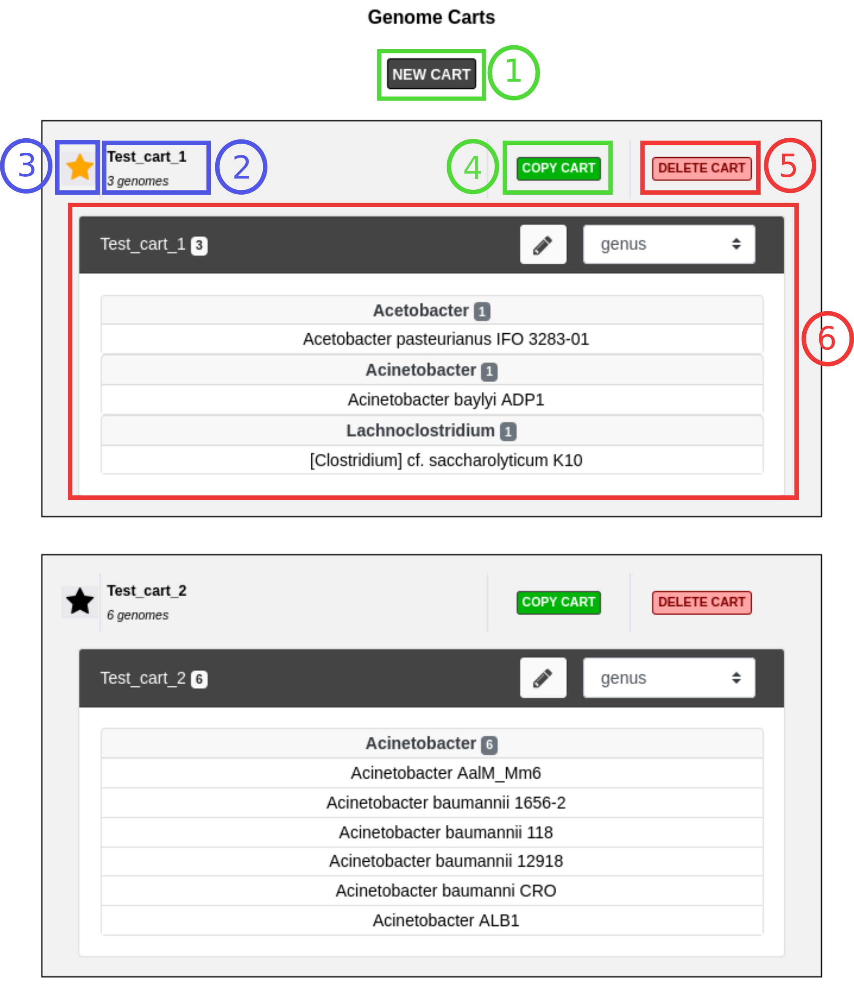
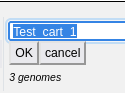

.. _genomecarts:

############
Genome Carts
############

A « Genome Cart » is a (named) list of related genomes.
The idea is that you can create your own groups of genomes (for instance for different projects).
Genome carts are integrated in the :ref:`advanced-selector` of various tools (both for genome and sequence selection) so you can select their content quickly.
Be sure to use meaningful names for your carts because the search is based on their name.
See :ref:`here <advanced-selector-genomecarts>` for more information.

Among those carts, you can (optionnally) choose a special one, called the « favourite » (this replace the list of favourite organisms found in previous versions).
This cart is integrated in the :ref:`simple-selector` (see :ref:`here <simple-selector-genomecarts>` for more information).

This page allows to create, edit, rename and delete carts and to select a favourite one.

.. tip:: Genome Carts are saved within your account settings, so they will persist even if you logout from your session.

.. warning:: For performance reasons, a genome cart can't contain more than 500 genomes.
    Also, you can't create more than 10 genome carts.

.. warning:: The name of the Genome Cart can not be longer than 64 characters.
     Also, only standard letters, numbers and a few characters (``_``, ``+``, ``-``) are allowed (no spaces or special characters) and the name can't contain only numbers.
     Last but not least, you can't use the name of the « magic » carts (see below).

.. _genomecarts-magic-carts:

***********
Magic carts
***********

In addition to the carts managed on this page, MicroScope maintains 2 « magic » carts:

* **My_Genomes:** This cart contains all the **private genomes** to which you have access (see :ref:`access-right-management`).
  This cart can contain more than 500 genomes.
* **Recently_Used:** This cart contains the last 20 genomes used as reference.

Those carts are not displayed here (since their content is not editable) but they appear in the :ref:`advanced-selector`.
They can't be chosen as favourites.
As mentionned, you can't use their names for another cart.

*************************
Overview of the interface
*************************

The image below shows 2 carts (named **Test_Cart_1** and **Test_Cart_2** but you can choose better names).
Each cart is displayed in its own frame.
The name is displayed and can be edited with **Item 2** (see below) and **Item 3** indicates which cart (if any) is the current favourite and allow to change it.
The content of the carts is displayed and can be edited with an :ref:`advanced-selector` (**Item 6**).

How to create a Genome Cart?
============================

The first way to create a Genome Cart is to click on the **NEW CART** button on top of the interface (**Item 1**).
This will create a new cart that you can edit with the selector.
The name of the new cart is **Cart_** plus a unique number.

Another way to create a cart is to copy an existing cart by clicking on the **COPY CART** button (**Item 4**).
The name of the new cart is formed by adding **_Copy** and a unique number to the name of the cart you copied.

How to edit a Genome Cart?
==========================

As mentionned, the content of the cart can be manipulated with the selector.
See :ref:`here <advanced-selector>` on how to do that.
This interface allows to easily manipulate cart content.
For instance, it's easy to merge two carts: open the interface of a cart, select the cart you want to merge in
add it's content in the cart and save.

How to delete a Genome Cart?
============================

To delete a cart, simply press the **DELETE CART** button (**Item 5**).
A confirmation popup will appear.
Note that if you delete your favourite cart, you will have to choose a new one (see below).

How to rename a Genome Cart?
============================

To rename a cart, click on its name in **Item 3**: an input area will be displayed so you can type in the new name and as shown below.

Then press **OK** or **Cancel**.

If you enter an invalid name (according to the rules stated above), the cart won't be renamed.

.. _genomecarts-favourite-cart:

******************
The favourite cart
******************

As mentionned above one cart can be choosen as the favourite cart.
This cart is shown with a yellow star (see **Item 3**).

To select a new favourite, simply click on the star next to its name.

If you click on the star of the current favourite, it will be deselected (there won't be any favourite cart).
