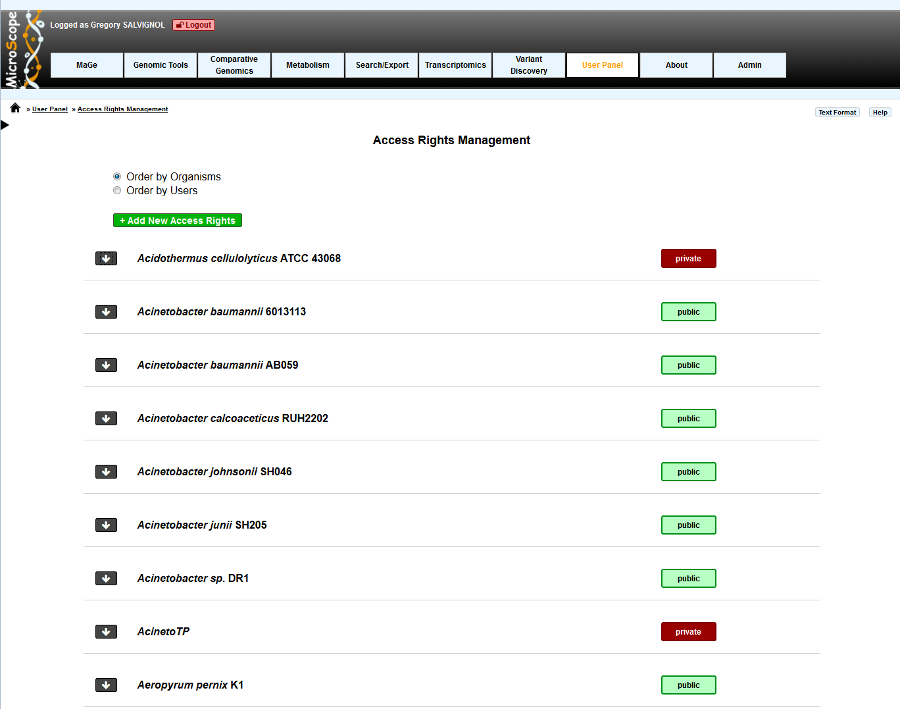
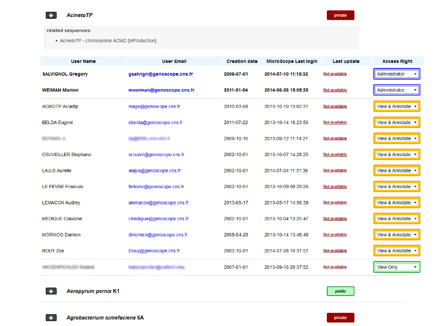
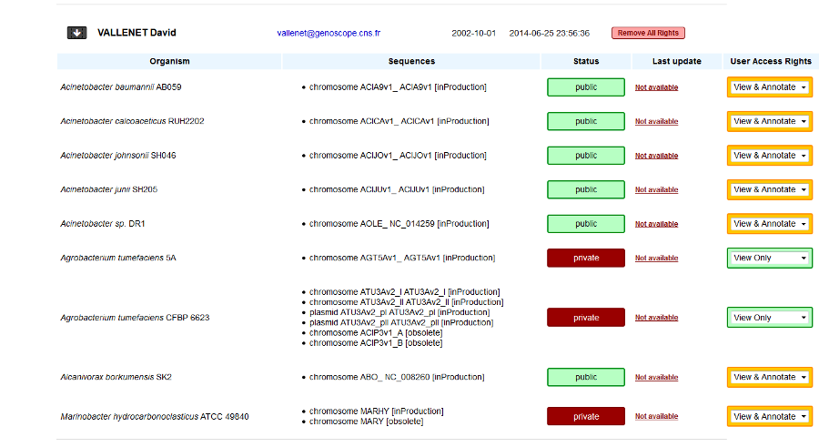
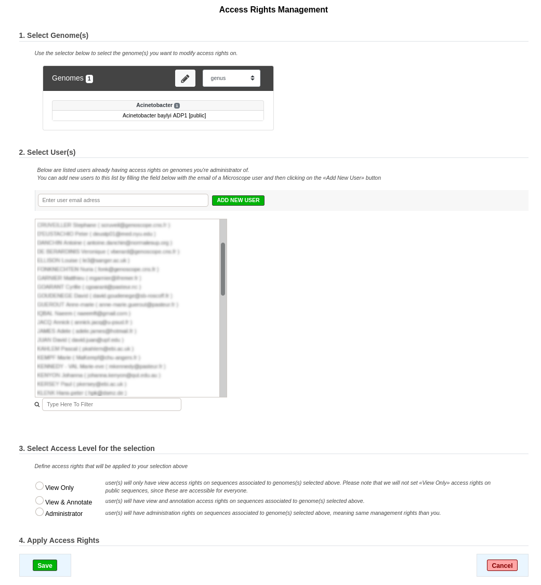

.. _access-rights-management:

########################
Access Rights Management
########################

This interface allows the administrators of a genome to manage the access rights.

.. note:: Only annotators defined as « Genome Administrators » are allowed to use this functionality.
   See below for an explanation of what an administrator is.

Genome status and access rights
-------------------------------

What are the different Access Rights?
^^^^^^^^^^^^^^^^^^^^^^^^^^^^^^^^^^^^^

For now, we provide 3 access rights:

* « **View Only** »: this level is the basic one.
  Users having this access right will be able to see the genome and the corresponding data on MicroScope but will not be able to annotate a sequence.
* « **View & Annotate** »: users having this access right are able to view the genome and to annotate it.
* « **Administrator** » : this level is the higher level (users having this right are called « administrators » of the genome).
  Administrators can view and annotate a genome and are able to set access rights for other people.
  Note that you can set several administrators on the same genome.

« **Private** » and « **Public** » genomes
^^^^^^^^^^^^^^^^^^^^^^^^^^^^^^^^^^^^^^^^^^

In MicroScope a genome can be « **Private** » or « **Public** »:

* « **Public** » status means everyone will have « **View Only** » access right on the corresponding genome/sequences in MicroScope.
  Other access rights, such as « **View & Annotate** », must be be granted to users by an administrator.
* « **Private** » status means that only people having access rights granted by an administrator will be able to view or annotate the genome / sequence.
  In order for other user to see a « **Private** » genome, an administrator must give them the « **View Only** » or « **View & Annotate** » access right to users.

.. note:: Status (« **Private** » or « **Public** ») is currently set by the LABGeM team. By default we set the status this way:

  * If the genome is a newly sequenced one, we will set the status to « **Private** » when we deliver the data on MicroScope, and we will give « **Administrator** » access right to the submitter of the corresponding Delivery of Service.
  * If the genome is coming from a public databank (RefSeq sequence, for example), the default status will be « **Public** », and no one will be set as « **Administrator** », except if you plan to re-annotate the genome (in this case, you have to contact us)

How to read the interface?
--------------------------

Two display modes are available:

* the first one (default), « **Order by Genomes** », will display all genomes for which the user have administration rights.
* the second one, « **Order by Users** », will list all the users that have access to genomes belonging to the administrator.

If you click on the *down arrow* on the left of an genome / user name, you will display the details about access rights on this genome / of this user.

How to Change Access Rights?
----------------------------

To change the user access rights, simply select the desired access right from the select menu, then the update will be performed automatically.
Selecting « **Remove** » will delete all access rights of the given user on this genome.
For « **Private** » genomes, it means that the user won't be able to see the genome anymore.

« **Order by Genomes** » view
^^^^^^^^^^^^^^^^^^^^^^^^^^^^^

All users having access to the corresponding genome are grouped by access right level: first, users having « **Administrator** » access right, users having « **View & Annotate** » access right and at the end, users having « **View Only** » access right.

Additional data about users are also available:

  * User name
  * User email
  * User account creation date
  * Last login date on MicroScope (not necessarily on the genome you are looking at)
  * Last date the user access rights have been modified by an administrator

« **Order by Users** » view
^^^^^^^^^^^^^^^^^^^^^^^^^^^

For a given user, will be listed all the genomes for which:

  * user have access rights
  * you have administrator access level

Please note that a user may have also access rights for genomes you are not administrator of.
In this case, corresponding genomes will not be displayed.

Additional data are also available:

  * Genome name
  * Related sequences (chromosomes, plasmids)
  * Genome status (« **Private** »/« **Public** »)
  * The last date the user access rights have been modified by an administrator

.. note:: There are some restrictions about the access rights an administrator can select:

  * an administrator can not change is own access rights.
    If an administrator, for some reasons, wants to drop his access level, he will need to set administrator access rights to another user.
    Then, this user will be allowed to drop the access level of the first administrator.
  * an administrator can not set a « **View Only** » access right to users on « **Public** » genomes, since those genomes are accessible for everyone.

How to give Access Rights to a new user?
----------------------------------------

To add new access rights to a new user or set a same access right to several genomes or users, click on the green button called « **+ Add New Access Rights** ».
You will be redirected into another interface with 3 steps:

* **Step 1**: this advanced selector will list all the genomes you are administrator of.
  Use it to select all the genomes for which you want to grant access rights.
  In the example, « Acinetobacter baylyi ADP1 » has been selected.
* **Step 2**: this list contains all the users that currently have access rights on the genomes you are administrator of (the names have been blurred in the example).
  Select all the users for who you want to update access rights.
  If a user is missing in this list, you can add him by filling the upper field and click on « **ADD NEW USER** » button.
  You will have to **fill the field with the user email address used for his account creation**.
  So, be sure that people have already a MicroScope account before trying to give them access rights on your genomes.
* **Step 3**: select the access level you want to give to your selection and save.
