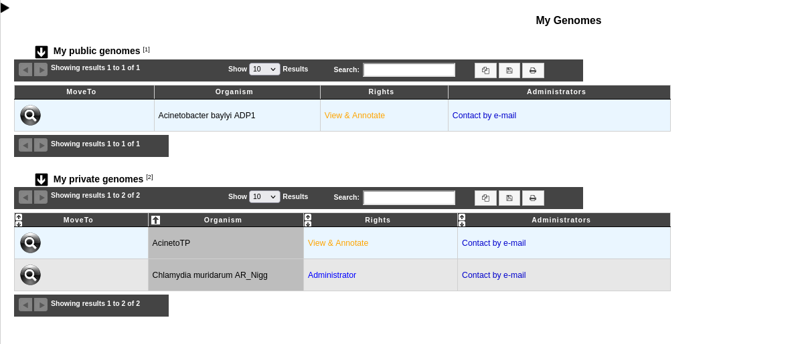

.. _mygenomes:

##########
My Genomes
##########

This page allows logged users to see all the genomes on which they have rights.
For a description of the rights, see :ref:`here <genome-status-access-rights>`.

Public and private genomes are displayed separately.

The **« Move to »** column allows to open the selected genomes in the viewer.

The **« Administrators »** column allows to contact the administrator(s) of the genome
by e-mail.
