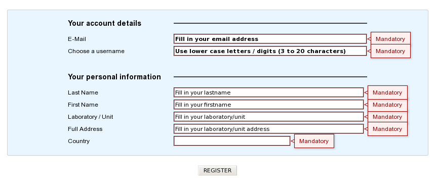

.. _register:

###################
Register an Account
###################

Why should I need to create an account?
---------------------------------------

This interface is dedicated to new account registration.
Creating an account on the MicroScope platform will allow you to:

* request for a delivery of service.
* save :ref:`user preferences <display-preferences>`.
* save :ref:`genecarts` and :ref:`genomecarts`.
* receive the newsletter and participate in user surveys.

What information is needed to create a new account?
---------------------------------------------------

Fill in all the required fields (see the image below to find which are mandatory).
The most important ones are the email address and the chosen username.
Both must be unique else the system won't allow you to create a new account.

The tooltips indicate if the fields are incorrectly formatted.
The rules are as follows:

  - for the username: lower case non-accented letters, or digits, no space, 3 to 20 characters
  - for your first and last name: only non-accented letters, spaces, ``-`` and ``'``; your last name will be converted to capital letters
  - for the name of your institution, laboratory and address: non-accented letters, digits, spaces and some characters (``_``, ``(``, ``)``, ``&``, ``,``, ``/``, ``.``, ``'``, ``\``, and ``-``)

Please, see :ref:`personal-information` for more information about your personal information and how to update them.

What is the process?
--------------------

When you submit the registration form, an automated email will be sent to the known email address.
This email contains an activation link: you'll have to click it in order to activate your account.

.. note:: Dear annotator, 

	This is an automated message from LABGeM about a MicroScope account registration. 
	Please click on the activation link below in order to activate your MicroScope's account and receive a second automated email containing your account password. 
	https://mage.genoscope.cns.fr/microscope/userpanel/register.php?registrationkey=xxxxxxxxxxxxxxxxxxxxxxxxxxxxxxxxxxxxxxxxxxxxxx 

	This link will be valid for 2 weeks from this day. 

	If you didn't request for a MicroScope account, just ignore this E-mail. 
	Best regards, 
	LABGeM Team

Then, a second email containing your username and password information for your MicroScope account will be sent.
Use this data to login on the MicroScope platform.

.. note:: Dear annotator, 

	This is an automated message from LABGeM: your MicroScope account is now fully active. 

	The Microscope web interface URL is : https://mage.genoscope.cns.fr/microscope 

	Your login : your_username 
	Your password : your_password 

	Please note that login data is confidential. You may not share your account with anyone, or allow anyone other than you personally to access or use your account. 

	Best regards, 
	LABGeM Team

