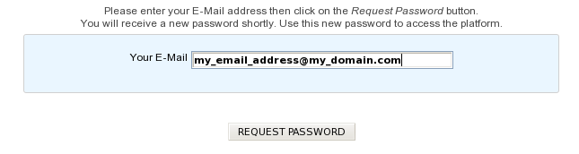

##############
Lost Password?
##############

If you lost your account password, this tool allows you to get a new one. The new password will be sent to your E-mail address (assuming it is registered into our annotators database).

How to proceed for a new password?
----------------------------------

* **step 1**. Fill the Request Password Form with the E-mail you gave us during the creation of your account. Then click on Request Password button.

* **step 2**. You will receive an automated E-mail shortly. This automated message contains an activation link as described below:

.. note:: Dear annotator,

	This is an automated message from LABGeM about your MicroScope account: a request has been made for a new password.

	Please click on the activation link below in order to get a new password for your MicroScope’s account: https://mage.genoscope.cns.fr/microscope/userpanel/requestpassword.php?requestkey=xxxxxxxxxxxxxxxxxxxxxxxxxxxxxxxxxxxxxxxxxxxxxx

	This link will be valid for 2 weeks from this day.

	If you didn’t request for a new password, just ignore this E-mail.

	Best regards, LABGeM Team

* **step 3**. Click on the activation link, you will be redirected to the MicroScope platform in order to confirm automatically your demand.
* **step 4**. Then, another automated E-mail containing your new password will be sent to your E-mail address.
* **step 5**. Use the new password to login on the MicroScope platform (your username should remain the same).

.. tip::
	* If you didn’t request for a new password, just ignore the first E-mail. This won’t alter your current login username & password.
	* The activation link given in the first E-mail is valid for 15 days. After the validity date, you’ll have to ask for a new activation E-mail (see step 1).